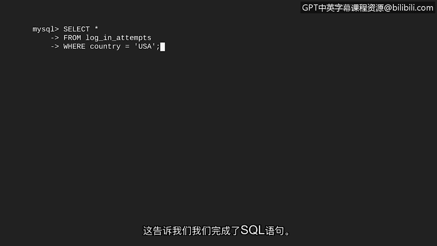
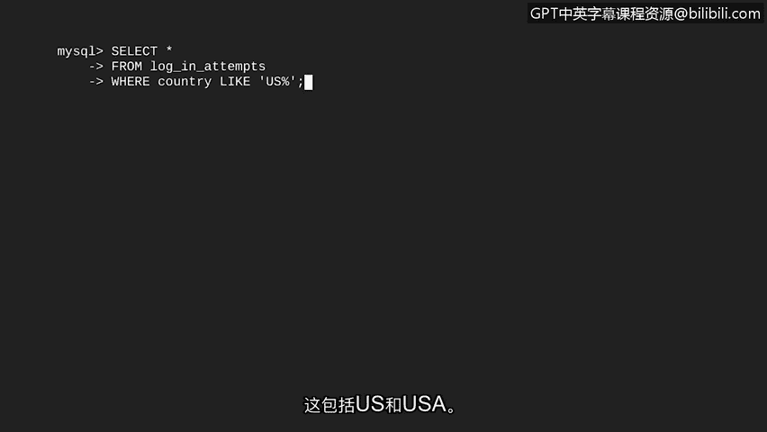

# 036：SQL查询中的基本筛选 🔍


在本节课中，我们将要学习SQL最强大的功能之一：数据筛选。我们将了解如何通过筛选条件，从数据库中选择更具体、更符合需求的数据片段。

## 什么是筛选？ 🎯

筛选是指选择符合特定条件的数据。你可以将筛选理解为一种只挑选我们想要的数据的方式。

例如，假设我们想从一个水果摊上选择苹果。筛选功能允许我们指定想要哪种苹果。当我们去挑选苹果时，我们可能会明确地说：“只选择新鲜的苹果。” 这会将不新鲜的苹果从选择中移除。这就是一个筛选过程。

在网络安全分析中，你可能会筛选登录尝试表，以查找来自特定国家的所有尝试。这可以通过对国家列应用筛选条件来实现。例如，你可以筛选出仅包含“Canada”的记录。

## 理解SQL运算符 ⚙️

在开始之前，我们需要关注SQL语法的一个重要部分：运算符。

**运算符**是一个代表某种操作的符号或关键字。一个运算符的例子是“等于”运算符（`=`）。例如，如果我们想找到所有在“country”列中包含“USA”的记录，我们会使用 `country = 'USA'`。

## 使用WHERE子句进行筛选 📝

要在SQL中筛选查询，我们只需在之前使用的`SELECT`和`FROM`语句后添加额外的一行。这额外的一行将使用SQL中的`WHERE`子句。`WHERE`指明了筛选的条件。


在关键字`WHERE`之后，使用运算符列出具体的条件。因此，如果你想找到所有在美国进行的登录尝试，我们将创建这样一个特定的筛选条件：指示返回所有在“country”列中值等于“USA”的记录。

让我们在SQL中将其组合起来。我们将从选择`log_in_attempts`表中的所有列开始，然后添加`WHERE`筛选器。别忘了分号，它表示SQL语句的结束。



以下是示例代码：
```sql
SELECT *
FROM log_in_attempts
WHERE country = 'USA';
```

运行此查询后，由于我们的筛选条件，只有登录尝试国家为“USA”的行会被返回。

## 使用LIKE运算符进行模式匹配 🔄

在之前的例子中，我们的筛选条件仅仅是基于返回等于特定值的记录。我们也可以通过搜索模式而非精确单词来使条件更复杂。

例如，在员工表中，我们有一个“office”列。我们可以搜索此列中匹配特定模式的记录。也许我们想要所有在东楼（East building）的办公室。为了搜索模式，我们使用百分号（`%`）作为未指定字符的通配符。

如果我们运行一个筛选条件 `WHERE office LIKE 'East%'`，这将返回所有以“East”开头的记录，例如办公室“East 120”、“East 290”和“East 435”。

当使用百分号搜索模式时，我们不能使用等于运算符。相反，我们使用另一个运算符：`LIKE`。`LIKE`是一个与`WHERE`一起使用的运算符，用于在列中搜索模式。由于`LIKE`是一个运算符，类似于等号，我们用它来代替等号。

因此，当我们的目标是返回“office”列中所有以单词“east”开头的值时，`LIKE`会出现在`WHERE`子句中。


## 实践：处理数据不一致性 🛠️

让我们回到想要筛选在美国进行的登录尝试的例子。想象一下，我们意识到数据库中表示“美国”的方式存在不一致性：有些条目使用“US”，而另一些使用“USA”。

让我们进入SQL并应用这种带有`LIKE`的新筛选类型。我们将以相同的前两行代码开始，因为我们想从`login_attempts`表中选择所有列。然后，我们将添加一个带有`LIKE`的筛选器，以便如果“country”列中的值以字符“US”开头，记录就会被返回。这包括了“US”和“USA”。

以下是示例代码：
```sql
SELECT *
FROM login_attempts
WHERE country LIKE 'US%';
```



运行此查询以检查输出是否改变。这将返回用户位置在美国的所有条目。现在，我们可以使用`LIKE`子句基于模式来筛选列。

## 总结 📚


本节课中，我们一起学习了SQL查询中的基本筛选。我们首先了解了筛选的概念及其在精确获取数据中的重要性。接着，我们认识了SQL中的运算符，特别是`=`和`LIKE`。我们详细探讨了如何使用`WHERE`子句添加筛选条件，从简单的等值匹配到更灵活的模式匹配。通过处理数据表示不一致的实际例子，我们掌握了`LIKE`运算符结合通配符（`%`）的用法。现在，你已经能够通过单一查询，非常精确地从数据库中获取所需的数据了。