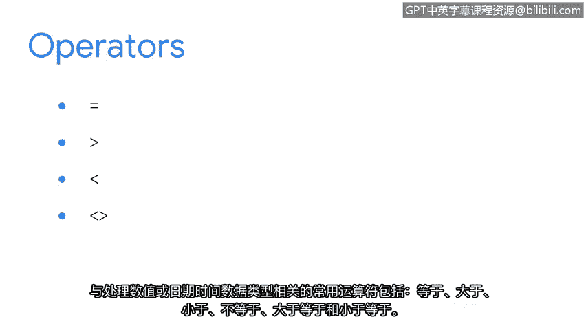
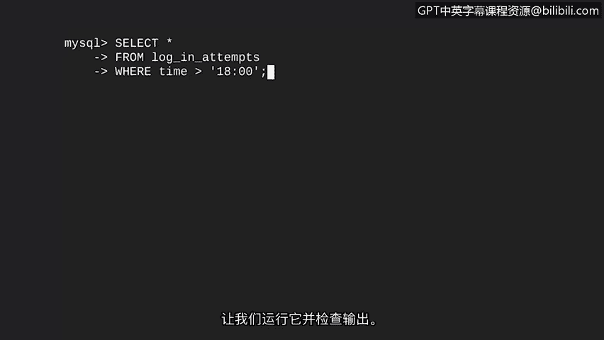
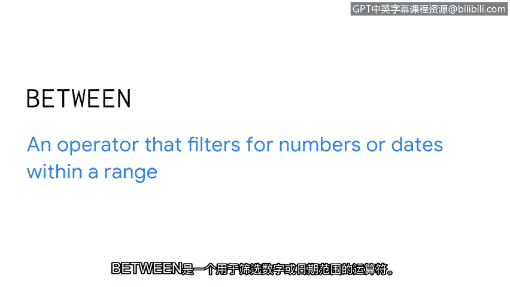
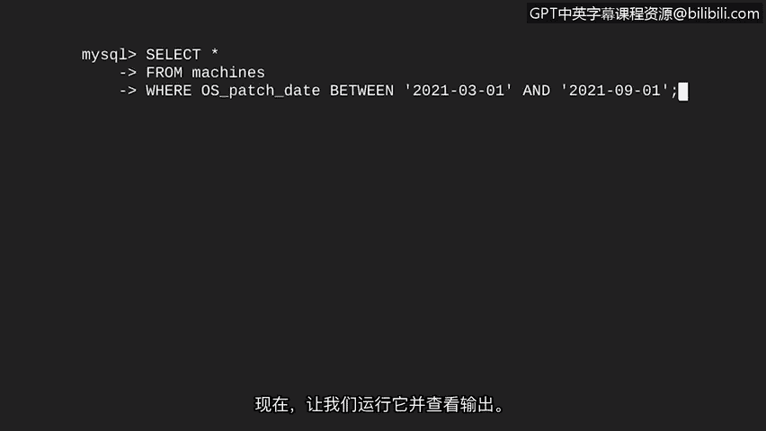

# 037：日期和数字筛选 📊


在本节课中，我们将继续学习SQL查询和筛选，但这次我们将把这些技巧应用到新的数据类型上。我们将探索如何在数据库中对数字和日期时间数据进行筛选，这对于安全分析师识别异常活动（如非工作时间的登录尝试）或管理任务（如查找特定时间段内需要更新的机器）至关重要。

## 数据类型简介

上一节我们介绍了如何使用字符串数据进行筛选，本节中我们来看看SQL中另外两种常见的数据类型：数字和日期时间。

以下是三种常见的数据类型：

*   **字符串数据**：由有序的字符序列组成的数据。这些字符可以是数字、字母或符号。例如，用户名 `analyst10` 就是字符串数据。
*   **数字数据**：由数字组成的数据。与字符串不同，可以对数字数据进行数学运算，如乘法或加法。例如，登录尝试次数。
*   **日期时间数据**：表示日期和/或时间的数据。例如，补丁安装日期或登录尝试的具体时间。

## 使用运算符筛选数字和日期

我们将使用与字符串筛选类似的运算符来筛选数字和日期。这些运算符允许我们进行比较。

以下是用于处理数字或日期时间数据类型的常见运算符：

*   `=` 等于
*   `>` 大于
*   `<` 小于
*   `!=` 不等于
*   `>=` 大于或等于
*   `<=` 小于或等于

例如，假设您想查找晚上6点之后进行的登录尝试，因为这属于非正常工作时间，可能存在可疑活动。

您可以在筛选器中使用**大于**运算符来识别这些尝试。



```sql
SELECT *
FROM log_in_attempts
WHERE time > ‘18:00’;
```

在这段代码中：
1.  `SELECT *` 表示选择 `log_in_attempts` 表中的所有列。
2.  `WHERE time > ‘18:00’` 是筛选条件，它指定 `time` 列中的值必须大于 `18:00`（即SQL中表示下午6点的方式）。

执行此查询后，我们将获得一份下午6点之后所有登录尝试的列表。

## 使用 BETWEEN 运算符筛选范围



除了基本的比较运算符，我们还可以使用 `BETWEEN` 运算符来筛选特定范围内的数字或日期。



`BETWEEN` 是一个用于筛选处于某个范围内的数字或日期的运算符。

一个典型的应用场景是查找在特定时间范围内安装的所有补丁。

让我们尝试查找所有在2021年3月1日至2021年9月1日之间安装的补丁。

```sql
SELECT *
FROM machines
WHERE os_patch_date BETWEEN ‘2021-03-01’ AND ‘2021-09-01’;
```

在这段代码中：
1.  我们从 `machines` 表中选择所有记录。
2.  在 `WHERE` 语句中，我们指定要筛选的列是 `os_patch_date`。
3.  使用 `BETWEEN` 运算符，并给出范围的开始 `‘2021-03-01’` 和结束 `‘2021-09-01’`。

运行此查询后，我们将得到在这两个日期之间打过补丁的所有机器的列表。



## 重要注意事项：引号的使用

在结束之前，有一个重要的细节需要注意：当我们筛选**字符串、日期和时间**时，需要使用**引号**来指定我们要查找的内容。然而，对于**数字**，我们**不使用**引号。

掌握了这些新知识，您现在就可以为各种数字和日期创建有趣的筛选条件了。

本节课中我们一起学习了如何对数字和日期时间数据类型使用运算符（如 `>`、`<`、`BETWEEN`）进行SQL筛选，并了解了在筛选不同数据类型时使用引号的规则。在下一个视频中，我们将通过在一个查询中使用多个条件，进一步扩展我们的筛选能力。