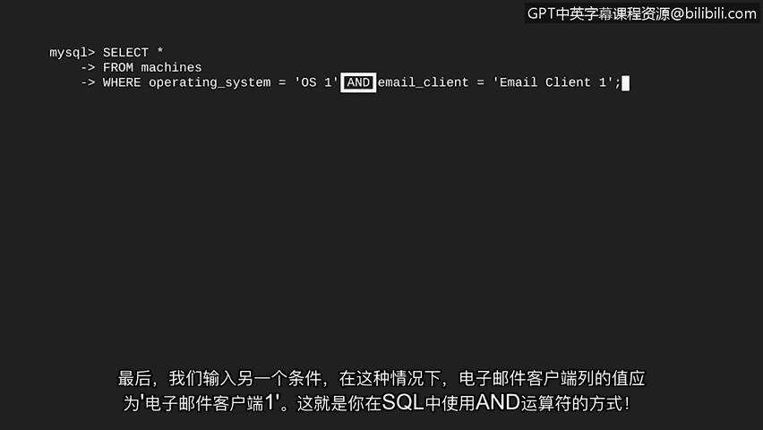
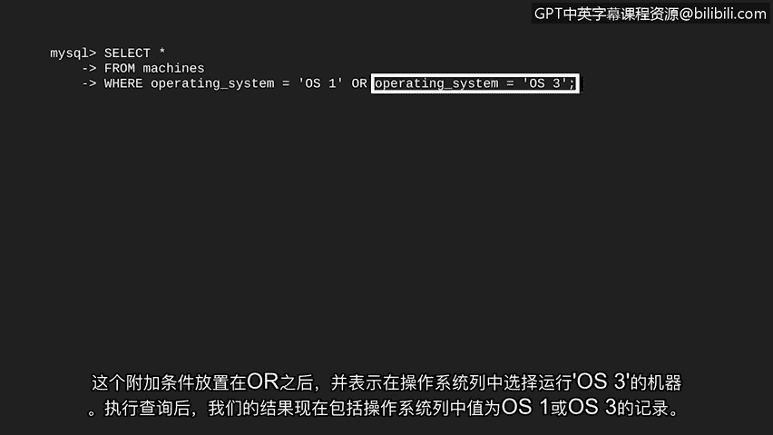
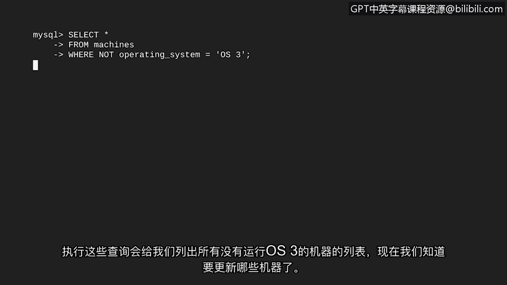

# 038：使用AND、OR和NOT进行筛选


在本节课中，我们将要学习如何在SQL查询中使用`AND`、`OR`和`NOT`运算符来组合多个筛选条件。这对于处理复杂的网络安全分析任务至关重要，例如识别依赖于多个因素的特定漏洞。

## 概述

上一节我们介绍了SQL中的基本筛选方法。本节中我们来看看如何通过组合多个条件进行更精确的查询。在实际的网络安全工作中，我们经常需要根据多个条件来筛选数据。例如，一个安全漏洞可能同时与特定的操作系统和特定的电子邮件客户端相关。为了找到所有可能受影响的设备，我们需要筛选出同时满足这两个条件的记录。

## 使用AND运算符

`AND`是一个逻辑运算符，它要求**同时满足**其连接的两个条件。

我们可以用一个类比来理解：假设你有一个装满了水果的大箱子，你需要从中挑选出**又大又新鲜**的苹果。这意味着结果中不会包含小的苹果（即使它是新鲜的），也不会包含腐烂的苹果（即使它是大的）。只有同时满足“大”和“新鲜”这两个条件的苹果才会被选中。

在SQL中，`AND`运算符的用法如下：

```sql
SELECT *
FROM 表名
WHERE 条件1 AND 条件2;
```

让我们将其应用到具体的例子中。假设我们有一个名为`Machines`的表，其中包含`operating_system`和`email_client`等列。我们想找出所有运行`OS1`操作系统**并且**使用`EmailClient1`电子邮件客户端的机器。

对应的SQL查询是：

```sql
SELECT *
FROM Machines
WHERE operating_system = ‘OS1’ AND email_client = ‘EmailClient1’;
```


执行这个查询后，返回的结果将只包含那些在`operating_system`列值为`‘OS1’`**并且**在`email_client`列值为`‘EmailClient1’`的行。

## 使用OR运算符

接下来，我们来看看`OR`运算符。`OR`也是一个逻辑运算符，它要求满足其连接的**任意一个**条件即可。



在维恩图中，每个圆圈代表一个条件。当使用`OR`连接时，SQL会选择满足其中任何一个条件的所有行（同时满足两个条件的行也会被包含在内）。

例如，我们需要找出所有运行`OS1`**或**`OS3`操作系统的机器，因为这两种系统都需要打补丁。

以下是使用`OR`运算符的SQL查询：

```sql
SELECT *
FROM Machines
WHERE operating_system = ‘OS1’ OR operating_system = ‘OS3’;
```


执行此查询后，结果将包含`operating_system`列的值为`‘OS1’`**或**`‘OS3’`的所有记录。

## 使用NOT运算符

最后，我们学习`NOT`运算符。`NOT`用于**否定**一个条件，即选择不满足该条件的行。



在维恩图中，条件由圆圈表示。使用`NOT`时，返回的是圆圈**之外**的所有部分，即所有不匹配该条件的数据。

这比逐一列出所有不需要的情况要高效得多。例如，在挑选水果时，你可以说“任何不是苹果的水果”，这比说“我要香蕉、或橘子、或酸橙等等”要简洁。

在SQL中的应用示例如下：假设你想更新公司里所有**不是**运行`OS3`操作系统的设备。

对应的SQL查询是：

```sql
SELECT *
FROM Machines
WHERE NOT operating_system = ‘OS3’;
```


执行这个查询，我们将得到所有没有运行`OS3`操作系统的机器列表，从而知道哪些机器需要更新。

## 总结

本节课中我们一起学习了SQL中三个重要的逻辑运算符：`AND`、`OR`和`NOT`。



*   `AND`：用于连接多个条件，要求**所有**条件都必须为真。
*   `OR`：用于连接多个条件，要求**至少一个**条件为真。
*   `NOT`：用于**否定**一个条件，选择不满足该条件的行。

掌握这些运算符的组合使用，能让你构建出更复杂、更精确的查询，以应对各种网络安全数据分析场景。

在下一个视频中，我们将学习如何将两个表连接（JOIN）在一起，从而进一步扩展我们能运行的查询类型。