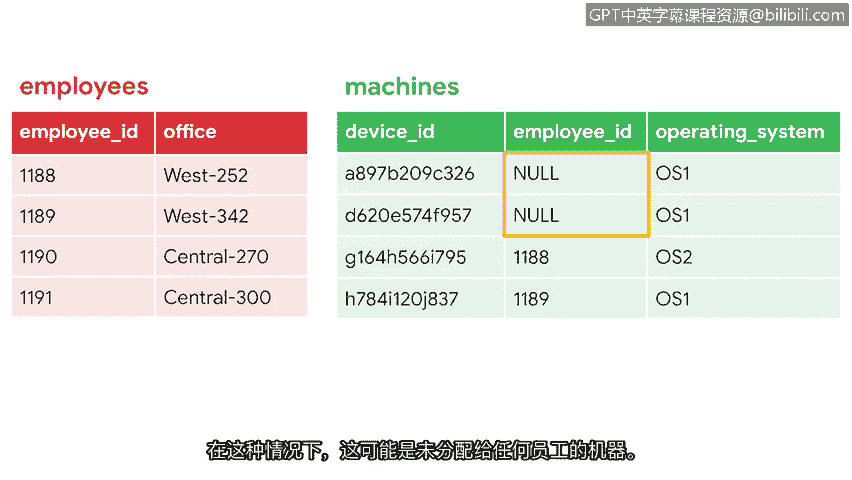
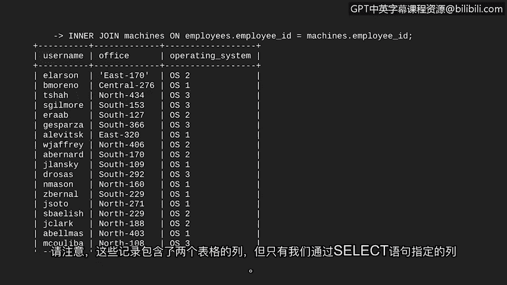

# 039：在SQL中连接表 🧩


在本节课中，我们将要学习SQL中一个非常强大的功能：连接表。当我们需要从数据库的两个不同表中获取信息时，这个功能至关重要。通过学习连接操作，你将能够整合数据，从而获得更全面的洞察。

## 连接表的语法

上一节我们介绍了SQL查询和筛选的基础知识。本节中，我们来看看如何连接多个表。由于现在要处理两个表，我们需要一种方法来告诉SQL我们是从哪个表中选择列。

在SQL语句中，如果两个表包含同名的列，SQL需要知道我们指的是哪一个。解决方法是先写表名，然后是一个点号`.`，最后是列名。例如：

*   `employees.employee_id` 表示`employees`表中的`employee_id`列。
*   `machines.employee_id` 表示`machines`表中的`employee_id`列。

## 理解连接的基础

现在我们已经理解了引用列的语法，让我们将其应用到连接操作中。假设我们想更深入地了解公司中访问机器的员工信息。通过连接`employees`表和`machines`表，我们可以实现这个目标。

我们首先需要确定用于连接两个表的共享列。通常，我们会使用一个表中的主键去连接另一个表中作为外键的对应列。

*   在`employees`表中，`employee_id`是主键，因为它为表中的每一行提供了唯一值，并且没有空值。
*   在`machines`表中，`employee_id`是外键。我们无法保证它遵循与主键相同的唯一性和非空性标准。

## 内连接详解

接下来，我们将使用一种称为**内连接**的连接类型。内连接会返回在指定列上匹配的行，该列存在于多个表中。

为了更清晰地解释内连接，让我们聚焦于`employees`表和`machines`表中的各四行数据。

如果我们选择在两个表的`employee_id`列上执行内连接，那么只有那些在两个表中`employee_id`值都存在的行才会被返回。例如，如果两个表都有`1188`和`1189`，那么这两行就是匹配的。连接的结果将包含这两行，以及来自两个表的所有列。

在继续学习查询之前，我们必须了解表中的空值。在SQL中，**NULL** 代表由于任何原因而缺失的值。在我们的例子中，`machines`表中的`NULL`值可能代表尚未分配给任何员工的机器。

## 编写内连接查询



现在，让我们在SQL中实现这一点，对完整的表执行内连接。假设我们希望通过连接这两个表，获得一个显示用户名、办公室位置及其机器操作系统的列表。`employee_id`是这两个表之间的公共列，我们可以用它来连接它们，但结果中不需要显示此列。

以下是构建查询的步骤：

1.  首先，编写一个基本的`SELECT`语句，指明我们想要选择的列：`username`、`office`和`operating_system`。
2.  我们希望`employees`表作为第一个（左）表，因此在`FROM`语句中使用它。
3.  然后，编写查询中告诉SQL将`machines`表与`employees`表连接的部分。

让我们分解这个查询：

```sql
SELECT username, office, operating_system
FROM employees
INNER JOIN machines ON employees.employee_id = machines.employee_id;
```

*   `INNER JOIN` 指示SQL执行内连接。
*   `machines` 是我们想要与第一个表（`employees`）组合的第二个表，称为右表。
*   `ON employees.employee_id = machines.employee_id` 告诉SQL基于哪个列进行连接。由于涉及两个表，我们必须用`表名.列名`的格式来标识列。

让我们回顾一下输出结果。完美！我们已经成功连接了两个表。查询结果显示的是在`employee_id`列上匹配的记录。请注意，这些记录包含来自两个表的列，但仅限于我们通过`SELECT`语句指定的那些列。

## 总结与预告



本节课中，我们一起学习了SQL中连接表的核心概念。我们掌握了如何通过`表名.列名`的语法引用特定表中的列，理解了主键和外键在连接中的作用，并重点实践了**内连接**的用法。内连接能够帮助我们基于匹配条件，从多个表中整合出有意义的数据集。

然而，内连接只返回匹配的行。还有其他类型的连接（如左连接、右连接、全外连接）不要求完全匹配也能连接两个表，我们将在下一个视频中讨论这些内容。