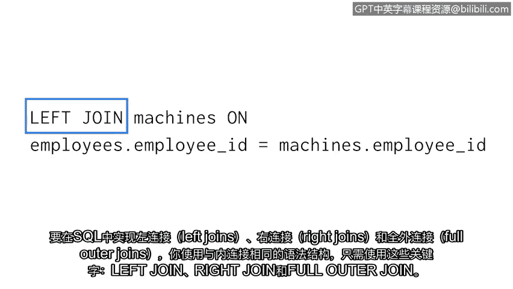

# 040：39_连接表的类型


在本节课程中，我们将学习外连接（Outer Joins）的三种类型：左连接、右连接和全外连接。我们将了解它们与内连接的区别，以及每种连接在何种场景下使用。

上一节我们介绍了内连接，它只返回两个表中指定列具有匹配值的记录。然而，在某些情况下，我们可能需要获取一个表或两个表中的所有记录，即使它们在另一张表中没有匹配项。本节中我们来看看如何通过外连接实现这一需求。

外连接有三种类型：左连接、右连接和全外连接。与外连接类似，外连接也是将两个表组合在一起。但是，它们不要求列之间必须匹配才能返回行。具体返回哪些行取决于连接的类型。

以下是三种外连接的简要说明：

*   **左连接**：返回左表（第一个表）的所有记录，但只返回右表中在指定列上有匹配值的行。
*   **右连接**：返回右表（第二个表）的所有记录，但只返回左表中在指定列上有匹配值的行。
*   **全外连接**：返回两个表中的所有记录。

让我们通过一个简单的例子来具体分析左连接。假设我们有两个表：`employees`（左表）和`machines`（右表），每个表只有几行和几列。我们通过 `employee_id` 列进行连接。

在这个例子中，只有两条记录在 `employee_id` 列上有匹配值。当我们执行左连接时，SQL会返回这些具有匹配值的行，以及左表（`employees`）中的所有其他行，同时包含两个表的所有列。那些来自 `employees` 表但未找到匹配的记录，其对应的来自 `machines` 表的列值将显示为 `NULL`。

接下来，我们谈谈右连接。右连接返回右表（第二个表）的所有记录，但只返回左表中在指定列上有匹配值的行。如果使用右连接重写上面的例子，结果将包含两个表的匹配行、右表的所有行以及两个表的所有列。对于任一表中不存在的值，结果中会显示为 `NULL`。

最后，我们讨论全外连接。全外连接返回两个表中的所有记录。使用同样的例子，一个全外连接将返回所有表的所有列。如果某一行在特定列上没有值，则返回 `NULL`。例如，`machines` 表中没有 `employee_id` 为 1190 的行，因此结果中该行来自 `machines` 表的列值就是 `NULL`。

要在SQL中实现左连接、右连接和全外连接，其语法结构与内连接相同，但使用不同的关键字。

以下是SQL中实现这些连接的代码示例：

```sql
-- 左连接
SELECT *
FROM table1
LEFT JOIN table2 ON table1.column = table2.column;

-- 右连接
SELECT *
FROM table1
RIGHT JOIN table2 ON table1.column = table2.column;

-- 全外连接
SELECT *
FROM table1
FULL OUTER JOIN table2 ON table1.column = table2.column;
```

作为一名安全分析师，你不需要死记硬背所有这些内容。一旦理解了所需的连接类型，你可以快速搜索并找到执行这些查询所需的全部信息。



掌握了关于连接的知识后，我们已经涵盖了你作为使用SQL的安全分析师所需的一些非常重要的信息。


本节课中我们一起学习了外连接的三种类型：左连接、右连接和全外连接。我们了解了每种连接如何工作，它们与内连接的区别，以及如何在SQL查询中使用它们来组合数据表。