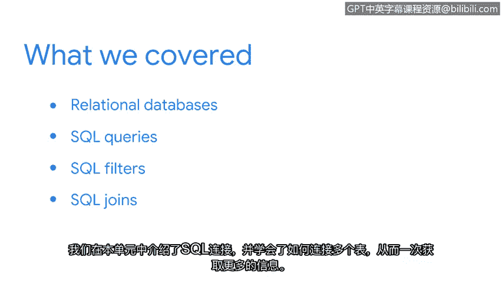

# 041：总结

在本节课程中，我们将回顾并总结在SQL部分所学习的所有核心知识与技能。

---

恭喜你，我们已经共同完成了SQL部分的学习。你付出了很多努力，并掌握了一项对安全分析师职业发展至关重要的工具。

现在，让我们花点时间回顾一下你在本节中学到的所有主题。

我们首先学习了关系数据库的结构，以及如何使用查询语言SQL来访问它们。

接着，我们进行了编写SQL查询语句的实践练习。我们使用SQL来提取作为分析师工作时可能需要的信息。

然后，我们重点学习了SQL过滤器。我们从简单的字符串条件开始，到最后，我们学会了如何在一个查询中使用多个过滤器。

本单元以SQL连接操作作为结尾，我们学习了如何连接多个表，从而一次性获取更多信息。

---

完成本课程，意味着你在未来成为安全分析师的职业生涯中迈出了非常重要的一步。你已经接触到了一个能在工作中为你提供强大助力的工具。

无论何时你需要，我都鼓励你重新回顾本课程的材料。学习像SQL这样的查询语言需要时间。

再次感谢你与我一同走过这段学习旅程。希望你也能像我一样享受使用SQL的过程。

---

**本节课总结**

在本节课中，我们一起学习了：
*   关系数据库的基本结构与SQL的用途。
*   编写基础SQL查询语句以提取数据。
*   使用`WHERE`子句进行数据过滤，从简单条件到多条件组合。
*   使用`JOIN`操作关联多个数据表，以获取更全面的信息。

掌握这些SQL核心技能，为你处理和分析安全相关数据奠定了坚实的基础。