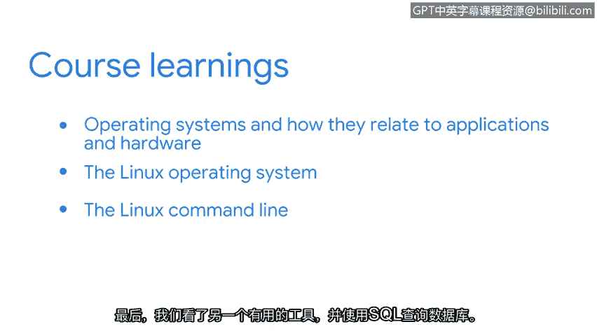
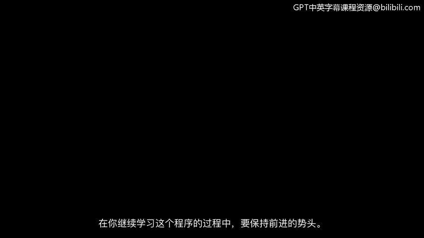

# 042：课程总结 🎉

在本节课中，我们将对《工具之道：Linux与SQL》课程的核心内容进行回顾与总结。

## 课程概述

您已经完成了本课程的学习。恭喜您。本课程的重点是计算基础。理解计算基础知识是您转型为安全分析师过程中的一项宝贵技能。

## 课程内容回顾

上一节我们介绍了SQL查询等具体工具，现在让我们来整体回顾一下您在本课程中学到的知识。

我们首先关注的是操作系统及其与应用程序和硬件的关系。理解您所要保护的系统如何运作，对于有效完成工作至关重要。

这自然将我们引向了Linux操作系统。在安全专业领域工作时，熟悉Linux非常重要。我们首先讨论了它的体系结构和各种发行版。然后，我们使用Linux命令行来执行安全分析师可能遇到的任务。

最后，我们探讨了另一个有用的工具，即使用SQL来查询数据库。

## 学习成果与展望

完成本课程后，希望您能更好地理解这些计算基础如何支持安全分析师的日常工作。同时也希望您能继续在这个专业项目中学习前进。前方还有许多其他有用且令人兴奋的主题。

再次恭喜您。您完成了又一门课程。掌握技能是值得自豪的事情。请在本项目的学习进程中继续保持。

## 总结

本节课中，我们一起学习了计算基础、Linux操作系统和SQL数据库查询的核心知识，这些都是安全分析师日常工作的基石。祝贺您取得的进步，并预祝您在后续的学习中再接再厉。