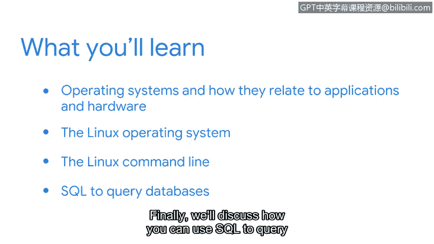

# 043：课程介绍

在本节课中，我们将学习网络安全领域的基础计算知识，包括操作系统、Linux命令行以及SQL查询。这些技能对于安全分析师高效地保护系统、调查事件至关重要。

大家好，欢迎来到这门网络安全基础计算课程。我叫Kim，是一名安全领域的技术项目经理。我从小接触计算机和互联网，但直到发现安全与技术的紧密交织，才将其视为职业方向。

在我的第一份安全工作之前，我曾在一个云应用团队工作，需要定期与安全团队互动。那是我首次接触安全工作，但保护信息并与他人共同实现这一目标的想法让我感到兴奋。因此，我决定考取CISSP认证，这为我在公司带来了新的工作机会，并使我得以转入安全领域。

至此，如果你一直跟随课程学习，应该已经探索了安全领域的多种有用概念，包括安全域和网络。我很高兴能在课程的下一阶段加入你们。我们将循序渐进，以便你能以实用的方式理解这些主题。

本课程的重点是计算基础。理解组织中系统内机器的工作原理，有助于你更高效地履行安全分析师的工作职责。

作为安全分析师，你的部分职责是保护系统免受潜在攻击。你是保护组织数据的第一道防线之一。为了有效地做到这一点，了解你所保护的系统如何运作会很有帮助。

此外，你可能需要调查事件以帮助纠正系统中的错误。熟悉Linux操作系统及其相关命令，并能够通过SQL与组织的数据进行交互，将对此大有裨益。

在本课程中，你将学习操作系统及其与应用程序和硬件的关系。接下来，你将更详细地探索Linux操作系统。然后，你将在安全背景下使用Linux命令行。最后，我们将讨论作为安全分析师，如何使用SQL查询数据库。

我很高兴能与你们一起探索所有这些主题。让我们开始吧。

本节课中，我们一起学习了网络安全基础计算课程的目标和内容框架。我们了解到，掌握操作系统、Linux和SQL知识对于安全分析师保护系统、调查事件至关重要。在接下来的章节中，我们将深入这些核心工具的具体应用。