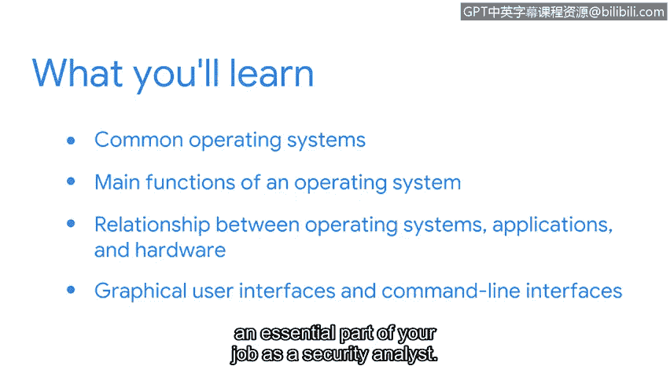

# 044：1_01_welcome-to-week-1

在本节课中，我们将学习操作系统的基础知识。我们将了解常见的操作系统，探索操作系统的主要功能，并理解操作系统、应用程序和硬件之间的关系。最后，我们将比较图形用户界面和命令行界面。命令行界面将成为你作为安全分析师工作中不可或缺的一部分。

## 操作系统简介

你每周使用电脑多少次？对一些人来说，答案可能是“非常多”。电脑是功能强大的机器，它们让我们能够完成各种任务，从工作中使用专业应用程序，到向远方的亲人发送电子邮件。

你是否思考过电脑如何实现所有这些功能？答案就在于操作系统。操作系统是管理计算机硬件与软件资源的系统软件，是所有程序运行的基础平台。

上一段我们提出了电脑功能背后的核心问题，本节中我们将正式介绍操作系统。

## 操作系统的主要功能

操作系统是计算机系统的核心管理者。它的主要功能包括：

以下是操作系统的几个核心功能：

*   **进程管理**：操作系统负责创建、调度和终止进程，并管理进程间的通信。
*   **内存管理**：操作系统跟踪内存的使用情况，为程序分配和回收内存空间。其核心目标可用公式表示为：**有效内存分配 = 避免内存泄漏 + 优化访问速度**。
*   **文件系统管理**：操作系统控制数据的存储、检索和组织方式，管理文件和目录结构。
*   **设备管理**：操作系统通过驱动程序与硬件设备（如键盘、鼠标、打印机）进行通信。
*   **用户界面**：操作系统提供用户与计算机交互的方式，例如图形界面或命令行。

## 操作系统、应用程序与硬件的关系

理解了操作系统的功能后，我们来看看它如何与计算机的其他部分协同工作。操作系统、应用程序和硬件之间存在着清晰的层次关系。

它们的关系可以概括为：**硬件** 是物理基础，**操作系统** 是管理和控制硬件的软件层，而 **应用程序** 则在操作系统的支持下运行，为用户提供特定功能。这就像一个三明治结构。

## 图形用户界面 vs. 命令行界面

操作系统通过用户界面与用户交互。主要有两种类型的用户界面，它们各有特点。

以下是两种主要用户界面的比较：

*   **图形用户界面**：用户通过视觉元素如图标、窗口和菜单与系统交互，通常使用鼠标点击操作。这种方式直观易学。
*   **命令行界面**：用户通过输入文本命令来与系统交互。例如，在Linux中列出当前目录文件的命令是：`ls`。这种方式虽然学习曲线较陡，但效率高、可编写脚本自动化，是安全分析工作的核心工具。

## 总结

本节课中，我们一起学习了操作系统的基础知识。我们了解了操作系统的定义及其进程管理、内存管理等核心功能，探讨了操作系统作为中间层连接应用程序与硬件的关系，并比较了图形用户界面和命令行界面的特点。理解这些概念是构建网络安全职业生涯的重要基石。接下来，我们将深入探索命令行界面的具体使用。

