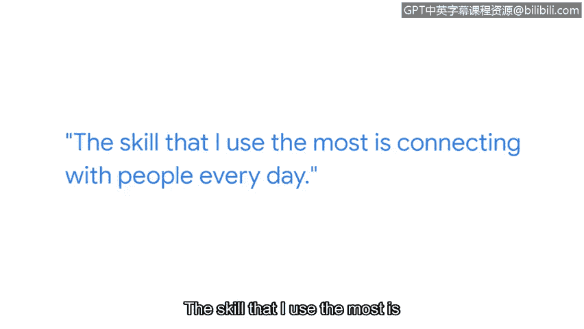

# 045：2_02_金姆的计算机之旅

## 概述
在本节课程中，我们将跟随谷歌技术项目经理金姆，了解她如何从非技术背景成功转型进入网络安全领域。她的个人经历将为我们揭示，通往网络安全职业的道路是多元且开放的。

大家好，我是金姆。我是谷歌的一名技术项目经理。我目前任职于安全并购团队，负责与谷歌收购的其他公司合作，并协助它们整合到谷歌的环境中。

在进入网络安全乃至科技行业之前，我曾担任过多个不同的职位。我最初在餐厅工作，之后在当地大学为国际学生担任英语辅导老师。在完成多次实习并从大学毕业之后，我获得了进入科技行业的第一个机会。正是在那里，我对科技以及最终对网络安全的兴趣开始萌芽。

## 核心建议：开放心态与技能迁移
上一部分我们了解了金姆的职业起点，本节中我们来看看她给初学者的核心建议。金姆想告诉所有背景的人，如果你对保护信息、保护他人感兴趣，你完全可以进入网络安全领域。

网络安全领域有众多不同的岗位，而你目前拥有以及过去积累的所有技能，都能在安全领域中找到用武之地。

## 最重要的技能：人际连接
除了技术知识，金姆强调了另一项至关重要的软技能。以下是她最依赖的核心能力：

*   **人际连接能力**：我运用最多的技能是与人沟通。除非我能以正确的方式与他们建立联系，否则我将一事无成。这实际上是我最依赖的重要技能。

## 给新人的关键建议
对于刚进入网络安全领域的新人，金姆有一条关键建议：

*   **保持开放心态**：我最初获得的是商科学位，当时我甚至觉得自己不够技术化，无法达到今天的职位。在那之前，我所有的经验要么是餐厅工作，要么是市场营销，或是其他感觉与科技无关的工作。但所有这些经历都帮助并激励我更多地涉足科技领域，并最终进入安全领域。在我意识到之前，那种自我怀疑已经被来自同事的支持和与我共事过的其他人的尊重所取代。

## 总结
本节课中，我们一起学习了金姆从非技术岗位转型为谷歌安全专家的历程。她的故事清晰地表明，**多元化的背景和软技能**同样是网络安全领域的宝贵财富。关键在于保持开放心态，积极建立人际连接，并相信你过去的每一段经历都可能成为未来成功的基石。