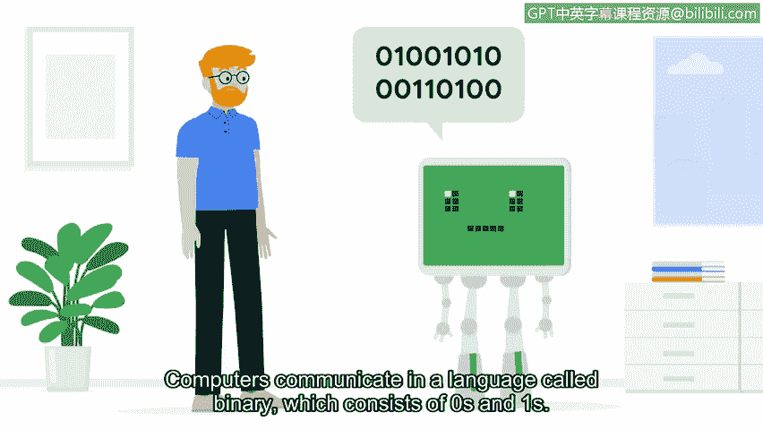

# 046：Linux与SQL》

## P46：操作系统简介

在本节课中，我们将要学习操作系统的基础知识。操作系统是计算机、智能手机和平板电脑等设备的核心软件。了解操作系统的工作原理对于网络安全专业人员至关重要，因为它是执行安全任务、配置系统和防范威胁的基础。

---

计算机、智能手机和平板电脑等设备都拥有操作系统。

如果你使用过台式机或笔记本电脑，你可能使用过 Windows 或 Mac OS 操作系统。

智能手机和平板电脑则运行在 Android 和 iOS 这类移动操作系统上。

另一个流行的操作系统是 **Linux**。Linux 在安全行业中被广泛使用。

作为一名安全专业人员，你很可能会与 Linux 操作系统进行交互。

那么，操作系统究竟是什么？它是计算机硬件与用户之间的接口。

**操作系统**，通常简称为 **OS**，负责在使计算机尽可能高效运行的同时，也使其易于使用。“硬件”可能是另一个新术语。

**硬件**指的是计算机的物理组件。

我们今天每天依赖的 OS 界面，是早期计算机所不具备的。

在 20 世纪 50 年代，早期计算机面临的最大挑战是运行一个计算机程序所需的时间。

当时，计算机无法同时运行多个程序。相反，人们必须等待一个程序运行完毕，然后重新启动计算机并加载新程序。

想象一下，每次需要打开一个新应用程序时都必须开关计算机。完成发送电子邮件这样简单的任务将花费很长时间。自那时起，操作系统已经进化，我们不再需要担心以这种方式浪费时间。

---

上一节我们回顾了操作系统的历史，本节中我们来看看现代操作系统带来的好处。

得益于操作系统及其发展，今天的计算机运行高效。

它们可以同时运行多个应用程序，并且还能访问打印机、键盘和鼠标等外部设备。

操作系统之所以重要的另一个原因是，它们帮助人类和计算机彼此通信。

计算机使用一种称为**二进制**的语言进行通信，这种语言由 0 和 1 组成。

操作系统提供了一个接口，以弥合用户与计算机之间的这种通信鸿沟，允许你以复杂的方式与计算机交互。

---

操作系统对于计算机的使用至关重要。同样地，**操作系统安全**对于计算机的安全也至关重要。

这涉及保护文件、数据访问和用户身份验证，以帮助防范和预防病毒、蠕虫和恶意软件等威胁。

了解操作系统的工作原理对于完成不同的安全相关任务至关重要。

例如，作为一名安全分析师，你可能需要负责通过管理访问权限来配置和维护系统的安全性。

以下是安全分析师可能负责的一些关键任务：

*   管理和配置防火墙。
*   设置安全策略。
*   启用病毒防护。
*   执行审计、记账和日志记录以检测异常行为。

所有这些任务都需要对操作系统有深入的理解。随着我们继续本课程，我们将更详细地探讨操作系统。

---

本节课中我们一起学习了操作系统的基本概念、其历史演变、在现代计算中的核心作用，以及它在网络安全领域的重要性。理解操作系统是高效执行安全任务、保护系统免受威胁的基础。在接下来的课程中，我们将深入探索操作系统的更多细节。