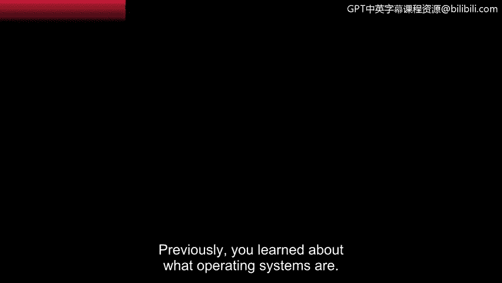
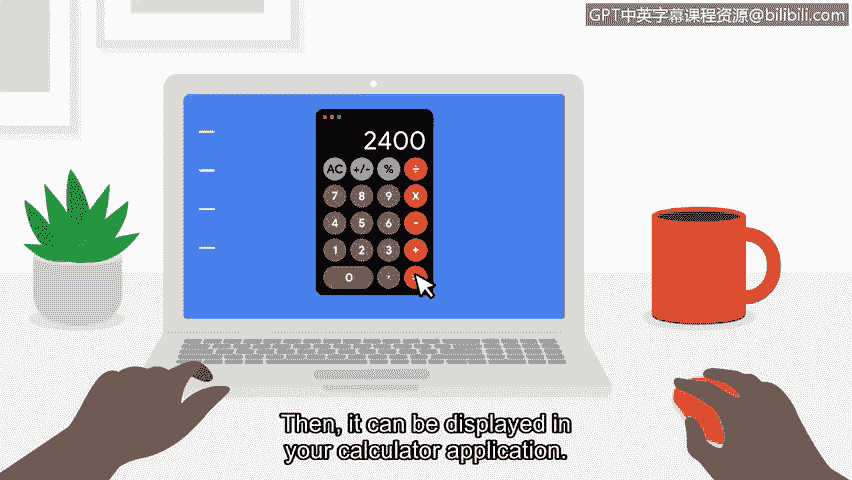

# 047：操作系统内部探秘 🔍

在本节课程中，我们将深入探讨操作系统的工作原理。我们将了解从启动计算机到执行一个简单任务（如使用计算器）的完整流程，并理解这些知识对网络安全分析师的重要性。

---

上一节我们介绍了什么是操作系统。现在，让我们来讨论它们是如何工作的。

当你按下电源按钮时，你正在与计算机硬件进行交互。这个动作会启动计算机并加载操作系统。启动计算机意味着激活一个名为 **BIOS** 的特殊微芯片。在许多2007年后制造的计算机上，这个芯片已被 **UEFI** 所取代。BIOS和UEFI都包含启动指令，负责加载一个名为 **引导加载程序** 的特殊程序。然后，引导加载程序负责启动操作系统。就这样，你的计算机就开机了。

作为安全分析师，理解这些过程对你很有帮助。漏洞可能出现在像启动过程这样的环节中。通常，BIOS不会被防病毒软件扫描，因此它可能容易受到恶意软件感染。

---

现在你已经了解了如何启动操作系统，让我们看看你和其他用户如何与系统通信以完成任务。

这个过程始于你——用户。为了完成任务，你使用计算机上的应用程序。**应用程序** 是执行特定任务的程序。当你这样做时，应用程序会将你的请求发送给操作系统。从那里，操作系统解释这个请求，并将其引导至计算机硬件的相应组件。

在之前的视频中，我们了解到硬件由计算机的所有物理组件构成。硬件也会将信息发送回操作系统，操作系统再将其发送回应用程序。

以下是当你想要使用计算机上的计算器时，这个过程如何运作的简单概述：
*   你使用鼠标点击计算机上的计算器应用程序。
*   当你输入想要计算的数字时，应用程序与操作系统通信。
*   你的操作系统随后将计算任务发送给硬件的一个组件——**中央处理器** 或 **CPU**。
*   一旦硬件完成了确定最终数字的工作，它会将答案发送回你的操作系统。
*   然后，答案就可以显示在你的计算器应用程序中。

---

理解这个过程有助于调查安全事件。安全分析师应该能够追溯这个流程，分析安全事件可能发生的位置。就像机械师需要比普通司机更了解汽车内部工作原理一样，认识操作系统如何工作是安全分析师的重要知识。

---

在本节课中，我们一起学习了计算机的启动过程（从BIOS/UEFI到引导加载程序），以及用户、应用程序、操作系统和硬件（特别是CPU）之间如何协作以完成任务。理解这些内部流程是追踪和分析潜在安全事件的基础。