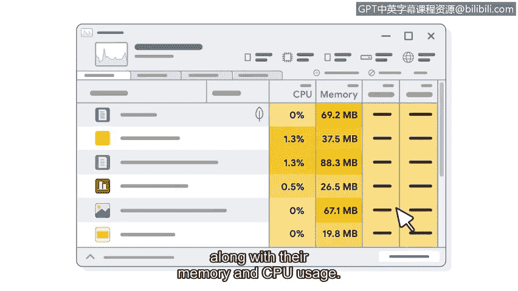

**操作系统基础：第四课：操作系统资源管理**

在本节课中，我们将要学习操作系统如何管理计算机的资源。我们将了解资源分配的重要性，以及作为安全分析师，理解资源使用情况如何帮助我们识别和解决问题。

---

上一节我们介绍了操作系统与计算机其他部分的交互。本节中，我们来看看操作系统如何扮演“资源管理者”的角色。

操作系统不仅与其他计算机部件交互，还负责管理系统资源。这是一项需要大量平衡工作的重大任务，旨在确保计算机的所有资源被高效利用。

这类似于“能量”的概念。一个人需要能量来完成不同的任务。有些任务需要更多能量，而另一些则需求较少。例如，跑步比看电视需要更多能量。计算机的操作系统同样需要确保它有足够的“能量”来正确执行特定任务。在计算机上运行杀毒扫描比使用计算器应用程序会消耗更多“能量”。

想象你的计算机是一个管弦乐队。许多不同的乐器，如小提琴、鼓和喇叭，都是乐队的一部分。乐队还有一位指挥来引导音乐的流向。在计算机中，操作系统就是指挥。操作系统处理资源和内存管理，以确保计算机系统有限的能力被用在最需要的地方。

各种程序、任务和进程不断竞争中央处理单元的资源。它们都有各自需要内存、存储和输入/输出带宽的理由。操作系统负责确保每个程序都能分配和释放资源。所有这些都在你的计算机中同时发生，以使系统高效运行。作为用户，这些过程大部分对你来说是隐藏的。例如，你的浏览器任务管理器会列出所有正在处理的任务及其内存和CPU使用情况。

---

了解系统资源的使用位置对分析师很有帮助。理解资源使用情况可以帮助你响应事件并排查系统中的应用程序问题。例如，如果一台计算机运行缓慢，分析师可能会发现它正在将资源分配给恶意软件。对操作系统工作原理的基本理解，将帮助你更好地理解在本课程后续部分将学到的安全技能。

---

本节课中，我们一起学习了操作系统作为资源管理者的核心功能。我们了解到，操作系统像指挥一样，协调CPU、内存等资源在各种竞争程序间的分配，以确保系统整体效率。理解资源分配机制是安全分析的基础，能帮助我们识别异常的资源消耗，例如由恶意软件引起的系统性能下降。