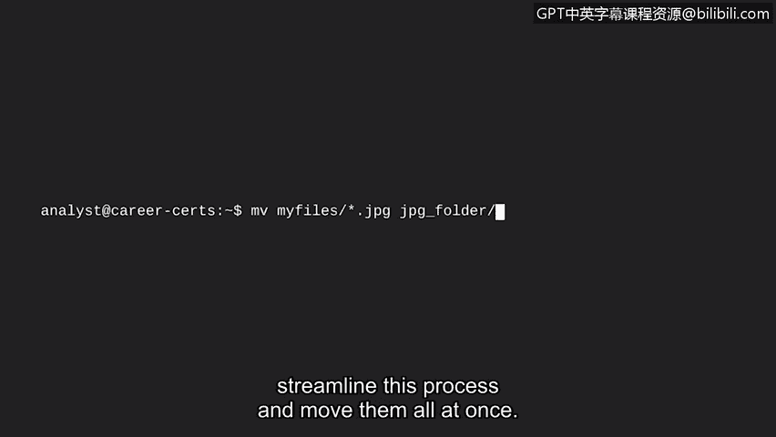

# 049：图形界面与命令行界面

在本节课程中，我们将探讨用户如何与计算机操作系统进行通信。我们将学习两种主要的用户界面：图形用户界面和命令行界面，并了解它们各自的特点、优势以及它们在网络安全工作中的实际应用。

## 概述：用户与操作系统的通信

上一节我们学习了计算机的内部工作原理。现在，让我们来讨论用户和操作系统之间是如何相互通信的。

你已经了解到，计算机包含操作系统、硬件和应用程序。操作系统负责与硬件通信以执行任务。在本节中，你将学习用户（也就是你）如何与操作系统交互，以便向硬件发送任务。

用户通过一个**界面**与操作系统进行通信。

**用户界面**是一个允许用户控制操作系统功能的程序。我们将讨论的两种用户界面是**图形用户界面**和**命令行界面**。

## 图形用户界面

让我们更详细地介绍这些界面。**图形用户界面**是一种利用屏幕上的图标来管理计算机上不同任务的用户界面。

大多数操作系统都可以使用图形用户界面。如果你使用过个人电脑或手机，你就已经拥有操作图形用户界面的经验。

以下是大多数图形用户界面通常包含的组件：

*   一个包含程序组的开始菜单。
*   一个用于启动程序的任务栏。
*   一个带有图标和快捷方式的桌面。

所有这些组件都帮助你与操作系统通信以执行任务。除了点击图标，在使用图形用户界面时，你还可以从开始菜单搜索文件或应用程序。你只需要记住程序的图标或名称即可启动应用程序。

## 命令行界面

现在，让我们来讨论命令行界面。

相比之下，**命令行界面**是一种基于文本的用户界面，它使用命令与计算机交互。这些命令与操作系统通信，并执行诸如打开程序等任务。

命令行界面的结构与图形用户界面有很大不同。当你使用命令行界面时，你会立刻注意到区别：屏幕上没有图标或图形。命令行界面看起来类似于使用特定文本语言的代码行。

命令行界面比图形用户界面更灵活、更强大。可以这样理解：使用命令行界面就像在杂货店的食材区，你可以用任何食材创造你想吃的任何餐点。这让你对要吃什么拥有很大的控制权和定制能力。

相比之下，使用图形用户界面更像是从餐厅点餐。你只能点菜单上有的东西。如果你既想吃面条又想吃披萨，但你去的第一家餐厅只有披萨，你就得去另一家餐厅点面条。

使用图形用户界面，你一次只能完成一项任务。但命令行界面允许定制，这让你可以同时完成多项任务。

例如，想象你有一个包含数百个不同类型文件的文件夹，而你只需要将其中所有的JPEG文件移动到一个新文件夹中。

试想一下，如果你使用图形用户界面在这个文件夹中找到每一个JPEG文件并将其移动到新文件夹，这个过程将是多么缓慢和繁琐。

另一方面，命令行界面则可以让你简化这个过程，一次性移动所有文件。

## 两种界面的差异与安全分析师的视角

正如你所见，这两种用户界面存在非常大的差异。

作为一名安全分析师，你的部分工作可能会涉及使用命令行界面，例如在分析日志或对用户进行身份验证和授权时。安全分析师在日常工作中普遍会使用命令行界面。

## 总结

在本节视频中，我们讨论了两种类型的用户界面。你了解到，由于大多数个人电脑和手机都使用图形用户界面，你已经拥有了使用它的经验。同时，你也初步认识了命令行界面。

在本课程的后续部分，你将学习如何在Linux中使用命令行界面，并了解它对于你作为安全分析师的日常工作有多么重要。你将获得通过命令行进行通信的实践经验。