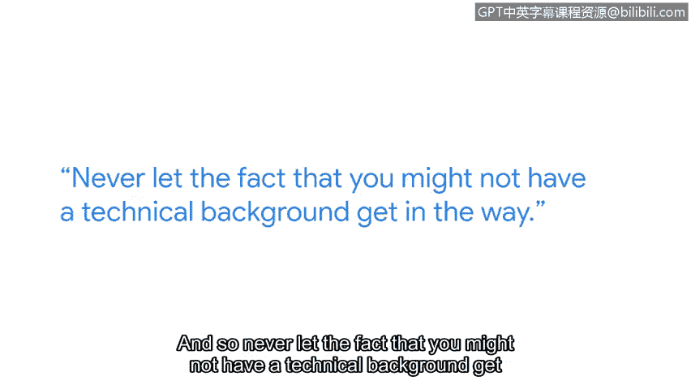

**网络安全职业路径：第四课：埃伦的网络安全之路**

在本节课中，我们将跟随谷歌安全工程经理埃伦的分享，了解她非传统的网络安全职业路径。她的经历将告诉我们，进入这个领域并不一定需要计算机科学背景，好奇心和学习热情才是关键。

我的名字是埃伦，我是谷歌的一名安全工程经理，专注于谷歌如何使用云。

在我开始接触技术时，网络安全还不是一个独立的领域。我是后来才进入这个领域的。

我的技术生涯始于在一家海报店做零售工作。当时我们需要建立一个网站，而我的脚很疼，非常需要坐下来工作。于是我请朋友教我HTML，这样我就可以坐着工作，让脚上的水泡休息一下。

在海报店工作时，我们的一位顾客在一家初创公司工作，常来给员工照片装裱。他请这位顾客给我的网站提意见，最终他们给了我一个实习机会。

我后来拥有的一个专长是API设计，即设计开发者与机器通信的接口。因此，我得到了一份工作，为安全技术设计一个微型操作系统，并从那里开始学习安全知识。

我认识的从事网络安全的人，尤其是在早期，大多根本没有学位。即使有，也像我一样，是哲学或诗歌之类的学位。

几乎所有人都是通过自己动手实验、与人交流、阅读来自学的。所以我认为，**技术背景并非必需**。

事实上，拥有在现实世界中实践过的背景，有时能让网络安全更容易理解，并帮助你做出更平衡的决策。

在几乎所有领域，你都能找到安全社区。找到他们所在的地方。

寻找本地会议。开始与人交流。

这种方式学习比独自摸索要有趣得多。我发现，大多数人，如果你走上前对他们说：“嘿，你在这方面真的很擅长。你介意我请你喝杯咖啡，然后你教教我吗？”他们几乎总是会答应。

我给没有技术背景的人的建议如下：

以下是具体建议：

*   **不要害怕技术。** 技术可能看起来只有拥有计算机科学学位的人才能理解。但这些核心概念和技术是任何人都可以理解的。所以，永远不要让你可能没有技术背景这一点成为障碍。
*   **选择感兴趣的领域并深入钻研。** 只要你保持好奇心，只要你发现它有趣，你就能学会相关技术。

在本节课中，我们一起学习了埃伦从零售业到谷歌安全经理的独特职业旅程。她的故事强调了**好奇心、主动学习和社区参与**在网络安全职业发展中的重要性，并鼓励所有背景的学习者勇敢迈出第一步。