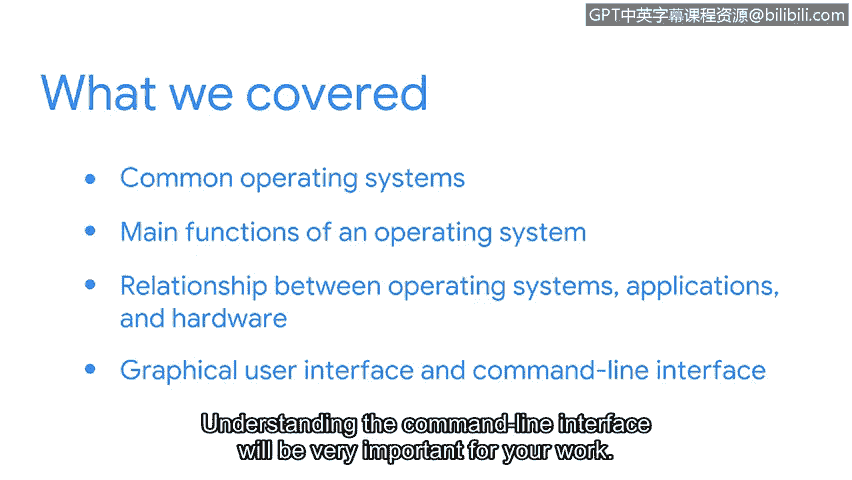

# 051：8_01_wrap-up.en_subtitled

## 概述

在本节课程中，我们一起学习了计算机操作系统的基础知识。这些知识对于网络安全分析师理解其工作环境至关重要。

## 课程内容回顾

我们成功完成了本节的学习。这是一段收获丰富的学习过程。最棒的是我们共同完成，并涵盖了一些非常实用的主题。

让我们来回顾一下本节的课程内容。

作为一名安全分析师，理解你所使用的系统非常重要。掌握计算机基础知识将帮助你更有效、更高效地完成工作。

在本节中，我们介绍了常见的操作系统。我们还讨论了操作系统的主要功能。重要的是，你学习了操作系统、应用程序和硬件之间的关系。了解它们如何像管弦乐队一样协同工作很有意义。

此外，你学习了图形用户界面（GUI）和命令行界面（CLI）之间的区别。理解命令行界面对你的工作将非常重要。

## 总结与展望

很高兴能与你一同探索操作系统的世界。了解操作系统的工作原理，是迈向安全分析师职位的重要一步。你做得很好。

让我们继续推进这个课程项目。在下一节中，我们将特别聚焦于Linux操作系统。