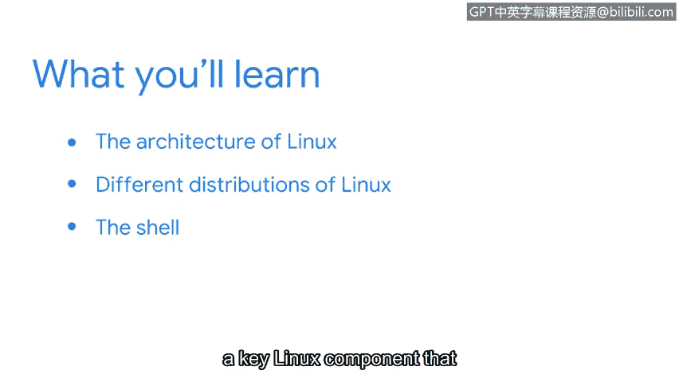

**谷歌网络安全专业证书第四课：《工具之道：Linux与SQL》 - P52：9_01_welcome-to-week-2**


欢迎回来。我们将探讨另一个重要主题。在之前的内容中，你学习了操作系统和用户界面。你了解了操作系统的工作原理以及计算机中资源如何分配。我们还回顾了几种常见的操作系统。你可能已经有了自己偏爱的操作系统。人们常常会偏爱某一款操作系统。但在安全领域，**Linux** 被广泛使用。在本节中，你将深入学习 Linux 操作系统及其在日常任务和安全中的应用。

首先，你将了解 Linux 的体系结构。之后，我们将比较现有的不同 **Linux 发行版**。最后，你将探索 **Shell**，这是一个关键的 Linux 组件，它允许你与系统进行通信。



我记得自己初次了解 Linux 操作系统时的情景，现在很高兴能与你一同探索它。


---

### **课程概述**

在本节课中，我们将要学习 Linux 操作系统的基础知识，包括其核心架构、不同的发行版本以及用于系统交互的关键工具——Shell。

---

### **Linux 操作系统架构 🏗️**

上一节我们介绍了操作系统的基本概念，本节中我们来看看 Linux 的具体架构。Linux 架构主要包含以下几个核心层次：

以下是 Linux 系统的主要组成部分：

1.  **内核**：这是 Linux 的核心，负责管理硬件资源（如 CPU、内存）和基本系统服务。其作用类似于计算机的“大脑”。
2.  **系统库**：为应用程序提供一系列预构建的函数，方便开发者调用内核功能，而无需直接与内核交互。
3.  **系统工具**：包含各种实用程序和命令行工具，用于执行文件管理、进程控制等任务。
4.  **Shell**：作为用户与内核之间的命令行接口，接收用户指令并将其传递给内核执行。
5.  **应用程序**：用户直接使用的软件，例如网页浏览器、文本编辑器等。

### **Linux 发行版比较 🔄**

了解了 Linux 的基本架构后，我们来看看它的不同“风味”——即发行版。Linux 发行版是基于 Linux 内核，搭配不同的软件包、库和桌面环境组合而成的完整操作系统。

以下是几种常见的 Linux 发行版：

*   **Ubuntu**：非常适合初学者，拥有庞大的社区支持和丰富的文档。
*   **Debian**：以稳定性和大量的软件仓库著称，是许多其他发行版（包括 Ubuntu）的基础。
*   **Red Hat Enterprise Linux**：一款商业发行版，专注于企业级应用，提供强大的技术支持。
*   **Kali Linux**：专为网络安全测试和渗透测试而设计，预装了大量的安全工具。

### **探索 Shell：与 Linux 交互的关键 🐚**

最后，我们来深入了解 Shell。Shell 是网络安全专业人员必须掌握的核心工具，它提供了直接、高效控制操作系统的方式。

Shell 本质上是一个命令行解释器。你输入文本命令，Shell 会理解这些命令并指示内核执行相应操作。例如，要列出当前目录的文件，你可以使用 `ls` 命令。

```bash
ls -la
```


这个命令会以详细列表形式显示所有文件（包括隐藏文件）。

通过 Shell，你可以管理文件、监控系统进程、配置网络设置以及运行安全脚本，其灵活性和强大功能是图形界面难以比拟的。

---


### **总结**

本节课中，我们一起学习了 Linux 操作系统的基础知识。我们首先探讨了 Linux 的体系结构，包括内核、Shell 等核心组件。接着，我们比较了不同的 Linux 发行版及其适用场景。最后，我们深入了解了 Shell 作为与系统交互的关键工具的重要性。掌握这些基础知识，是你在网络安全领域有效使用 Linux 的第一步。