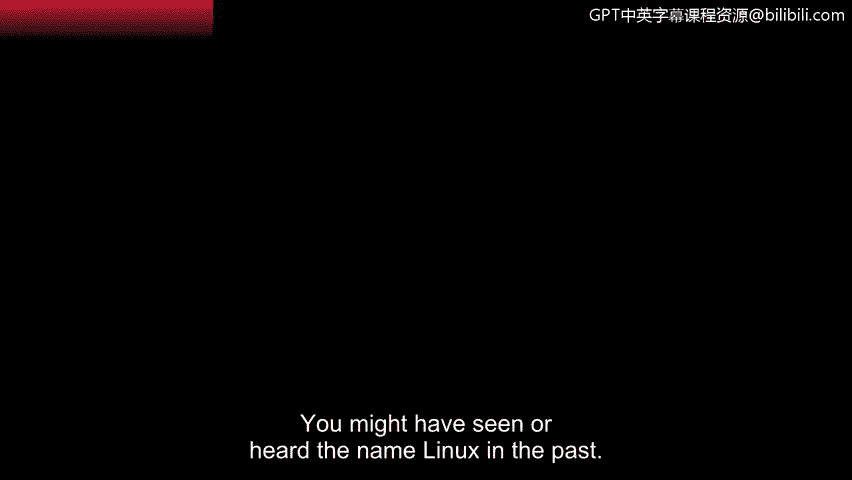

# 053：10_02_Linux简介

在本节课中，我们将要学习Linux操作系统，了解它的历史、独特之处以及在网络安全领域中的核心应用。Linux是当今安全领域最常用的操作系统之一。

## Linux的历史背景

上一节我们提到了Linux的重要性，本节中我们来看看它的起源。Linux是一个开源操作系统，诞生于20世纪90年代初，由两部分组成。

当时有两位不同的人各自进行着改进计算机工程的项目。第一位是**Linus Torvalds**。当时，Unix操作系统已被广泛使用。他希望改进它，使其开源并让任何人都能使用。他的革命性贡献是引入了**Linux内核**。我们稍后会学习内核的作用。

大约在同一时间，**Richard Stallman**开始致力于**GNU**项目。GNU也是一个基于Unix的操作系统。Stallman与Torvalds有着共同的目标，即创建免费且对所有人开放的软件。

在开发GNU数年后，该软件缺少的关键组件就是内核。两人的创新成果结合在一起，共同构成了今天通常所说的**Linux**。

## Linux的独特之处

现在你已经了解了Linux背后的历史，让我们看看是什么让Linux如此独特。

如前所述，Linux是开源的，这意味着任何人都可以访问该操作系统及其源代码。Linux及其附带的许多程序都在**GNU通用公共许可证**的条款下授权，该许可证允许你自由地使用、共享和修改它们。

得益于Linux的开源理念以及强大的功能集，整个开发者社区都采用了这个操作系统。这些开发者能够在项目上进行协作，共同推动计算技术的发展。

作为一名安全分析师，你会发现Linux被不同的组织所使用。更具体地说，Linux被用于许多安全程序中。

Linux的另一个独特之处在于其开发出的不同**发行版**或变体。由于社区的广泛贡献，Linux有超过600个发行版。稍后你将了解更多关于发行版的信息。

## Linux在初级安全岗位中的应用

最后，让我们看看在初级安全岗位上你将如何使用Linux。

作为一名安全分析师，你将在日常工作中使用许多工具和程序。你可能会检查不同类型的日志来识别系统中发生的情况。例如，在调查问题时，你可能会查看错误日志。

你将使用Linux的另一个地方是验证身份与访问管理系统中的访问权限和授权。在安全领域，管理访问权限是确保系统安全的关键。我们稍后将更深入地探讨访问和授权。

最后，作为一名分析师，你可能会发现自己在使用为特定任务设计的发行版。例如，你可能使用一个包含数字取证工具的发行版来调查事件警报中发生了什么。你也可能使用一个用于渗透测试和攻击性安全的发行版来寻找系统中的漏洞。

发行版的创建是为了满足其用户的需求。

## 总结

本节课中我们一起学习了Linux操作系统的历史、其开源和社区驱动的特性，以及它在网络安全工作中的多种应用场景，包括日志分析、访问管理和使用专用发行版进行取证或渗透测试。掌握Linux将是你安全领域一项非常有用的技能。

