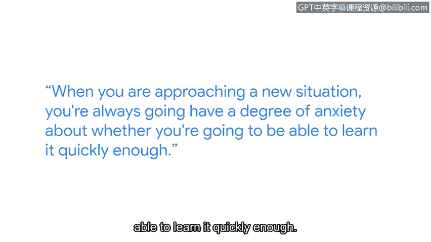

# 054：11_03_网络安全领域的成长与学习

在本节课中，我们将跟随谷歌云的首席信息安全官Phil，了解在快速变化的网络安全领域如何持续学习和成长。我们将探讨从零开始构建知识体系的方法，并理解终身学习在这一行业中的核心重要性。

大家好，我是Phil。我是谷歌云的首席信息安全官，我的工作很大一部分当然与网络安全相关。

在网络安全领域，你必须持续学习，必须紧跟最新发展。根本原因在于技术、商业以及数字生活世界总是在不断变化。你今天使用的在线服务，很可能与仅仅12个月前就已大不相同。

在90年代中期，我参与了世界上最早的网上银行系统之一的工作。本质上，当时我们是在自己构建和编写所有的安全措施。我记得曾参与开发最早的网页浏览器、最早的网页服务器，以及互联网上最早的加密实现。这甚至是在谷歌公司成立之前，处于互联网的萌芽期。我们实际上是在一边摸索、一边构建、一边学习。

当你初次进入网络安全领域时，重要的是不要被其广度吓倒。这是一个非常广阔的领域。我们所有人都曾从你今天所处的位置起步，都必须在某个时间点开始学习。我曾经不懂Linux，不懂如何编程，也不懂其他操作系统的各个部分。我必须一步步学习所有这些是如何运作的，并随着时间的推移逐渐积累起这些知识。

即使是现在，我偶尔也需要查阅资料，因为我无法一次性记住所有东西，这完全没问题。当你面对一个新情境时，总会对是否能足够快地学会它感到一定程度的焦虑。通常，随着经验的积累，你会逐渐确信自己能够做到。但同样重要的是要记住，你不必一次性学会所有东西。

大多数时候，你只需在过程的初始阶段学到足够有价值的知识，然后边做边学。你可以从编写几行简单的代码开始，或者阅读他人的代码并尝试理解其功能，然后稍作修改，逐步深入。建立起这个知识基础，能赋予你学习其他事物的能力。我认为，许多事情都将由此生发。

---

**总结**

本节课中，我们一起学习了网络安全专家Phil分享的行业成长经验。我们认识到，网络安全是一个需要**持续学习**和**知识迭代**的领域，面对庞大的知识体系，关键在于**建立基础**和**循序渐进**。初学者应从简单的实践开始，如编写基础代码或分析现有代码，逐步构建自己的知识框架，并接纳学习过程中查阅资料和阶段性掌握知识的常态。