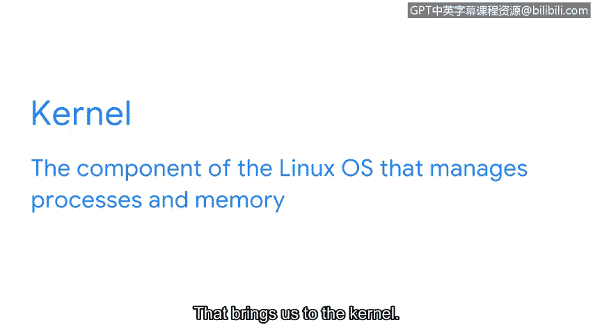

# 055：Linux架构解析

在本节课程中，我们将学习Linux操作系统的核心架构。我们将逐一解析构成Linux系统的各个组件，了解它们如何协同工作，从而帮助你建立对Linux系统更深入的理解。

## 架构概述：从建筑到操作系统

让我从一个看似与安全无关的快速问题开始。你是否有最喜欢的建筑？它的哪个建筑特点最令你印象深刻？是窗户，还是墙体的结构？就像建筑物一样，操作系统也拥有自己的架构，并由相互协作的独立组件构成一个整体。

在本视频中，我们将探讨构成Linux系统的所有组件。

## Linux架构的六大组件

Linux的组件包括：**用户**、**应用程序**、**Shell**、**文件系统层次标准**、**内核**以及**硬件**。别担心，我们将逐一详细讲解这些组件。

### 第一组件：用户

用户是与计算机进行交互的人。在Linux中，你是操作系统架构中的第一个元素。你负责发起操作系统将要执行的任务或命令。

Linux是一个**多用户系统**。这意味着多个用户可以同时使用系统的资源。

### 第二组件：应用程序

系统架构的第二个元素是应用程序。应用程序是执行特定任务的程序，例如文字处理器或计算器。你可能会听到“应用程序”和“程序”这两个词互换使用。

例如，我们稍后将深入学习的一个流行的Linux应用程序是**Nano**。Nano是一个文本编辑器。这个简单的应用程序可以帮助你在屏幕上记录笔记。

Linux应用程序通常通过**包管理器**进行分发。我们将在后续课程中了解更多关于这个过程的内容。

### 第三组件：Shell

Linux架构中的下一个组件是Shell。这是一个重要的元素，因为它是你与系统通信的方式。

Shell是一个**命令行解释器**。它处理命令并输出结果。这听起来可能很熟悉。之前，我们学习了两种类型的用户界面：**图形用户界面**和**命令行界面**。你可以将Shell视为一个命令行界面。

### 第四组件：文件系统层次标准

Linux操作系统架构的另一个元素是**文件系统层次标准**。FHS是Linux操作系统中负责组织数据的组件。

理解FHS的一个简单方法是将其视为一个数据文件柜。FHS是数据在系统中存储的方式。它是一种组织数据的方法，以便在系统访问数据时能够找到它们。

### 第五组件：内核

这引出了我们的下一个组件：内核。内核是Linux操作系统的一个组件，负责管理**进程**和**内存**。

内核与硬件通信，以执行Shell发送的命令。内核使用**驱动程序**来使应用程序能够执行任务。Linux内核有助于确保系统更有效地分配资源，并使系统运行得更快。

### 第六组件：硬件

最后，架构的最后一个组件是硬件。硬件指的是计算机的物理组件。你可以将其与可以下载到系统中的软件应用程序进行比较。

你计算机中的硬件包括**CPU**、**鼠标**和**键盘**等。

## 课程总结

恭喜你，我们现在已经涵盖了Linux的架构。理解这些组件将帮助你越来越熟悉Linux。

😊

