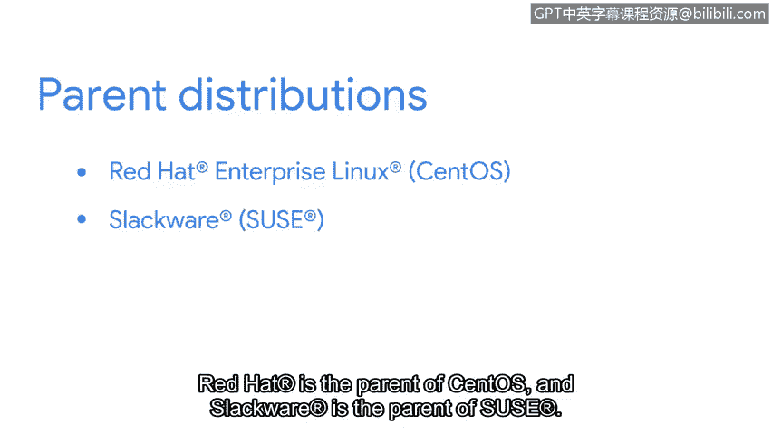

# 056：Linux发行版详解 🐧

在本节课中，我们将深入学习Linux操作系统，并重点了解作为一名安全分析师需要掌握的Linux发行版知识。

Linux是一个高度可定制的操作系统。与其他操作系统不同，Linux有多种版本可供选择。这些不同的Linux版本被称为**发行版**。你可能也听说过它们被称为“distros”或Linux的“风味”。理解你正在使用的发行版至关重要，因为这决定了你可用的工具和应用程序。例如，Debian发行版提供的工具就与Ubuntu发行版不同。

## 理解Linux发行版：一个类比 🚗

为了更清晰地描述Linux发行版，我们可以用一个车辆类比来理解。

首先，我们从它的引擎开始，这相当于Linux的**内核**。正如引擎驱动车辆运行，内核是Linux操作系统最重要的组成部分。因为Linux内核是开源的，任何人都可以获取内核并修改它以构建新的发行版。这好比汽车制造商获取一个引擎，然后创造出不同类型的车辆：卡车、轿车、面包车、敞篷车、公共汽车、飞机等等。

这些不同类型的车辆可以比作不同的Linux发行版。公共汽车用于运输大量人员，卡车用于长距离运输大量货物，飞机则通过空运运送乘客或货物。正如每种车辆都有其特定用途，不同的发行版也因不同原因而被使用。

此外，车辆都有不同的组件来区分彼此。飞机有带按钮和旋钮的控制面板，普通汽车有四个轮胎，而卡车的轮胎可能更多。同样，不同的Linux发行版包含不同的预装程序、用户界面等等。这在很大程度上基于Linux用户的需求，但有些发行版的选择也基于个人偏好，就像有人会选择跑车作为座驾一样。

## Linux发行版的构成与优势 ⚙️

使用Linux作为操作系统的优势在于其可定制性。一个发行版通常包含以下核心部分：
*   **Linux内核**：操作系统的核心。
*   **实用工具**：各种系统工具和命令。
*   **包管理系统**：用于安装、更新和移除软件。
*   **安装程序**：用于将系统部署到计算机上。

我们之前了解到，Linux是开源的，任何人都可以为源代码做出贡献。这正是新发行版被创建的方式。所有发行版都派生自另一个发行版，但有几个被认为是“父发行版”。例如，Red Hat是CentOS的父发行版，Slackware是SUSE的父发行版。而Ubuntu和Kali Linux都派生自Debian。

## 安全分析师常用的发行版 🛡️

上一节我们介绍了发行版的基本概念和构成，本节中我们来看看安全分析师最常用的一些发行版。对这些发行版了解得越深入，你的工作就会越轻松。

以下是几个关键的安全相关发行版：
*   **Kali Linux**：**专门为渗透测试和数字取证设计**。它预装了数百种安全工具，是安全专业人士的首选。
*   **Ubuntu**：**基于Debian，以用户友好和社区支持强大著称**。它拥有庞大的软件库，适合作为通用操作系统，也常被用作安全工作的基础平台。
*   **Red Hat Enterprise Linux (RHEL) / CentOS**：**在企业环境中极为流行，以稳定性和安全性著称**。RHEL是商业版本，而CentOS（社区企业操作系统）是其免费的开源克隆版，常用于服务器和安全应用。

## 总结 📝

本节课中我们一起学习了Linux发行版的核心知识。我们了解到Linux发行版是包含内核、工具和包管理系统的不同操作系统版本，其开源特性带来了高度的可定制性。通过车辆类比，我们理解了不同发行版各有侧重。最后，我们认识了Kali Linux、Ubuntu和RHEL/CentOS等安全分析师常用的发行版，理解它们的特点有助于我们根据任务需求选择合适的工具环境。