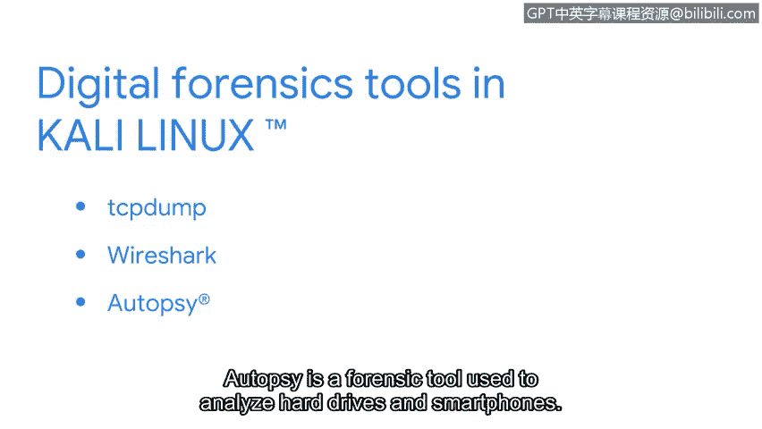

# 057：14_02_kali-linux-tm.en_subtitled


在本节课程中，我们将介绍一个在安全领域广泛使用的Linux发行版——Kali Linux。我们将探讨它的起源、设计目的以及它为安全专业人员提供的核心工具。

## 🐧 Kali Linux简介

Kali Linux是Offensive Security公司的注册商标，它基于Debian系统开发。这个开源发行版是专门为渗透测试和数字取证而设计的。

## 💻 使用建议：虚拟机环境

Kali Linux应运行在虚拟机中。这可以防止因工具使用不当而对你的主系统造成损害。使用虚拟机的另一个好处是，你可以随时将系统状态回滚到之前的快照，这为学习和测试提供了极大的便利。

## 🔍 Kali Linux在渗透测试中的应用

随着安全专业人员职业发展，部分人会专攻渗透测试领域。渗透测试是一种模拟攻击，旨在帮助识别系统、网络、网站、应用程序和流程中的漏洞。Kali Linux内置了大量在渗透测试中有用的工具。

以下是几个核心工具的例子：

*   **Metasploit**：用于发现并利用计算机系统中的漏洞。
*   **Burp Suite**：用于测试Web应用程序弱点的工具。
*   **John the Ripper**：一款用于密码破解的工具。

## 🕵️ Kali Linux在数字取证中的应用

作为一名安全分析师，你的工作可能涉及数字取证。数字取证是收集和分析数据以确定攻击发生后情况的实践。例如，你可能需要调查与网络活动相关的数据。

Kali Linux对于从事数字取证工作的安全专业人员同样非常有用，它包含了大量可用于此目的的工具。

以下是几个相关工具的例子：

*   **Tcpdump**：一个命令行数据包分析器，用于捕获网络流量。
    ```bash
    tcpdump -i eth0
    ```
*   **Wireshark**：安全领域常用的工具，它拥有图形用户界面，可用于分析实时和已捕获的网络流量。
*   **Autopsy**：一个用于分析硬盘驱动器和智能手机的取证工具。




## 📚 本节总结

以上仅仅是Kali Linux所包含工具的几个例子。这个发行版拥有许多用于进行渗透测试和数字取证的强大工具。

我们已经探讨了Kali Linux为何是安全领域一个重要且广泛使用的发行版。当然，安全专业人员也会使用其他发行版。在接下来的内容中，我们将继续探索更多相关的Linux发行版。