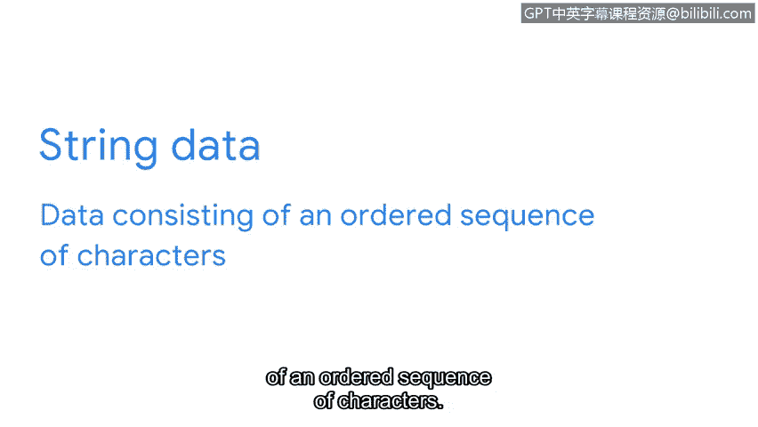
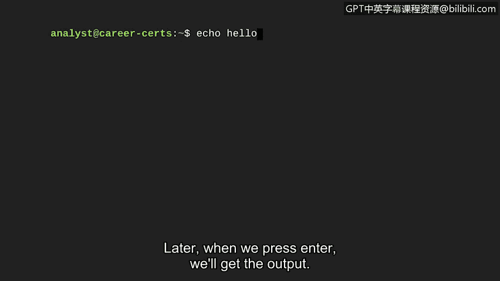
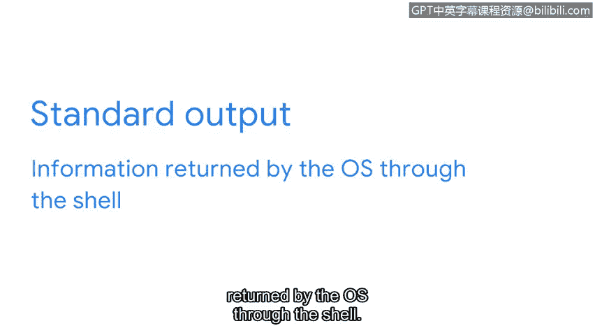
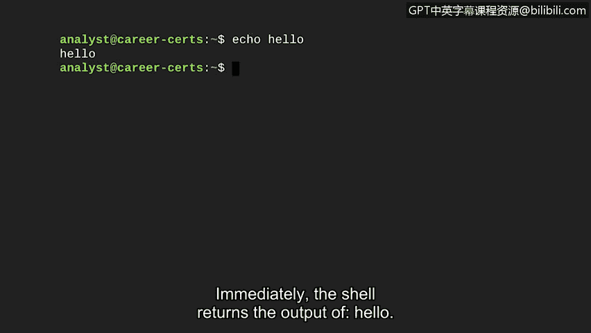
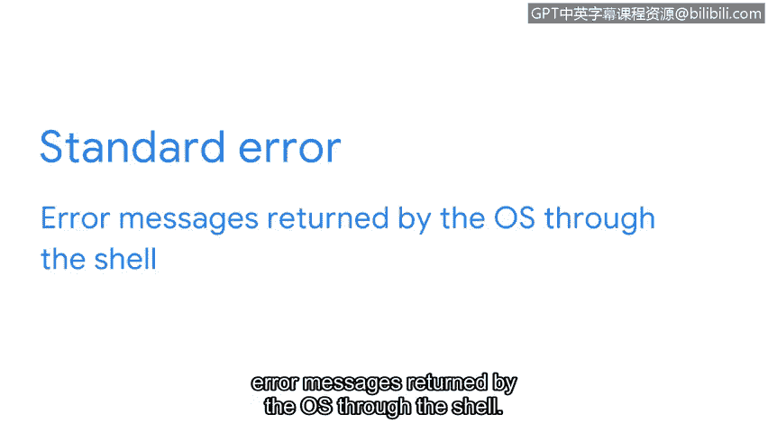
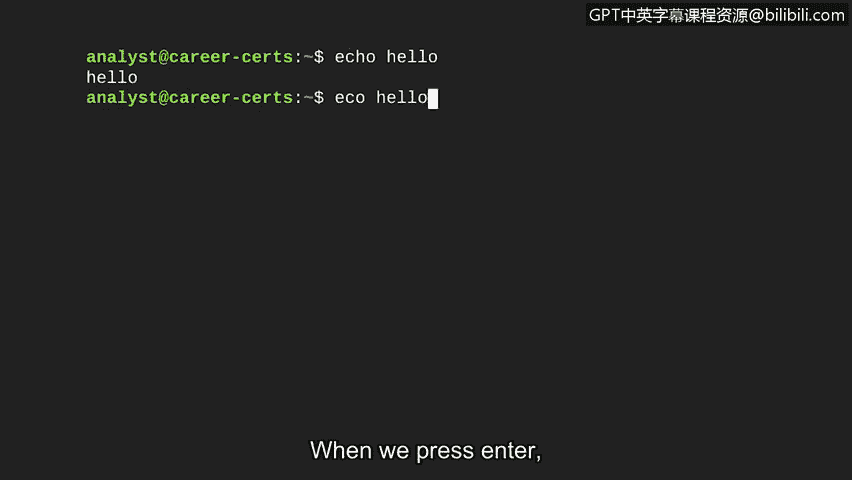

# 059：Shell中的输入与输出


在本节中，我们将学习如何与Shell进行通信，理解标准输入、标准输出和标准错误这三个核心概念。掌握这些是有效使用命令行工具的基础。

## 概述

与计算机交互就像与朋友对话。你提出问题（输入），朋友给出回答（输出），或者表示无法回答（错误）。在Shell中，这个过程通过标准输入、标准输出和标准错误来实现。本节我们将逐一探讨它们。

## 标准输入：向Shell发出指令

上一节我们介绍了Shell的基本概念，本节中我们来看看如何向它发送指令。标准输入是指操作系统通过命令行接收的信息。这就像在对话中向朋友提问。

信息从你的键盘输入到Shell。如果Shell能够理解你的请求，它会向内核申请执行相关任务所需的资源。

以下是一个简单的例子，我们使用 `echo` 命令。`echo` 是一个Linux命令，用于输出指定的文本字符串。字符串数据是由有序字符序列组成的数据。

在我们的例子中，我们将让它输出字符串“Hello”。因此，作为输入，我们将在Shell中键入：



```bash
echo Hello
```

## 标准输出：接收系统的回应

在按下回车键执行上述命令之前，让我们先详细讨论输出的概念。标准输出是操作系统通过Shell返回的信息。





就像朋友回答你的问题一样，输出是计算机对你输入命令的响应。输出就是你接收到的结果。

现在，让我们继续之前的例子，按下回车键将 `echo Hello` 这个输入发送给操作系统。

```bash
$ echo Hello
Hello
```

立即，Shell返回了“Hello”这个输出。

## 标准错误：当系统无法回应时





最后，标准错误包含操作系统通过Shell返回的错误消息。就像你的朋友可能表示无法回答问题一样，如果系统无法响应你的命令，它会返回一条错误消息。

有时，这可能是因为我们拼错了命令，或者系统不知道如何响应该命令。其他时候，可能是因为我们没有执行命令的适当权限。

我们将探索另一个演示标准错误的例子。让我们在Shell中输入 `eccho Hello`。请注意，我故意将 `echo` 拼写为 `eccho`。

```bash
$ eccho Hello
bash: eccho: command not found
```



当我们按下回车键时，出现了一条错误消息，指出找不到该命令。

## 总结

本节课中我们一起学习了与Shell通信的基础知识。与Shell的通信只能通过以下三种方式进行：
*   **输入**：系统接收命令。
*   **输出**：系统响应命令并产生结果。
*   **错误**：系统不知道如何响应，导致错误。

随着我们后续探索对安全专业人员有用的命令，你会对这些概念更加熟悉。