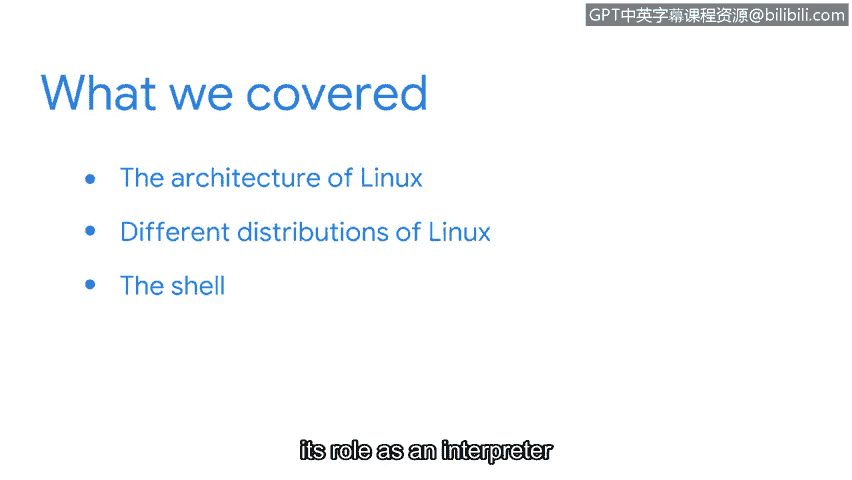

# 060：17_01_wrap-up.en_subtitled

## 概述 📋
在本节课程中，我们完成了对Linux操作系统基础知识的探索。现在，让我们一起来回顾一下本节的核心内容。

## 本节内容回顾 🔄
我们已经到达本节的结尾。出色的工作。让我们回顾一下你刚刚完成的学习内容。

在本节中，你学习了关于Linux操作系统的知识。

## Linux架构与发行版 🏗️
在探索Linux的不同发行版时，我们研究了Linux的架构。

我们讨论了在安全领域中最广泛使用的一些发行版。你接触到了Kali Linux、Ubuntu、Parrot、Red Hat和SUSE发行版。

## Shell及其角色 🐚
最后，你学习了Shell及其作为用户与操作系统之间**解释器**的角色。Shell的核心功能可以用以下概念描述：
*   **解释器**：接收用户命令，将其翻译成系统内核能理解的指令。

## 总结与展望 🎯
恭喜你。你做得很好。我们还有更多有用的主题即将到来。

在课程的下一部分，你将学习作为安全分析师工作时，在Shell中使用的具体命令。

让我们继续前进。

