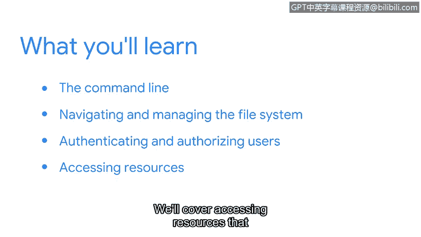

# 061：18_01_welcome-to-week-3

## 概述

在本节课中，我们将要学习如何通过命令行与Linux操作系统进行交互。你将掌握在Shell中输入命令的方法，并了解一些作为安全分析师将要用到的核心Linux命令。具体内容包括文件系统的导航与管理，以及用户的认证与授权。最后，我们还会介绍如何获取资源以支持你学习更多新的Linux命令。

## 学习新沟通方式的感受

学习一种新的沟通方式会令人兴奋。你可能学习过一门新语言，并记得这种感觉。或许我们许多人都能体会到小孩子在扩展词汇量时的这种兴奋感。包括我在内的其他人，则记得当我们第一次使用一门专门的语言与计算机交流时，那种奇妙的感觉。

上一节我们介绍了Linux的基础，本节中我们来看看如何通过其Shell与操作系统进行更深入的交流。

## 使用命令行与操作系统交互

你将利用命令行与操作系统进行通信。你将学习如何在Shell中输入命令，并了解一些作为安全分析师将要用到的核心Linux命令。

以下是本节将重点学习的两个核心领域：

*   **文件系统导航与管理**：你将学习如何浏览和操作Linux文件系统中的文件和目录。
*   **用户认证与授权**：这意味着你将能够使用命令行在系统中添加和删除用户，并控制他们能访问哪些资源。

## 持续学习与资源获取

最后，学习永无止境，因此我们将介绍如何获取资源来支持你学习新的Linux命令。

## 个人经验分享

我记得当我第一次了解命令行时，对其提供的强大功能感到震惊。我不再需要通过点击多个屏幕来完成工作。尽管需要一些练习和时间来适应，但它一直是我手中最重要的工具之一。

## 总结

本节课中，我们一起学习了如何通过命令行与Linux系统交互，涵盖了文件管理、用户权限等核心操作。完成本节后，你将获得在使用Linux命令进行安全分析工作这一重要领域的实践经验。