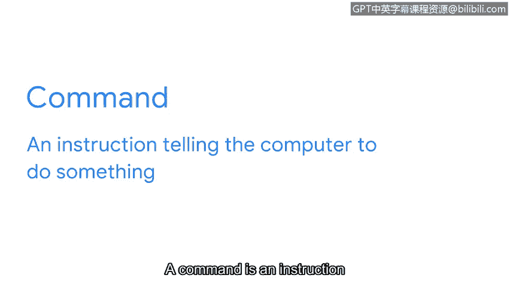
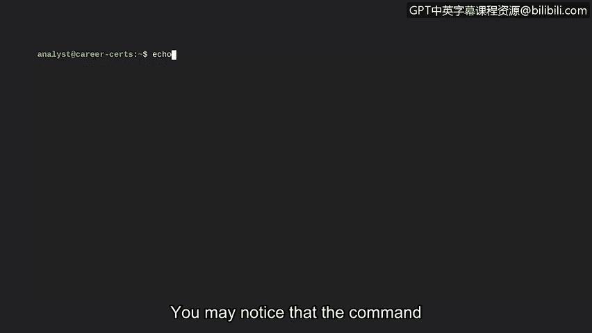
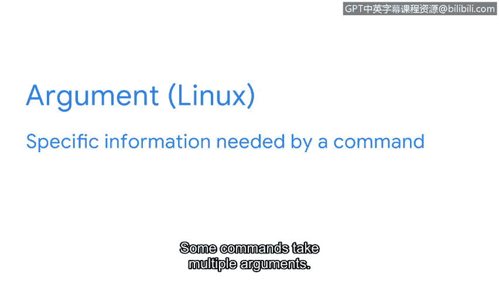
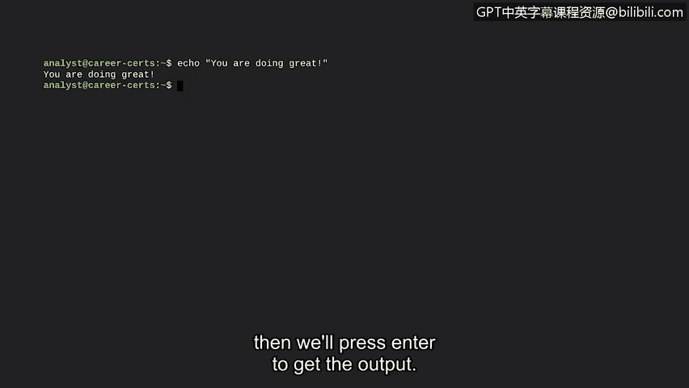

# 062：19_02_linux-commands-via-the-bash-shell

在本节课中，我们将要学习如何通过Bash shell与Linux操作系统进行通信的基础知识。掌握Linux命令是每位安全专业人员必备的核心技能。我们将从命令和参数的基本概念开始，为后续学习具体命令打下基础。

上一节我们介绍了Linux的架构和Shell的作用，本节中我们来看看如何通过Bash shell输入命令与系统交互。

## 命令行的重要性

能够使用Linux命令是所有安全专业人员的基础技能。作为一名安全分析师，您需要处理服务器日志，并且需要知道如何在没有图形用户界面的情况下远程导航、管理和分析文件。此外，您还需要知道如何在组访问期间验证配置的用户，以及授予授权和设置文件权限。这意味着，培养命令行技能对于您作为安全分析师的工作至关重要。

## 认识Bash Shell

当我们学习Linux架构时，我们了解到Shell是操作系统的主要组件之一。我们也了解到存在不同的Shell。在本节中，我们将使用Bash。Bash是大多数Linux发行版中的默认Shell。您将在本节中学到的主要Linux命令在大多数Shell中都是通用的。

## 命令与参数基础

现在您知道了将要使用的Shell，让我们深入了解如何在Bash中编写命令。正如我们在上一节中讨论的，与操作系统通信就像一场对话。您输入命令，操作系统则用命令的答案来回应。

一个命令是告诉计算机执行某项操作的指令。我们将在Bash中尝试一个命令。请注意光标前的美元符号。这是提示您输入新命令的提示符。

有些命令可能告诉计算机查找某些内容，例如特定文件。

其他命令可能告诉它启动一个程序，或者输出特定的文本字符串。在上一节中，当我们讨论输入和输出时，我们探讨了`echo`命令是如何做到这一点的。让我们再次输入`echo`命令。

您可能注意到，我们刚刚输入的命令并不完整。如果我们想使用`echo`命令输出特定的文本字符串，我们需要指定该文本字符串是什么。这就是参数的作用。

**参数**是命令所需的特定信息。有些命令接受多个参数。现在，让我们用一个参数来完成`echo`命令。

我们正在学习一些相当技术性的东西，那么让我们输出“you are doing great”这句话。我们将添加这个参数，然后按回车键获取输出。

在这个例子中，我们的参数是一个文本字符串。参数也可以提供其他类型的信息。

在Linux中，非常重要的一点是，所有命令和参数都是**区分大小写**的。这包括文件和目录名。在您作为安全分析师学习如何在日常任务中使用Linux时，请牢记这一点。

## 总结

本节课中我们一起学习了通过Bash shell与Linux系统交互的基础。我们了解了命令行对安全分析师工作的重要性，认识了Bash作为默认Shell的角色，并掌握了命令和参数的基本概念，特别是区分大小写的特性。现在我们已经掌握了通过Shell输入Linux命令和参数的基础知识，为学习具体命令做好了准备。