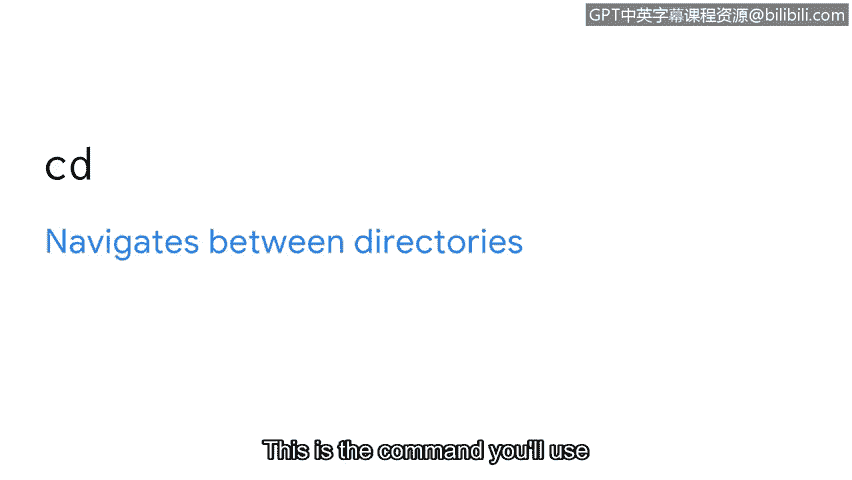
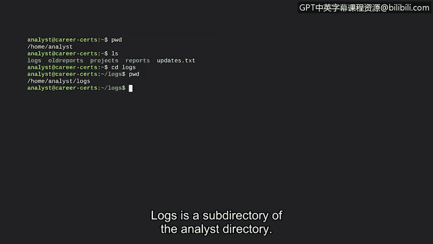
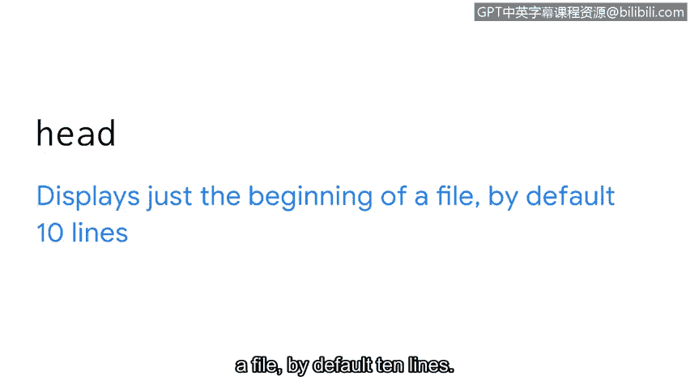
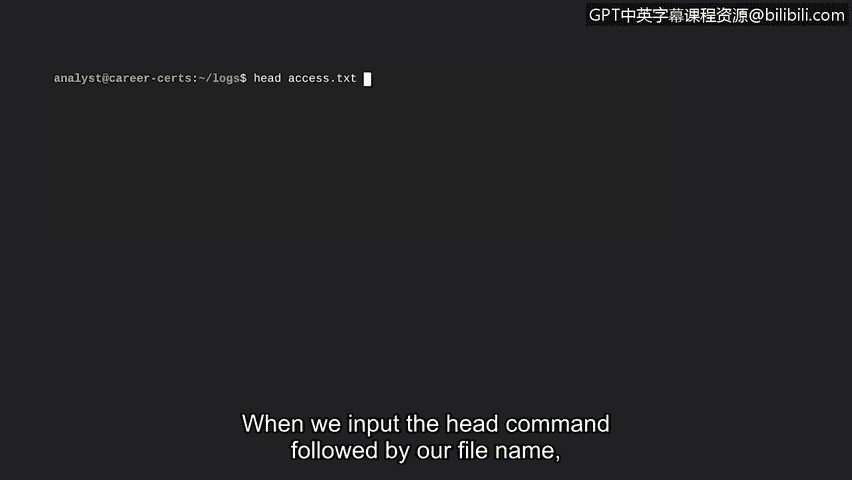

# 063：核心导航与文件读取命令

欢迎回来。希望你在学习如何与Linux操作系统沟通方面收获颇丰。

在我们继续探索Linux命令行的旅程中，本节将重点学习如何在Linux文件系统中导航。现在，请想象一棵树。你首先注意到树的哪个部分？是树干还是树枝？这些部分确实引人注目，但它的树根呢？一棵树的一切都始于树根。当我们思考Linux文件系统时，情况也类似。

上一节我们介绍了Linux架构的组成部分。文件系统层次结构标准是Linux操作系统的一个组件，用于组织数据。这个文件系统是Linux中非常重要的一部分，因为我们在Linux中所做的一切，在系统的某个目录中都被视为一个文件。

FHS是一个层次化系统。就像一棵树一样，所有内容都从根目录生长和分支出来。根目录是Linux中的最高级别目录，用一个正斜杠 `/` 表示。子目录从根目录分支出来。这些子目录会进一步分支，离根目录越来越远。

在描述Linux的目录结构时，当沿着这些分支回溯到根目录时，会使用斜杠。例如，路径 `/home/anna/` 中，第一个斜杠表示根目录。然后它分支到 `home` 子目录。另一个斜杠表示它再次分支，这次是分支到位于 `home` 内的 `anna` 子目录。

从事安全工作时，学习导航文件系统以定位和分析日志至关重要。你将分析这些日志文件，以了解应用程序使用情况和身份验证情况。

有了这些背景知识，我们现在可以学习用于导航文件系统的常用命令了。

以下是三个核心导航命令：

*   **`pwd`**：将当前工作目录打印到屏幕上。使用此命令时，输出会告诉你当前位于哪个目录。
*   **`ls`**：显示当前工作目录中的文件和目录名称。
*   **`cd`**：在目录之间导航。当你想更改目录时，就会使用这个命令。

让我们在Bash中使用这些命令。首先，我们输入命令 `pwd` 以显示当前位置，然后按回车键。输出是 `analyst` 目录的路径，这是我们当前的工作目录。

接下来，我们输入 `ls` 以显示 `analyst` 目录内的文件和目录。输出是四个目录的名称：`logs`、`old_reports`、`projects` 和 `reports`，以及一个名为 `updates.txt` 的文件。

假设我们现在想进入 `logs` 目录以检查是否存在未授权访问。我们将输入 `cd logs` 来更改目录。`cd` 命令不会在屏幕上产生任何输出。但如果我们再次输入 `pwd`，其输出会显示当前工作目录是 `logs`，它是 `analyst` 目录的一个子目录。

作为一名安全分析师，你还需要知道如何在Linux中读取文件内容。例如，你可能需要读取包含配置设置的文件以识别潜在漏洞，或者在调查未授权访问时查看用户访问报告。

在读取文件内容时，有一些命令会对你有所帮助。

以下是两个核心文件读取命令：

*   **`cat`**：显示文件的全部内容。这个命令很有用，但有时你并不想查看一个大文件的全部内容。
*   **`head`**：在这种情况下，你可以使用 `head` 命令。它默认只显示文件的开头10行。

让我们试试这些命令。假设我们想读取 `access.log.txt` 文件的内容，并且我们已经位于该文件所在的工作目录中。首先，我们输入 `cat` 命令，然后跟上文件名 `access.log.txt`。

Bash返回了这个文件的完整内容。让我们将其与 `head` 命令进行比较。当我们输入 `head` 命令并跟上文件名时，只显示该文件的前10行。

本节内容非常充实，而这仅仅是个开始。很高兴你学习了安全分析师如何使用基本命令来导航系统。接下来，我们将探索如何管理系统。😊

**总结**

在本节课中，我们一起学习了Linux文件系统导航和文件内容读取的核心命令。我们首先了解了Linux文件系统层次结构标准，它像一棵树一样从根目录 `/` 开始组织。然后，我们实践了三个导航命令：`pwd`（查看当前位置）、`ls`（列出当前目录内容）和 `cd`（切换目录）。最后，我们学习了两个读取文件的命令：`cat`（显示文件全部内容）和 `head`（显示文件开头部分）。掌握这些命令是进行日志分析、配置检查和系统管理的基础。