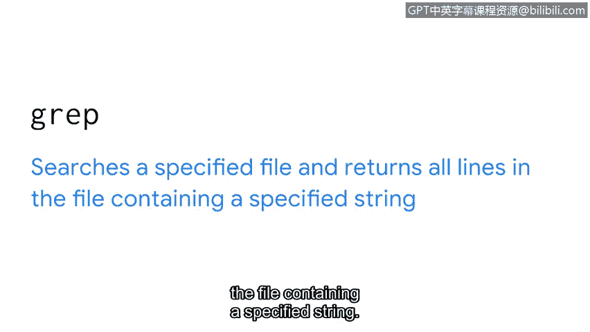
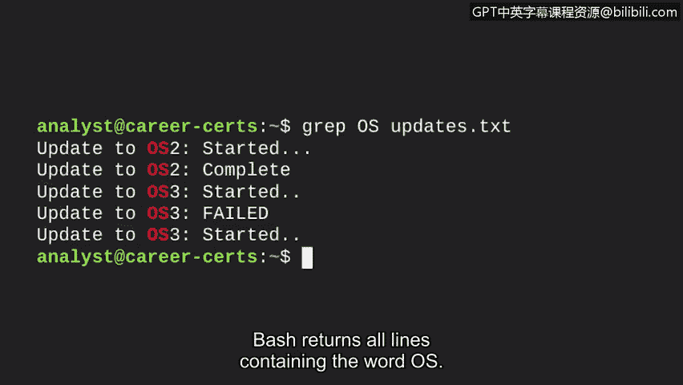
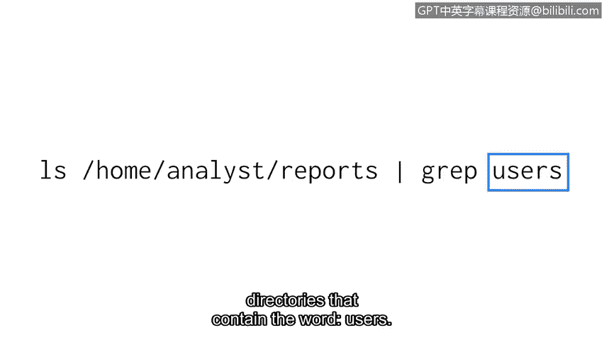

# 064：在Linux中查找所需内容 🔍


在本节课中，我们将学习如何在Linux文件系统中查找所需的信息。作为安全分析师，过滤信息是解决复杂问题的关键技能。我们将重点介绍两个强大的工具：`grep`命令和管道（`|`）操作符，它们能帮助您高效地搜索和筛选数据。

## 使用 `grep` 命令进行搜索

上一节我们介绍了`pwd`、`ls`和`cd`等基本导航命令。本节中，我们来看看如何使用`grep`命令在文件中搜索特定字符串。

`grep`命令用于搜索指定文件，并返回包含指定字符串的所有行。其基本语法是一个命令后跟两个参数。

以下是`grep`命令的基本语法：



```bash
grep [搜索字符串] [文件名]
```

*   第一个参数是您要搜索的字符串。
*   第二个参数是您要搜索的文件名。

例如，假设我们有一个名为`updates.txt`的文件，我们需要在其中查找所有包含单词“OS”的行。如果文件很大，人工逐行扫描将非常耗时。我们可以使用以下命令：

```bash
grep OS updates.txt
```

执行此命令后，Bash将返回`updates.txt`文件中所有包含“OS”的行。



## 使用管道进行过滤

了解了如何在单个文件中搜索后，我们来看看如何将多个命令组合起来，对命令的输出结果进行过滤。这就需要用到管道。

管道命令（`|`）将一个命令的标准输出作为另一个命令的标准输入进行进一步处理。它由竖线字符（`|`）表示，可以想象成一根物理管道：数据从一端进入，经过处理，从另一端流出。

在过滤上下文中，`grep`命令可以接在管道之后，用于筛选前一个命令的输出。

例如，以下命令组合：

```bash
ls /home/reports | grep users
```

*   第一部分 `ls /home/reports` 指示操作系统列出`reports`子目录中的所有文件和目录。
*   管道符 `|` 将这个列表输出传递给下一个命令，而不是直接显示在屏幕上。
*   第二部分 `grep users` 则在接收到的列表（即`reports`目录的内容）中搜索包含字符串“users”的项目。

最终，该命令将只返回`reports`目录中名称包含“users”的文件和目录。

## 实践示例

为了更好地理解过滤的工作原理，让我们在Bash中探索一个例子。

首先，我们输出`reports`目录中的所有内容。如果我们已在该目录中，只需输入`ls`。但假设我们不在，则需要指定路径：



```bash
ls /home/reports
```

按回车后，输出显示`reports`目录中有七个文件。

现在，我们只想返回包含单词“users”的文件。我们将结合使用`ls`命令、管道和`grep`命令：

```bash
ls /home/reports | grep users
```


如输出所示，Linux现在只返回包含“users”字符串的文件。不包含此字符串的两个文件不再出现。

## 总结


本节课中我们一起学习了在Linux中进行信息过滤的两种核心方法。您掌握了使用 **`grep`** 命令在文件中直接搜索特定字符串，以及通过 **管道（`|`）** 将一个命令的输出作为另一个命令（如`grep`）的输入进行链式处理和筛选。这些技能是安全分析师高效处理日志、配置文件和各种系统数据的基础。接下来，让我们继续探索Linux命令行的更多功能。