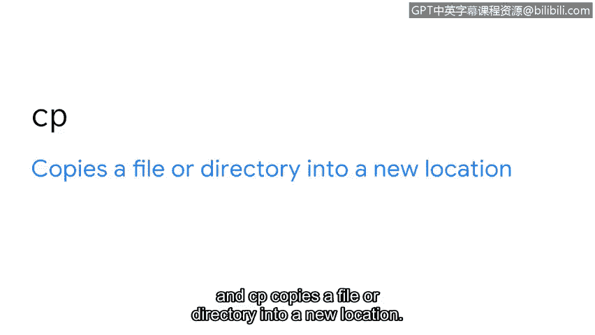
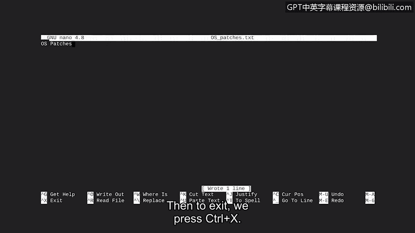

# 065：创建与修改目录和文件 📁


在本节课中，我们将学习如何在Linux系统中创建、修改、删除、移动和复制目录与文件。这些是组织和管理数据的基础技能，对于网络安全工作至关重要。

---

上一节我们讨论了目录导航，本节中我们来看看如何构建和修改目录结构。

让我们创建一些“分支”。这是什么意思呢？在之前的视频中，我们讨论了根目录以及其他子目录如何从根目录分支出来。让我们再次将文件目录系统想象成一棵树。子目录就是树的枝干。它们都从同一个根连接，但可以生长成一个复杂的结构。在本视频中，我们将创建目录和文件，并学习如何修改它们。

在安全领域处理数据时，组织是关键。如果我们知道信息的位置，就更容易发现问题并确保信息安全。

---

## 管理目录和文件的基本命令

以下是用于管理目录和文件的一些基本Linux命令。

首先，我们来看创建和删除目录的命令：
*   **`mkdir`** 命令用于创建新目录。
*   **`rmdir`** 命令用于移除或删除目录。这个命令的一个有用特性是它内置了警告功能，当目录非空时会提示你，这可以防止你意外删除文件。

接下来，是用于创建和删除文件的命令：
*   **`touch`** 命令用于创建新文件。
*   **`rm`** 命令用于移除或删除文件。



最后，是用于复制和移动文件或目录的命令：
*   **`mv`** 命令将文件或目录移动到新位置。
*   **`cp`** 命令将文件或目录复制到新位置。

---

## 实践操作

现在，我们准备好尝试这些命令了。

首先，我们使用 `pwd` 命令确认当前目录。然后，使用 `ls` 命令显示 `analyst` 目录中的文件和目录名称。

假设我们不再需要文件列表中出现的 `old_reports` 目录。我们来看看如何删除它。我们输入 `rmdir` 命令，后面跟上要删除的目录名 `old_reports`。我们可以使用 `ls` 命令来确认 `old_reports` 已被删除，不再出现在内容列表中。

现在，让我们做另一个更改。我们需要一个用于存放报告草稿的新目录。因此，我们需要使用 `mkdir` 命令，并为此目录指定一个名称 `drafts`。如果我们再次输入 `ls`，会注意到新的 `drafts` 目录已包含在 `analyst` 目录的内容中。

让我们通过输入 `cd drafts` 进入这个新目录。如果运行 `ls`，它不会返回任何输出，表明此目录当前为空。但接下来，我们将向其中添加一些文件。

假设我们需要起草关于最近安装的电子邮件和操作系统补丁的新报告。要创建这些文件，我们输入：
```bash
touch email_patches.txt
```
然后输入：
```bash
touch os_patches.txt
```
运行 `ls` 表明这些文件现在已在 `drafts` 目录中。

如果我们意识到只需要一份关于操作系统补丁的新报告，并想删除 `email_patches` 报告，该怎么做？为此，我们输入 `rm` 命令，并指定要删除的文件为 `email_patches.txt`。运行 `ls` 确认它已被删除。

---

## 移动与复制

现在，让我们专注于移动和复制命令。

我们意识到，在 `reports` 文件夹中有一个名为 `email_policy.txt` 的文件目前是草稿格式。因此，我们想把它移动到新创建的 `drafts` 文件夹中。为此，我们需要切换到当前包含该文件的目录。在该目录中运行 `ls` 显示它包含多个文件，其中包括 `email_policy.txt`。

然后，要移动该文件，我们输入 `mv` 命令，后跟两个参数。`mv` 后的第一个参数标识要移动的文件。第二个参数指示移动的目标位置。
```bash
mv email_policy.txt ../drafts/
```
如果我们切换到 `drafts` 目录并显示其内容，会注意到 `email_policy.txt` 文件已被移动到此目录。我们切换回 `reports` 目录，显示文件内容确认 `email_policy` 已不在那里。

还有一件事。`vulnerabilities.txt` 是一个我们希望保留在 `reports` 目录中的文件，但由于它影响一个即将进行的项目，我们也想将其复制到 `projects` 目录中。由于我们已经在包含此文件的目录中，我们将使用 `cp` 命令将其复制到 `projects` 目录。
```bash
cp vulnerabilities.txt ../projects/
```
请注意，第一个参数指示要复制哪个文件，第二个参数提供要复制到的目录路径。当我们按下回车键时，这会将 `vulnerabilities.txt` 文件复制到 `projects` 目录，同时将原始文件保留在 `reports` 中。

---

## 使用文件编辑器

除了使用命令，你还可以使用应用程序来帮助你编辑文件。作为安全分析师，文件编辑器对于日常任务（如编写或编辑报告）通常是必需的。一个流行的文件编辑器是 **Nano**，它非常适合初学者。你可以通过 `nano` 命令访问此工具。

让我们一起来熟悉一下 Nano。我们将为新的草稿报告 `os_patches.txt` 添加一个标题。首先，我们切换到包含该文件的目录。然后，我们输入 `nano`，后跟要编辑的文件名 `os_patches.txt`。这将打开Nano文件编辑器并载入该文件。

现在，我们只需在编辑器中键入标题“OS Patches”。在返回命令行之前，我们需要保存它。为此，我们按 `Ctrl + O`，然后按回车键以当前文件名保存。接着，要退出，我们按 `Ctrl + X`。

---



## 总结


本节课中我们一起学习了从创建和删除目录及文件，到复制、移动它们，以及最后使用Nano编辑文件。你现在已经很好地掌握了学习Linux命令的道路。