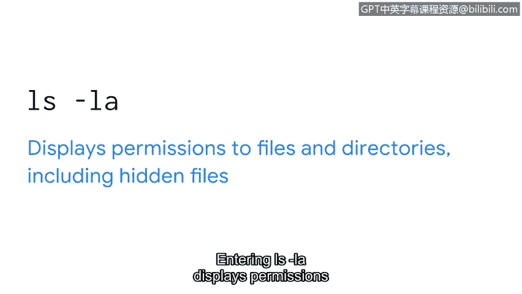
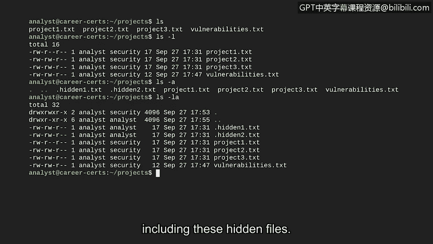

# 066：文件权限与所有权

## 概述
在本节课中，我们将学习Linux系统中的文件和目录权限。我们将了解Linux如何表示权限，以及如何检查与文件和目录关联的访问权限。理解权限对于保护敏感信息和维护系统安全至关重要。

## 权限与授权
上一节我们介绍了Linux的基本操作，本节中我们来看看如何控制对文件和目录的访问。权限是授予文件或目录的访问类型。权限与授权相关。授权是授予对系统中特定资源访问权限的概念。授权允许您限制对指定文件或目录的访问。

遵循“按需知密”原则是良好的实践。可以想象，如果任何人都能访问或修改系统上的任何内容，将会带来多大的安全风险。

## Linux中的权限类型
在Linux中，授权用户可以拥有三种类型的权限。

以下是三种基本权限类型：
*   **读取权限**：对于文件，读取权限意味着可以读取文件的内容。对于目录，此权限意味着您可以读取该目录中的所有文件。
*   **写入权限**：对于文件，写入权限允许修改文件内容。对于目录，写入权限表示可以在该目录中创建新文件。
*   **执行权限**：对于文件，执行权限意味着如果它是可执行文件，则可以运行该文件。对于目录，执行权限允许用户进入该目录并访问其文件。

## 权限的所有者类型
权限被授予三种不同的所有者类型。

以下是三种所有者类型：
*   **用户**：用户是文件的所有者。当您创建一个文件时，您就成为该文件的所有者，但所有权可以被更改。
*   **组**：每个用户都属于某个特定的组。一个组由多个用户组成，这是管理多用户环境的一种方式。
*   **其他**：“其他”可以视为系统上的所有其他用户。基本上，任何其他可以访问系统的人都属于此组。

## 权限的表示方法
在Linux中，文件权限用一个10个字符的字符串表示。对于一个用户、组和其他都拥有完全权限的目录，该字符串为：`drwxrwxrwx`。

让我们更仔细地分析其含义：
*   第一个字符表示文件类型。在此示例中，`d` 表示它是一个目录。如果此字符是连字符 `-`，则表示它是一个常规文件。
*   第二、三、四个字符表示用户的权限。在此示例中，`r` 表示用户拥有读取权限，`w` 表示写入权限，`x` 表示执行权限。如果缺少某项权限，则用连字符 `-` 代替该字母。
*   第五、六、七个字符以相同的方式表示下一个所有者类型“组”的权限。如图所示，组也拥有读、写和执行权限。没有连字符表示所有这些权限都已授予。
*   第八到第十个字符表示最后一个所有者类型“其他”的权限。在此示例中，他们也拥有读、写和执行权限。

## 权限设置的重要性
确保文件和目录设置了适当的访问权限对于保护敏感文件和维护系统的整体安全至关重要。

例如，薪资部门处理敏感信息。如果薪资组之外的人可以读取此文件，这将引发隐私问题。另一个例子是当用户、组和其他都可以写入一个文件时。此类文件被视为**全局可写文件**。全局可写文件可能带来重大的安全风险。

## 如何检查权限
那么，我们如何检查权限呢？首先，我们需要理解什么是选项。选项用于修改命令的行为。我们命令的选项可以是单个字母或完整的单词。

检查权限涉及向 `ls` 命令添加选项。

以下是用于检查权限的常用 `ls` 命令选项：
*   `ls -l`：显示文件和目录的权限。
*   您可能还想显示隐藏文件并查看其权限。隐藏文件在其名称前以句点 `.` 开头，通常在使用 `ls` 显示文件内容时不会出现。输入 `ls -a` 可以显示隐藏文件。
*   然后，您可以组合这些选项来同时实现两个功能。输入 `ls -la` 可以显示文件和目录（包括隐藏文件）的权限。

## 实践操作
让我们进入Bash环境尝试这些选项。目前，我们在 `project` 子目录中。

首先，使用 `ls` 命令显示其内容。输出显示此目录中的文件，但我们不知道它们的任何权限信息。

通过使用 `ls -l` 代替，我们获得了这些文件的扩展信息。文件名现在显示在每行的右侧。每行的第一个信息片段以我们之前讨论的格式显示权限。由于这些都是文件而不是目录，请注意第一个字符是连字符 `-`。

让我们关注一个特定的文件 `project1.txt`。其权限的第二到第四个字符显示用户拥有读取和写入权限，但缺少执行权限（`rw-`）。在第五到第七个字符以及第八到第十个字符中，序列是 `r--`。这意味着组和其他只有读取权限。

在权限之后，`ls -l` 首先显示一个用户名（这里是 `analyst`），接着是组名（在我们的例子中是 `security` 组）。

现在让我们使用 `ls -a`。输出中包含了另外两个文件：名为 `.hidden1.txt` 和 `.hidden2.txt` 的隐藏文件。

最后，我们也可以使用 `ls -la` 来显示所有文件（包括这些隐藏文件）的权限。

## 总结
本节课中，我们一起学习了Linux中的文件权限与所有权。我们了解了三种基本权限（读、写、执行）和三种所有者类型（用户、组、其他），并学会了如何使用 `ls -l`、`ls -a` 和 `ls -la` 命令来检查权限。监控和设置正确的权限对于保护信息安全至关重要，这些知识将在安全工作中为您提供帮助。