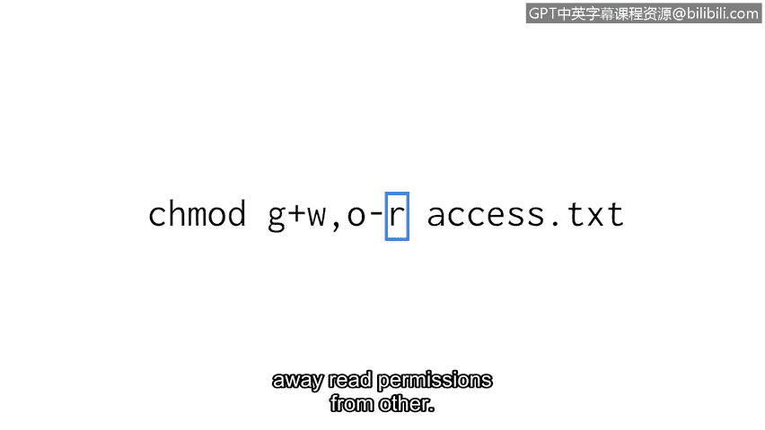
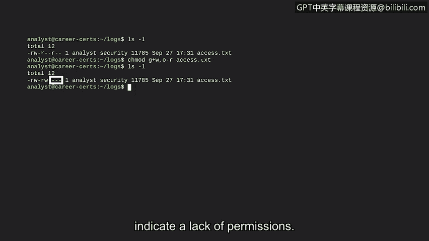

# 067：修改权限


## 概述
在本节课中，我们将要学习如何使用 `chmod` 命令来修改文件和目录的权限。这是保护系统文件不被意外或故意更改或删除的关键操作。

在上一节我们介绍了如何检查用户的权限，本节中我们来看看如何更改这些权限。

作为一名安全分析师，可能需要出于多种原因更改用户的权限。例如，用户可能更换了部门或被分配到不同的工作组，或者用户可能不再参与需要特定权限的项目。这些更改对于保护系统文件至关重要。

## 了解 `chmod` 命令
`chmod` 命令用于更改文件和目录的权限。该命令的名称是“Change mode”的缩写。更改权限有两种模式，但我们将重点介绍符号模式。

学习 `chmod` 工作原理的最佳方式是通过一个示例。虽然细节较多，但我们可以逐步分解。请记住，与许多 Linux 命令一样，您无需死记硬背所有信息，随时可以查阅参考资料。

以下是 `chmod` 命令的一个示例：
```bash
chmod g+w,o-r access.txt
```

## 分解 `chmod` 命令
让我们来分解这个命令的各个部分。

首先，您需要确定要调整权限的文件或目录。这是命令的最后一个参数，在本例中是一个名为 `access.txt` 的文件。

紧接在 `chmod` 命令后的第一个参数指明了如何更改权限。这目前可能看起来难以理解，但稍后我们会明白为什么这被称为符号模式。

之前，我们学习了三种所有者类型：用户（user）、组（group）和其他（other）。在 `chmod` 中，我们使用以下字母来标识它们：
*   **`u`** 代表用户
*   **`g`** 代表组
*   **`o`** 代表其他

在这个特定例子中，`g` 表示我们将对组权限进行一些更改，`o` 表示将对“其他”的权限进行更改。在这个参数中，这些所有者类型用逗号分隔。

那么，我们是想要添加还是移除权限呢？为此，我们使用数学运算符：
*   **`+`** 加号表示添加权限
*   **`-`** 减号表示移除权限

在这个例子中，`g` 后面的加号表示我们要为组添加权限，`o` 后面的减号表示我们要从“其他”那里移除权限。

最后一个问题是：进行何种更改？我们已经学过：
*   **`r`** 代表读取权限
*   **`w`** 代表写入权限
*   **`x`** 代表执行权限



因此，在本例中，`w` 表示我们正在为组添加写入权限，而 `r` 表示我们正在从“其他”那里移除读取权限。

虽然这仍然很复杂，但经过分解后，它看起来就不那么像外语了。请记住，您不必记住所有内容。

## 实践操作
让我们尝试使用这个新命令。我们将从 `log` 子目录开始。

如果我们使用 `ls -l` 命令，它将输出文件的权限。它显示了此目录中唯一文件 `access.txt` 的权限。

之前我们学习了如何解读这些权限：
*   第2到第4个字符表明用户拥有读取和写入权限。
*   第5到第7个字符表明组仅拥有读取权限。
*   第8到第10个字符表明“其他”仅拥有读取权限。

我们需要调整这些权限：我们希望确保安全组中的分析师拥有写入权限，但同时要从“其他”这类所有者那里移除读取权限。因此，我们为组添加写入权限，并为“其他”移除读取权限。

我们执行以下命令：
```bash
chmod g+w,o-r access.txt
```

现在，让我们再次运行 `ls -l`。这显示了 `access.txt` 的权限发生了变化。



请注意，在中间的权限段（组权限）中，添加了 `w` 以授予写入权限。另一个变化是，在最后的权限段中，`r` 被移除了，这表明“其他”的读取权限已被移除。如前所述，连字符表示缺少权限。现在，“其他”缺少所有权限。

## 总结
本节课中我们一起学习了如何使用 `chmod` 命令的符号模式来修改文件和目录的权限。我们分解了命令的语法，了解了如何指定所有者类型（`u`, `g`, `o`）、操作符（`+`, `-`）和权限类型（`r`, `w`, `x`），并通过一个实践示例巩固了理解。虽然需要练习，但随着时间推移，在 Linux 中工作会变得更加自然。掌握权限管理是维护系统安全的重要技能。