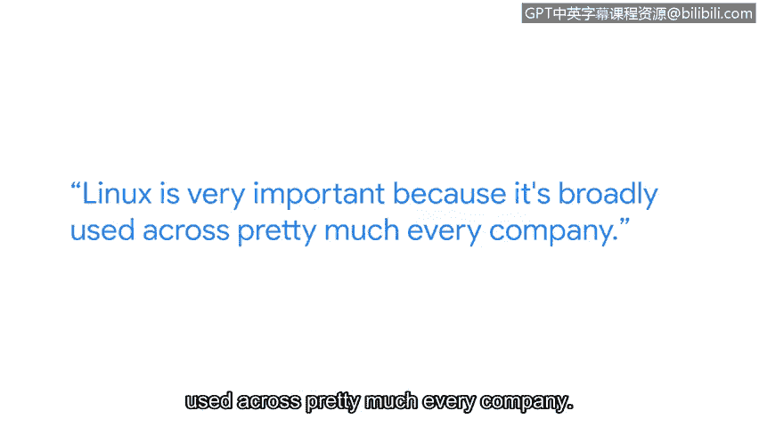

**谷歌网络安全专业证书课程：第四课：工具之道：Linux与SQL**


**P69：26_01_damar-my-journey-into-linux-commands**


**概述**

在本节中，我们将跟随谷歌安全工程师Demar的分享，了解他进入网络安全领域的个人历程，特别是学习Linux命令的经验与建议。这对于初学者理解Linux在网络安全中的重要性以及如何开始学习非常有帮助。

---

**我的名字是Demar，我是谷歌的一名安全工程师。**

我从小就想进入网络安全领域。我看过的很多卡通片里都有软盘或闪存驱动器，角色们将其插入电脑就能造成混乱。我一直觉得这很酷。

在加入谷歌之前，我做过不少工作。我最开始是在Jamba Juice制作冰沙。后来，我在Geek Squad找到了第一份与IT技术相关的工作，最终来到这里成为了一名安全工程师。

**给想进入网络安全领域的人的建议是：这可能比你想象的要容易得多。**

这绝对比我想象的要容易。我自己摸索学到的一点是：你无法一次性学会所有东西，也不需要一次性掌握所有知识。

---

**Linux的重要性与应用场景 🐧**

上一部分我们了解了Demar的背景，本节中我们来看看他为何强调Linux。

Linux非常重要，因为它几乎被每一家公司广泛使用。

在网络安全工作中，你可能会使用Linux来管理和分析日志。这是一种非常常见的做法。

你也可能使用Linux来编写bash脚本作业，以帮助完成Linux内的例行任务。

一个基础的bash脚本示例是：
```bash
#!/bin/bash
# 这是一个简单的脚本示例
echo "开始执行日志备份..."
cp /var/log/syslog /backup/
echo "备份完成。"
```

---

**如何开始学习Linux 💡**

了解了Linux的用途后，我们来看看Demar是如何对它产生兴趣并开始学习的。

我最初对学习Linux产生兴趣是因为电影《侏罗纪公园》。电影中有一个场景，他们需要重新激活电力门，必须使用Unix操作系统来完成。后来，我了解了Unix是什么，以及Linux是如何从它衍生出来的。这激励我去学习更多关于Linux的知识。

我能给正在尝试学习Linux和Linux命令的人的最好建议是：不要因为遇到任何小挫折而气馁。坚持下去。



把它想象成你第一次学游泳。你可能并不擅长，过程令人沮丧，你可能还有点害怕，但你坚持了下来。我希望你现在已经会游泳了。

---

**学习资源与支持 🛠️**

坚持学习需要方法和支持，以下是Demar推荐的一些途径。

学习Linux有大量的支持资源。一个很好的例子是证书课程中的讨论论坛。

另一个学习Linux的支持途径是使用谷歌搜索答案，可以利用Stack Overflow这样的网站。甚至可以发一个Reddit帖子。

---

**总结**

本节课中，我们一起学习了安全工程师Demar的入行故事。他分享了Linux在网络安全工作中的核心作用，例如**日志管理**和**脚本自动化**，并鼓励初学者克服困难、坚持学习，同时善用在线论坛和社区资源。他的经历表明，进入网络安全领域并掌握关键工具是一个循序渐进、充满支持的过程。


**我非常热爱网络安全工作。** 知道我和我的团队，以及谷歌所有其他安全团队正在帮助保护网络上的人们免受他们可能甚至不知道的威胁，这非常令人满足。