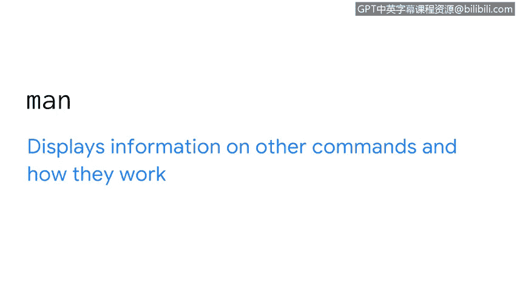
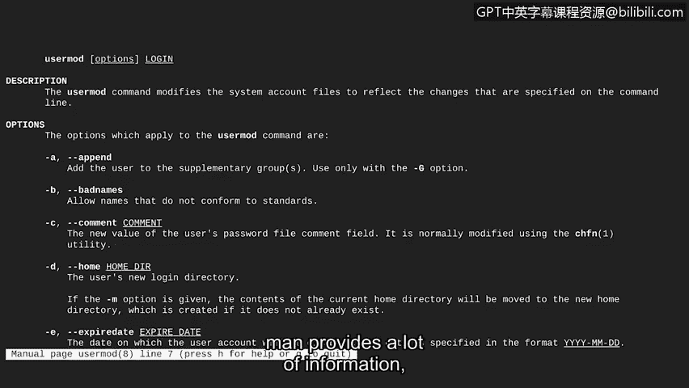
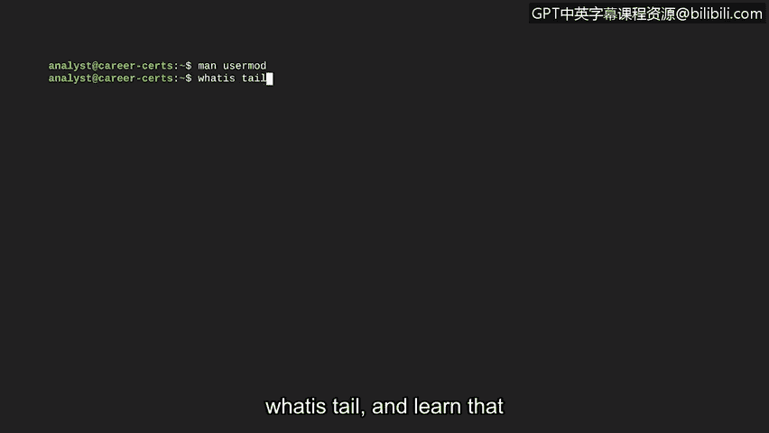
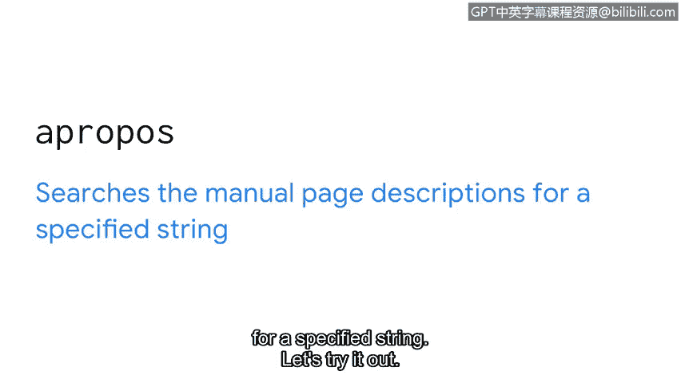
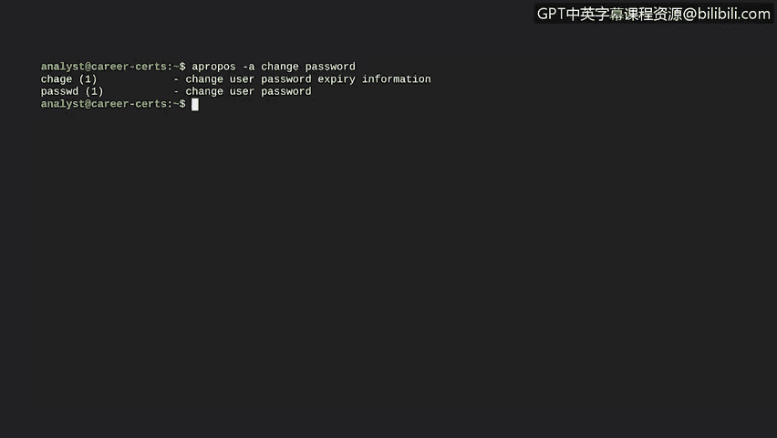

# 071：Shell内置帮助资源 📚

在本节课中，我们将学习如何直接在Shell中获取帮助，这些资源能有效辅助你在Linux环境下的工作。Linux的一个优点是，你可以通过命令行直接获得帮助。

## 使用 `man` 命令查看手册

首先，我们将介绍 `man` 命令。`man` 命令用于显示其他命令的详细信息及其工作原理。该命令的名称来源于单词“manual”（手册）。

让我们通过使用 `man` 来获取关于 `usermod` 命令的信息，以便更深入地了解它。在 `man` 之后，我们输入该命令的名称。`man` 返回的信息包括一个总体描述，以及关于 `usermod` 每个选项的详细信息。例如，选项 `-D` 可以添加到 `usermod` 中来更改用户的主目录。

`man` 提供了大量信息，但有时我们只需要快速了解某个命令的功能。

## 使用 `whatis` 命令快速查询

在这种情况下，你可以使用 `whatis` 命令。`whatis` 命令在一行内显示对某个命令的描述。

假设你听到同事提到了一个像 `tail` 这样的命令。你以前从未听说过这个命令，但你可以查明它的作用。只需使用命令 `whatis tail`，就能了解到它用于输出文件的末尾部分。

## 使用 `apropos` 命令搜索相关命令

有时，我们甚至不知道该查找什么命令。这时 `apropos` 命令可以帮助我们。`apropos` 在手册页描述中搜索指定的字符串。让我们来试试。

假设你有一个需要更改密码的任务，但不太确定如何操作。如果我们使用带有字符串 `password` 的 `apropos` 命令，这将显示大量包含该单词的命令。这有一定帮助，但可能仍然难以找到我们需要的内容。

不过，我们可以通过添加 `-a` 选项和一个额外的字符串来过滤结果。此选项将仅返回同时包含两个字符串的命令。在我们的例子中，由于我们想要更改密码，让我们查找同时包含 `change` 和 `password` 的命令。现在，搜索结果已被限制在最相关的命令范围内。

这些命令使得在Linux命令行中导航变得更加容易。

## 总结

作为一名新的分析师，你不可能总是知道所有答案，但你可以学会在哪里找到它们。本节课我们一起学习了三个重要的Shell内置帮助工具：`man`、`whatis` 和 `apropos`。它们分别是查看详细手册、获取命令简要说明以及根据关键词搜索相关命令的有效方法。掌握这些工具将极大地提升你在Linux环境下的工作效率和问题解决能力。