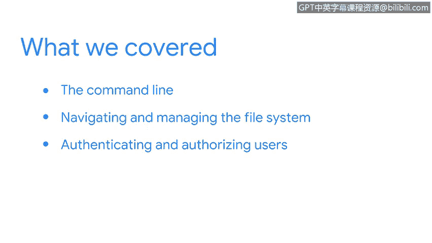

# 072：章节总结


## 概述

在本节课程中，我们学习了如何通过命令行与操作系统进行交互。这包括使用命令来导航和管理文件系统，以及使用其他命令进行用户身份验证和授权。这些任务都是安全分析师在工作中很可能遇到的。最后，我们还学习了如何获取资源以支持学习新的Linux命令。掌握这些知识后，你将能够持续深入地学习命令行的使用。

## 章节内容回顾

上一节我们介绍了与Linux系统交互的基础，本节中我们来回顾一下所涵盖的核心内容。

以下是我们在本节中完成的主要学习目标：

*   使用命令行与操作系统进行通信。
*   使用命令来导航和管理文件系统。
*   使用命令进行用户身份验证和授权。
*   学习如何获取资源以支持学习新的Linux命令。

## 核心概念与技能

我们学习了如何与Linux系统通信。这是一个重要的成就，对于你未来作为安全分析师的职业生涯将非常有用。



命令行交互是安全工作的基础，其核心在于理解并执行正确的命令。例如，用于列出目录内容的命令是：
```bash
ls
```
而用于更改文件权限的命令可能涉及：
```bash
chmod
```

## 总结

本节课中我们一起学习了通过命令行有效管理Linux系统的基本技能。你现在已经能够执行文件系统操作和基本的用户权限管理，并且掌握了持续自学新命令的方法。你应该为目前所完成的工作感到自豪。


我们做到了。