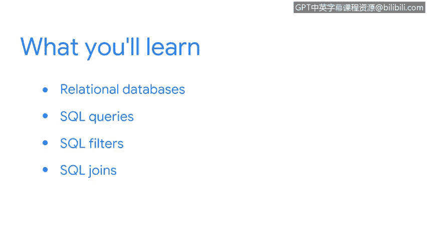

# 073：Linux与SQL

## 概述


在本节课中，我们将要学习一种新的工具——SQL。在上一节中，我们学习了Linux命令行，它帮助我们搜索、过滤数据，导航文件系统以及管理用户认证。本节中，我们将探索SQL，了解它如何以网络安全分析师角色所需的方式，帮助我们分析数据。

## 关系数据库与结构

上一节我们介绍了Linux命令行工具，本节中我们来看看数据分析的另一个核心工具：SQL。首先，我们需要理解SQL操作的对象——关系数据库。

关系数据库是一种以表格形式组织和存储数据的系统。每个表格包含行和列，行代表记录，列代表记录中的属性。表格之间可以通过共同的列（键）建立联系。

以下是数据库表格的基本结构示例：

```sql
-- 示例：创建一个用户表
CREATE TABLE users (
    user_id INT PRIMARY KEY,
    username VARCHAR(50),
    email VARCHAR(100)
);
```

理解这种结构是使用SQL进行有效查询的基础。

## SQL查询入门

了解了数据库的基本结构后，我们现在可以学习如何从中获取数据。SQL查询是与数据库交互的主要方式。

一个基础的SQL查询使用`SELECT`语句。它允许你指定想要从数据库表中检索哪些列的数据。

以下是SQL查询的基本组成部分：

*   **SELECT**： 指定要检索的列。
*   **FROM**： 指定数据来源的表。
*   **WHERE**（可选）： 添加条件来过滤结果。

例如，从一个名为`employees`的表中检索所有员工的姓名和部门，查询语句如下：

```sql
SELECT name, department FROM employees;
```

## 使用SQL过滤器精炼查询

基础查询能获取大量数据，但安全分析通常需要更精确的信息。这时就需要使用SQL过滤器。

SQL过滤器主要通过`WHERE`子句实现，它允许我们为查询设置条件，只返回满足这些条件的记录。

以下是`WHERE`子句中常用的操作符：

*   **等于 (`=`)**： 匹配特定值。`WHERE department = ‘Security’`
*   **大于/小于 (`>`, `<`, `>=`, `<=`)**： 进行数值比较。`WHERE login_attempts > 5`
*   **LIKE**： 进行模式匹配（常与`%`通配符合用）。`WHERE username LIKE ‘admin%’`
*   **IN**： 匹配列表中的任意值。`WHERE status IN (‘active’, ‘pending’)`
*   **AND/OR**： 组合多个条件。`WHERE department = ‘IT’ AND status = ‘active’`



通过组合这些过滤器，你可以构建出非常精确的查询，快速定位到关键的安全事件或日志条目。

## 探索SQL连接（JOIN）

在实际的数据库中，数据通常分散在多个相关的表中。为了进行综合分析，我们需要将多个表的数据组合起来，这就需要用到SQL连接（JOIN）。

SQL连接允许你基于两个表之间的关联列，将它们的数据行合并在一起。最常见的连接类型是`INNER JOIN`，它只返回两个表中匹配的行。

连接的基本公式如下：

```sql
SELECT columns
FROM table1
INNER JOIN table2
ON table1.common_column = table2.common_column;
```

例如，如果你有一个`users`表（包含`user_id`和`username`）和一个`login_logs`表（包含`log_id`、`user_id`和`login_time`），你可以通过`user_id`连接这两个表，来查看每个用户的登录记录：

```sql
SELECT users.username, login_logs.login_time
FROM users
INNER JOIN login_logs
ON users.user_id = login_logs.user_id;
```

掌握连接操作，使你能够从复杂的多表数据库中提取出有意义的关联信息，这对于追踪安全事件链条或进行行为分析至关重要。

## 总结

本节课中我们一起学习了SQL这一强大的数据分析工具。我们首先了解了关系数据库的结构，然后学习了如何使用`SELECT`语句进行基础查询。接着，我们探讨了通过`WHERE`子句添加过滤器来精炼查询结果。最后，我们学习了如何使用`JOIN`操作来连接多个表，进行综合数据分析。正如课程所强调的，在安全领域，工具的多样性很重要。SQL能帮助你快速、一致地审查大量数据，并自信地提供分析结果，是网络安全分析师工具箱中不可或缺的一部分。