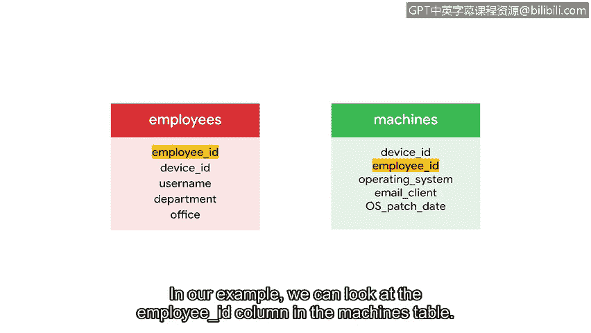

**谷歌网络安全专业证书第四课：4：数据库简介**

在本节课中，我们将要学习数据库的基本概念，包括其定义、结构以及如何通过关系型数据库来组织和管理数据。

---

我们的现代世界充满了数据，这些数据几乎总是在指导我们做出重要决策。处理大量数据时，我们需要知道如何存储它，使其组织有序，并能快速访问和处理。解决这个问题的方案就是数据库。这正是我们将在本视频中探讨的内容。

首先，我们可以将数据库定义为**信息或数据的有组织集合**。

数据库常与电子表格进行比较。你们中的一些人可能过去使用过 Google Sheets 或其他常见的电子表格程序。虽然这些程序是存储数据的便捷方式，但电子表格通常设计为供单个用户或小型团队存储较少数据。相比之下，数据库可以被多人同时访问，并能存储海量数据。数据库在访问数据时还能执行复杂的任务。

作为安全分析师，您经常需要访问包含有用信息的数据库。例如，这些可能是包含登录尝试信息、软件和更新信息，或机器及其所有者信息的数据库。

既然我们已经了解了数据库的重要性，接下来让我们谈谈它们是如何组织的，以及我们如何与之交互。

---

**关系型数据库的结构**

使用数据库使我们能够存储大量数据，同时保持快速、便捷的访问。构建数据库有很多不同的方式，但在本课程中，我们将使用关系型数据库。**关系型数据库**是一种包含相互关联的表格的结构化数据库。

让我们进一步了解关系型数据库的构成。我们将从检查一个大型组织信息数据库中的单个表格开始。

每个表格都包含信息字段。例如，在这个关于员工的表格中，字段包括员工ID、设备ID和用户名。这些就是表格的列。

此外，表格包含行，也称为记录。记录中填充了与表格列相关的具体数据。例如，我们的第一行是一条记录，对应一名ID为1000、在市场部工作的员工。

关系型数据库通常有多个表格。考虑一个例子，我们从一个更大的数据库中获取两个表格：一个包含公司员工，另一个包含分配给这些员工的机器。如果两个表格共享一个共同的列，我们就可以将它们连接起来。在这个例子中，我们通过一个共同的员工ID列在它们之间建立关系。

---

**主键与外键**

将两个表格相互关联的列称为键。键有两种类型。

第一种称为**主键**。主键指的是每一行都有唯一条目的列。主键不能有任何重复值或任何空值。主键允许我们唯一地标识表中的每一行。对于员工表，员工ID就是一个主键。每个员工ID都是唯一的，并且没有重复或为空的员工ID。

第二种键是**外键**。外键是一个表中的列，该列是另一个表中的主键。与主键不同，外键可以有重复值和空值。外键允许我们将两个表格连接在一起。在我们的例子中，我们可以查看机器表中的员工ID列。

我们之前已将其识别为员工表中的主键，因此我们可以用它来将每台机器与其对应的员工连接起来。

同样重要的是要注意，一个表只能有一个主键，但可以有多个外键。

---

**SQL简介**

掌握了这些信息，我们就可以开始学习SQL的基础知识了，SQL是让我们能够操作数据库的语言。在本节接下来的内容中，我们将亲身体验并实践刚刚介绍的概念。

---

**总结**

本节课中，我们一起学习了数据库的基本概念。我们了解了数据库作为有组织数据集合的定义，比较了数据库与电子表格的区别，并重点探讨了关系型数据库的结构，包括表格、记录、字段以及连接表格的关键——主键和外键。这些知识为我们接下来学习如何使用SQL语言与数据库交互打下了坚实的基础。