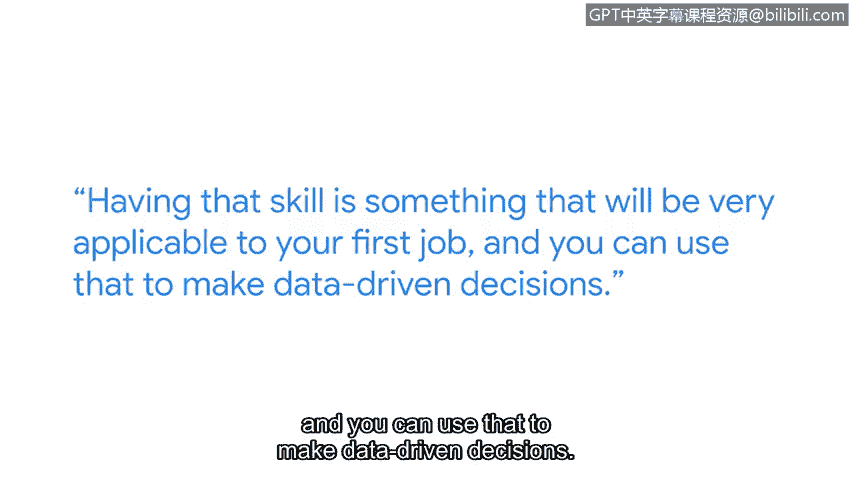

# 076：SQL在网络安全中的应用

## 概述
在本节课中，我们将跟随谷歌安全工程师A Dio的分享，了解SQL技能对于网络安全从业者的重要性、学习路径以及实践经验。我们将探讨如何利用SQL进行数据驱动的决策，并理解这项技能在职业生涯中的实际价值。

## 核心内容

大家好，我是A Dio，目前在谷歌担任安全工程师。

许多人认为必须拥有计算机科学学位才能进入网络安全领域。我认为事实并非如此。以我为例，我的学习起点是在尼日利亚的拉各斯，那里是我的家乡。如今，我已在硅谷为谷歌工作。我认为这非常了不起，是梦想成真。你学习这个证书，是承诺将职业生涯转向网络安全的第一步，值得称赞。

SQL是网络安全专业人员工具箱中必备的技能之一。掌握它，你不仅能快速做出判断，更能基于数据支撑你的决策，并能向你的团队和利益相关者清晰地解释决策依据。仅仅说“我们需要这样做”是一回事；而说“我们需要这样做，这是我通过SQL语句分析得出的数据依据”则是另一回事，后者更有说服力。

我的SQL学习路径始于学校的课程，那打下了很好的基础。但毕业后，我几乎忘记了所学的大部分内容。我采取的下一步是参加在线课程，就像你现在正在做的一样，重新学习SQL的基础知识和实际应用方法。

我第一次实际应用SQL是在谷歌。实践至关重要。我认为任何事情都是熟能生巧。即使每周只抽出几个小时，专门练习编写SQL语句，这项技能也将对你获得第一份工作非常有帮助，并能用于做出数据驱动的决策。

在网络安全领域工作让我感到非常充实。每天上班我都充满活力，这不仅是因为我能处理非常复杂的问题并尝试找出解决方案，还因为我拥有优秀的同事，我们能齐心协力攻克难题。晚上入睡时，我知道我的工作是为了让谷歌用户和员工更安全，这给我带来了极大的成就感。

## 总结
本节课我们一起学习了SQL在网络安全中的关键作用。我们了解到，数据驱动的决策能力是网络安全专业人员的核心优势之一，而SQL是实现这一能力的重要工具。通过持续的学习和实践，即使没有传统的计算机科学背景，也能掌握这项技能并在实际工作中创造价值，为保护数字世界贡献力量。