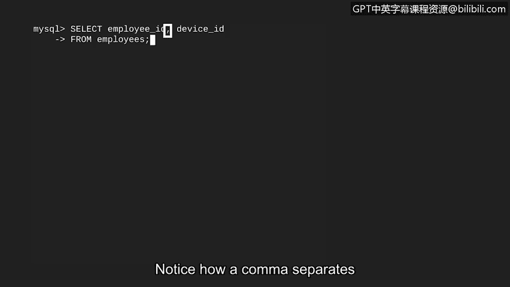
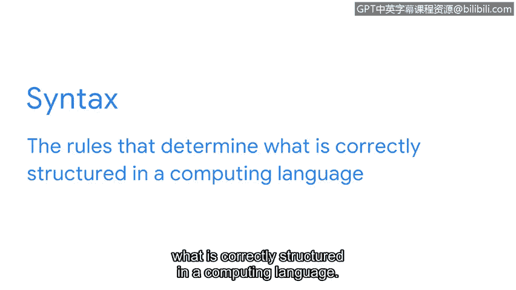
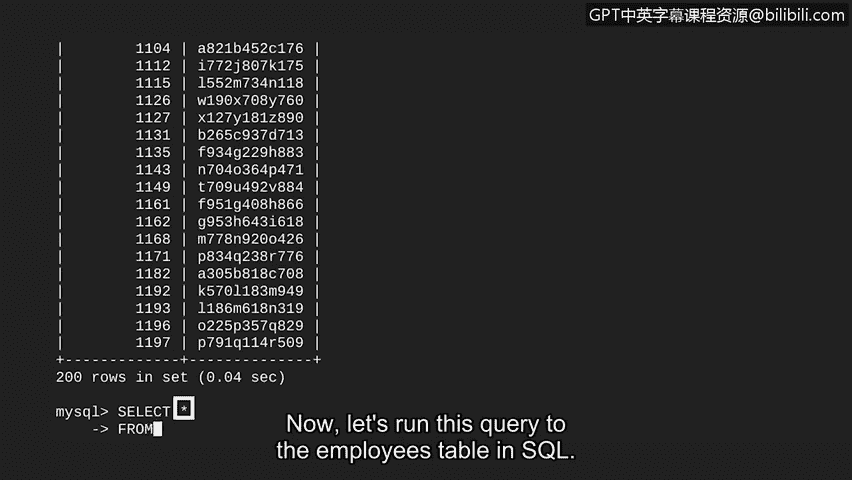

# 077：34_01_basic-queries - 基础查询入门


在本节课程中，我们将学习如何运行你的第一个SQL查询。这个查询将基于网络安全分析师可能遇到的一个常见工作任务：确定特定员工被分配了哪台计算机。

## 概述：什么是SQL查询？🔍

SQL查询是一种用于与数据库通信并获取特定信息的指令。它就像向数据库提问，并得到精确的答案。我们将从一个简单的任务开始，学习构建查询的两个核心关键字。

## 构建你的第一个查询 ✨

假设我们有权访问一个名为 `employees` 的表，该表包含五列。其中，`employee_id` 和 `device_id` 这两列包含了我们所需的信息。

我们的目标是编写一个查询，仅从该表中返回这两列数据。

### 核心关键字：SELECT 和 FROM

构建基础SQL查询需要两个关键字：**SELECT** 和 **FROM**。
*   **SELECT** 指示要返回哪些列。
*   **FROM** 指示要从哪个表中查询数据。

这两个关键字在SQL中的用法与日常用语非常相似。例如，你可以对朋友说：“请从那个大盒子里选出苹果和香蕉。” 这已经非常接近SQL的思维模式了。


现在，让我们在SQL中使用 `SELECT` 和 `FROM` 来获取关于员工及其所用计算机的信息。

我们首先输入SQL语句。在 `FROM` 之后，我们指明信息将从 `employees` 表中提取。在 `SELECT` 之后，我们列出想要从该表返回的两列：`employee_id` 和 `device_id`。

请注意，我们想要返回的两个列名之间用逗号分隔。

**示例代码：**
```sql
SELECT employee_id, device_id
FROM employees;
```




## 关于SQL语法的关键点 📝

在继续之前，有必要提及几个与SQL语法相关的关键方面。语法指的是决定计算语言中什么是正确结构的规则。




在SQL中，有两点重要的语法规则：
1.  **关键字不区分大小写**：你可以用小写字母书写 `select` 和 `from`。但通常使用大写字母，因为这会使查询语句更易于阅读和理解。
2.  **分号结束语句**：分号被放置在语句的末尾，表示一个完整查询的结束。

现在，我们通过按回车键来运行这个查询。输出结果将提供我们需要的信息，用以匹配员工和他们的计算机。

恭喜！你已经成功运行了你的第一个SQL查询。

## 查询所有列：使用 SELECT * 🌟

上一节我们介绍了如何查询特定的列。但如果我们想了解更多信息呢？例如，想知道使用该计算机的员工来自哪个部门、他们的用户名或办公地点。

为此，我们可以使用SQL编写另一个语句，打印出表中的所有列。我们可以通过在 `SELECT` 后放置一个星号 `*` 来实现。这通常被称为 **“SELECT ALL”**。



现在，让我们在SQL中对 `employees` 表运行这个查询。

**示例代码：**
```sql
SELECT *
FROM employees;
```


运行后，我们将在输出中获得完整的表格数据。

## 总结与展望 🎯

在本节课中，我们一起学习了SQL的基础查询操作。我们掌握了：
*   使用 **`SELECT`** 关键字指定要返回的列。
*   使用 **`FROM`** 关键字指定要查询的表。
*   使用逗号分隔多个列名。
*   使用星号 **`*`** 来快速选择表中的所有列。
*   了解了SQL语法中关键字大小写不敏感和以分号结束语句的规则。

你刚刚完成了一个基础的SQL查询，这是一个重要的开始！在下一个视频中，我们将学习如何为查询添加过滤器，以便更精确地获取数据。我们下节课再见。


