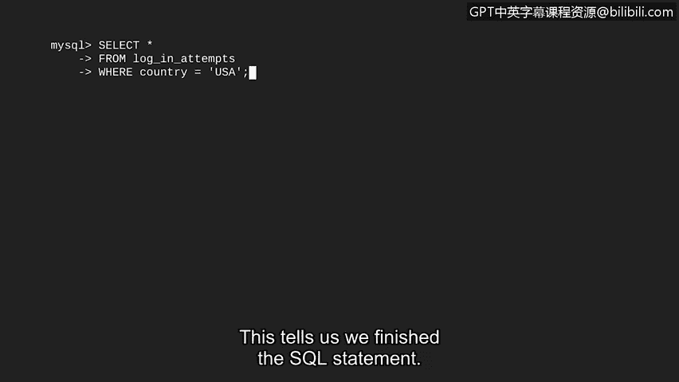
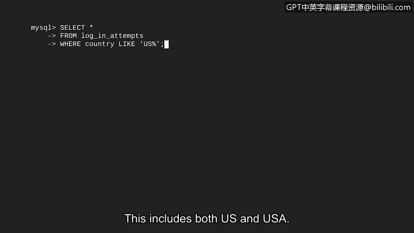

# 078：SQL基础查询过滤 🔍


在本节课中，我们将要学习SQL最强大的功能之一：数据过滤。通过过滤，我们可以从数据库中筛选出符合特定条件的精确数据，这对于安全分析师处理登录记录、用户信息等任务至关重要。

## 概述：什么是过滤？

过滤是指根据特定条件选择数据的过程。你可以将其理解为只挑选我们想要的数据。例如，从一个水果摊选择苹果时，我们可能会明确地说“只选新鲜的苹果”，这会将不新鲜的苹果从选择中排除。这就是一个过滤器。

在网络安全分析中，你可能会过滤登录尝试表，以查找来自特定国家的所有尝试。这可以通过对国家列应用过滤器来完成。例如，你可以过滤只返回包含“Canada”的记录。

## 运算符：过滤的基石

在开始之前，我们需要关注SQL语法的一个重要部分：运算符。

**运算符**是一个符号或关键字，用于表示一个操作。一个典型的例子是“等于”运算符（`=`）。例如，如果我们想找到所有在“country”列中包含“USA”的记录，我们会使用 `country = 'USA'`。

## 使用WHERE子句进行过滤

要在SQL中过滤查询，我们只需在之前使用的`SELECT`和`FROM`语句后添加额外的一行。这额外的一行将使用SQL中的`WHERE`子句。`WHERE`指明了过滤的条件。

在关键字`WHERE`之后，使用运算符列出具体的条件。因此，如果你想找到所有在美国进行的登录尝试，我们将创建这样一个特定的条件过滤器：指示返回所有在“country”列中值等于“USA”的记录。


让我们在SQL中将其组合起来。我们将从选择`log_in_attempts`表中的所有列开始，然后添加`WHERE`过滤器。别忘了分号，它表示SQL语句的结束。

```sql
SELECT *
FROM log_in_attempts
WHERE country = 'USA';
```



运行此查询后，由于我们的过滤器，只有登录尝试国家为“USA”的行会被返回。

## 使用LIKE运算符进行模式匹配

在上一个例子中，我们的过滤条件仅仅是基于返回等于特定值的记录。我们还可以通过搜索模式而非精确单词来使条件更复杂。

例如，在员工表中，我们有一个“office”列。我们可以搜索此列中匹配特定模式的记录。或许我们想要所有在东楼（East building）的办公室。为了搜索模式，我们使用百分号（`%`）作为未指定字符的通配符。

如果我们运行一个 `‘East%’` 的过滤器，这将返回所有以“East”开头的记录，例如办公室“East 120”、“East 290”和“East 435”。

当使用百分号搜索模式时，我们不能使用等号运算符。相反，我们使用另一个运算符：`LIKE`。

`LIKE`是一个与`WHERE`一起使用的运算符，用于在列中搜索模式。由于`LIKE`是一个类似于等号的运算符，我们用它来代替等号。因此，当我们的目标是返回“office”列中所有以单词“east”开头的值时，`LIKE`会出现在`WHERE`子句中。

## 实践：处理数据不一致性


让我们回到想要过滤在美国进行的登录尝试的例子。想象一下，我们意识到数据库中表示“美国”的方式存在不一致：有些条目使用“US”，而另一些使用“USA”。

我们将进入SQL并应用这种带有`LIKE`的新过滤器。我们将以相同的前两行代码开始，因为我们想从`login_attempts`表中选择所有列。然后，我们将添加一个带有`LIKE`的过滤器，以便如果“country”列中的值以字符“US”开头，记录就会被返回。这包括了“US”和“USA”。

```sql
SELECT *
FROM login_attempts
WHERE country LIKE 'US%';
```

运行此查询以检查输出是否变化。这将返回用户位置在美国的所有条目。现在，我们可以使用`LIKE`子句基于模式来过滤列。



## 总结

本节课中，我们一起学习了SQL查询过滤的核心概念。我们首先了解了过滤的基本定义及其在数据分析中的重要性。接着，我们认识了构成过滤条件的基石——运算符，特别是等号（`=`）。然后，我们详细探讨了如何使用`WHERE`子句来实施精确匹配的过滤。


为了处理更灵活的数据匹配需求，我们进一步学习了`LIKE`运算符和通配符（`%`）的使用，从而能够进行模式匹配，有效应对数据录入不一致的情况。通过结合这些技术，我们现在已经能够编写精确的查询，从数据库中高效地提取出所需的具体数据子集。