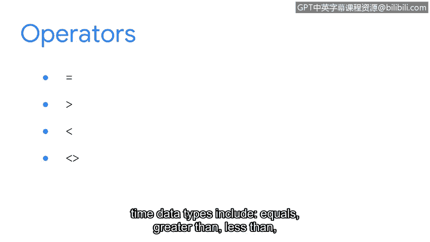
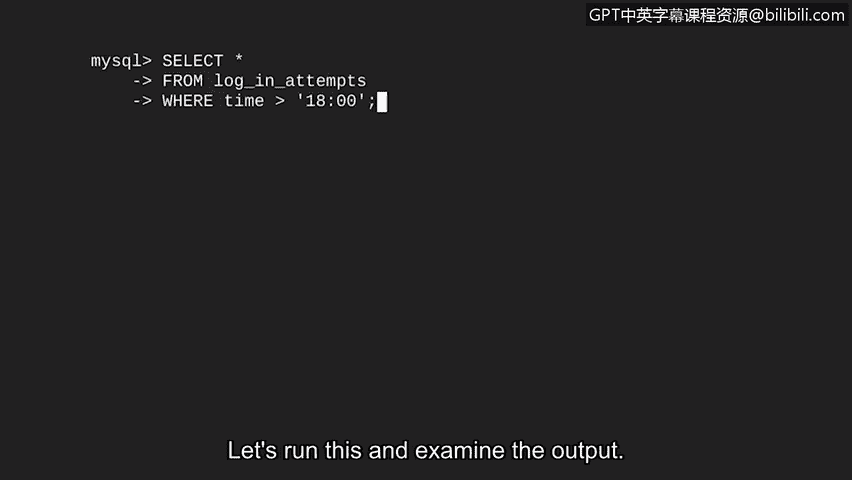
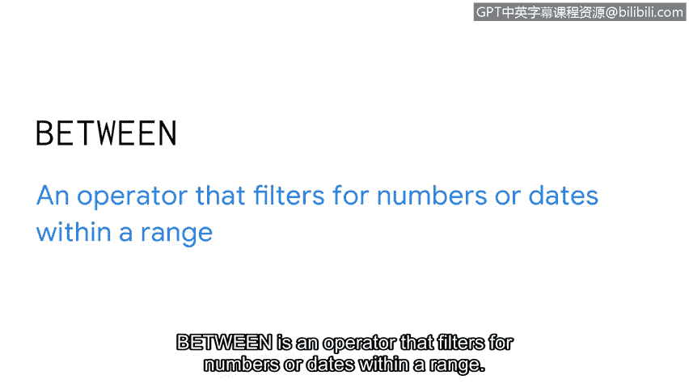
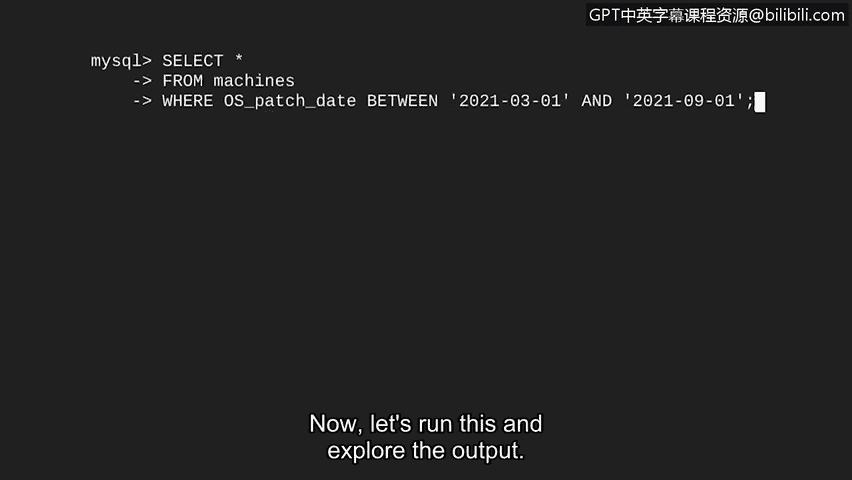

# 079：36_01_过滤日期与数字


在本节课中，我们将继续学习使用SQL查询和过滤器，但这次我们将把它们应用到新的数据类型上。我们将探索数据库中常见的三种数据类型，并学习如何对数字和日期时间数据进行过滤。掌握这些技能对于分析安全日志、识别异常活动至关重要。

## 数据类型简介

上一节我们介绍了如何使用字符串数据进行过滤。本节中，我们来看看SQL中另外两种重要的数据类型：数字和日期时间。

数据库中的数据主要分为三种类型：

*   **字符串数据**：由有序的字符序列组成的数据。这些字符可以是数字、字母或符号。例如，用户名 `analyst10` 就是字符串数据。
*   **数字数据**：由数字组成的数据。与字符串不同，可以对数字数据使用数学运算，如乘法或加法。例如，登录尝试次数。
*   **日期和时间数据**：表示日期和/或时间的数据。例如，补丁安装日期或登录尝试发生的时间。

作为安全分析师，经常需要查询数字和日期。例如，可以过滤补丁日期以找到需要更新的机器，或者过滤登录尝试以仅返回在特定时间段内发生的记录。

## 使用运算符过滤数字和日期

我们将在数字和日期数据上再次使用运算符。以下是处理数字或日期时间数据类型的常见运算符：

*   **等于** (`=`)
*   **大于** (`>`)
*   **小于** (`<`)
*   **不等于** (`!=` 或 `<>`)
*   **大于或等于** (`>=`)
*   **小于或等于** (`<=`)

假设你想查找下午6点之后进行的登录尝试，因为这超出了正常工作时间，可能存在可疑模式。



你可以通过在过滤器中使用**大于**运算符来识别这些尝试。

以下是编写查询的步骤：


1.  使用 `SELECT *` 表示从 `log_in_attempts` 表中选择所有列。
2.  使用 `WHERE` 添加过滤器。
3.  设置条件，要求 `time` 列中的值必须大于 `1800`（在SQL中，`1800` 表示下午6点）。

对应的SQL代码如下：
```sql
SELECT *
FROM log_in_attempts
WHERE time > 1800;
```
运行此查询后，将得到下午6点之后所有登录尝试的列表。

## 使用 BETWEEN 运算符过滤范围

除了比较运算符，我们还可以使用 `BETWEEN` 运算符来过滤特定范围内的数字或日期。

`BETWEEN` 是一个用于筛选处于某个范围内的数字或日期的运算符。





一个典型的应用场景是查找在特定日期范围内安装的所有补丁。


例如，我们想查找所有在2021年3月1日至2021年9月1日之间安装的补丁。

以下是编写查询的步骤：

1.  从 `machines` 表中选择所有记录。
2.  在 `WHERE` 语句中使用 `BETWEEN` 运算符。
3.  指定要过滤的列，这里是 `OS_patch_date`。
4.  使用 `BETWEEN` 定义范围的开始和结束日期。

对应的SQL代码如下：
```sql
SELECT *
FROM machines
WHERE OS_patch_date BETWEEN '2021-03-01' AND '2021-09-01';
```
运行此查询后，将得到在这两个日期之间打过补丁的所有机器的列表。



## 重要注意事项

在结束之前，有一个重要的细节需要注意：


*   当过滤**字符串、日期和时间**时，我们使用**引号**来指定要查找的内容。
*   然而，对于**数字**，我们**不使用**引号。

掌握了这些新知识，你现在已经准备好为数字和日期创建各种有趣的过滤器了。

## 总结

本节课中我们一起学习了：
1.  识别了SQL中的三种主要数据类型：字符串、数字以及日期和时间。
2.  学习了如何使用比较运算符（如 `>`、`<`、`=`）来过滤数字和日期数据。
3.  掌握了 `BETWEEN` 运算符的用法，用于查询特定范围内的数字或日期记录。
4.  明确了在编写过滤条件时，字符串和日期值需要引号，而数字值则不需要。

在下一个视频中，我们将通过在一个查询中使用多个条件，进一步扩展我们的过滤能力。