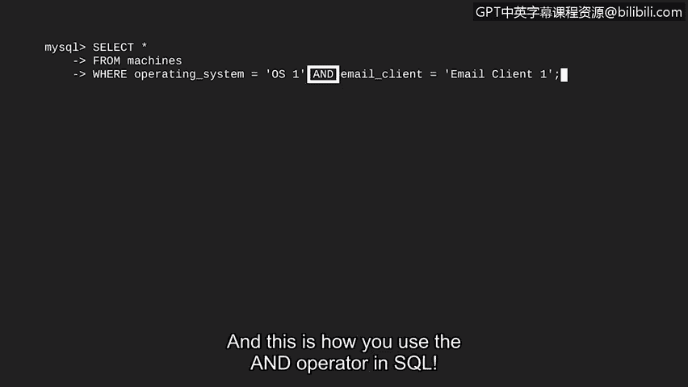
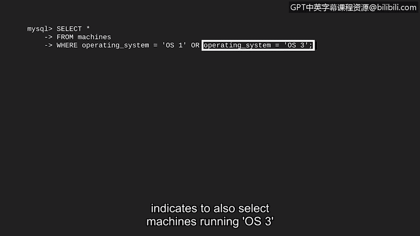
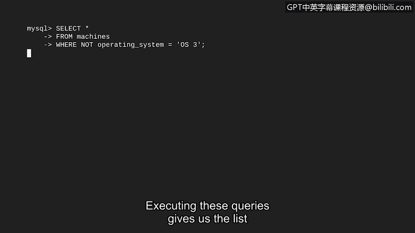

# 080：使用AND、OR和NOT进行筛选


在本节课中，我们将要学习如何在SQL查询中使用`AND`、`OR`和`NOT`运算符来组合多个筛选条件。这对于处理复杂的网络安全分析任务至关重要。

## 概述

上一节我们介绍了SQL中的基本筛选方法。本节中我们来看看如何通过组合多个条件进行更精确的查询。在实际的网络安全工作中，我们经常需要根据多个因素来定位问题。例如，一个安全漏洞可能同时与特定的操作系统和特定的电子邮件客户端相关。为了找到所有符合条件的记录，我们需要使用逻辑运算符。

## 使用AND运算符

`AND`运算符用于指定查询结果必须**同时满足**两个或多个条件。

我们可以用一个简单的公式来描述：
`条件1 AND 条件2`

这就像从一箱水果中挑选**又大又新鲜**的苹果。结果中不会包含小的苹果（即使新鲜），也不会包含腐烂的苹果（即使很大），只会包含同时满足“大”和“新鲜”这两个条件的苹果。

假设我们有一个名为`machines`的表，其中包含`operating_system`和`email_client`等列。我们想找出所有运行`OS1`**并且**使用`email_client1`的机器。

以下是实现此查询的SQL代码：

```sql
SELECT *
FROM machines
WHERE operating_system = ‘OS1’
  AND email_client = ‘email_client1’;
```

在这段代码中：
1.  `SELECT * FROM machines` 表示从`machines`表中选择所有列。
2.  `WHERE` 子句开始定义筛选条件。
3.  `operating_system = ‘OS1’` 是第一个条件。
4.  `AND` 运算符连接两个条件。
5.  `email_client = ‘email_client1’` 是第二个条件。


执行此查询将返回所有同时满足这两个条件的记录。

## 使用OR运算符

`OR`运算符用于指定查询结果只需满足**其中任意一个**条件即可。

其公式为：
`条件1 OR 条件2`



在维恩图中，这表示选择属于条件1**或**条件2圆圈内的所有部分（包括重叠部分）。

例如，我们需要为运行`OS1`**或**`OS3`的机器打补丁。我们可以使用`OR`运算符来查找所有符合任一操作系统的机器。

以下是相应的SQL查询：

```sql
SELECT *
FROM machines
WHERE operating_system = ‘OS1’
   OR operating_system = ‘OS3’;
```


在这段代码中：
*   第一个条件 `operating_system = ‘OS1’` 筛选出`OS1`。
*   `OR` 运算符表示“或者”。
*   第二个条件 `operating_system = ‘OS3’` 筛选出`OS3`。

执行此查询将返回所有操作系统为`OS1`**或**`OS3`的记录。

## 使用NOT运算符

`NOT`运算符用于**否定**一个条件，选择**不满足**该条件的记录。



其公式为：
`NOT 条件`

这就像告诉朋友：“请给我所有**不是**苹果的水果。”这比逐一列出香蕉、橘子、青柠等要高效得多。

例如，我们想要更新公司里所有**不是**运行`OS3`操作系统的设备。

以下是实现此需求的SQL代码：

```sql
SELECT *
FROM machines
WHERE NOT operating_system = ‘OS3’;
```


在这段代码中：
*   `WHERE NOT` 对紧随其后的条件进行否定。
*   `operating_system = ‘OS3’` 是被否定的条件。

执行此查询将返回所有操作系统**不等于**`OS3`的机器列表，从而我们知道需要更新哪些设备。

## 总结



本节课中我们一起学习了SQL中三个核心的逻辑运算符：
*   **`AND`**：要求所有条件**同时**为真。
*   **`OR`**：要求至少一个条件为真。
*   **`NOT`**：对条件取反，选择不符合条件的记录。

通过组合使用这些运算符，我们可以构建出非常强大和灵活的查询语句，以应对网络安全分析中各种复杂的筛选需求。你已经掌握了更多可用于实际分析工作的SQL技能。

在接下来的视频中，我们将学习如何将两张表连接（JOIN）在一起，从而进一步扩展我们能执行的查询类型。