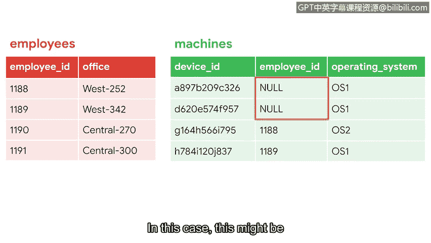
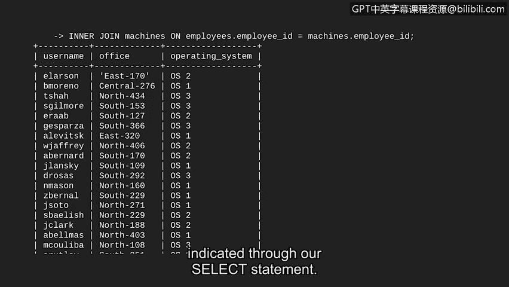

# 081：SQL中的表连接


在本节课中，我们将学习SQL中一个非常强大的功能：**连接表**。通过连接，我们可以将数据库中不同表的信息组合起来，从而获得更全面、更有价值的查询结果。

## 概述

上一节我们学习了如何使用SQL进行查询和过滤。本节中，我们将介绍如何通过连接操作，从多个表中提取和组合数据。这在网络安全分析中非常有用，例如，将员工信息表与机器信息表连接，可以快速识别出使用特定操作系统的员工。

## 连接表的基本语法

当我们同时操作两个表时，SQL需要明确知道我们引用的列属于哪个表。解决方法是使用**表名.列名**的格式。

例如，在示例数据库中，`employee_id`列同时存在于`employees`表和`machines`表中。为了区分它们，我们这样写：
*   `employees.employee_id` 表示`employees`表中的员工ID列。
*   `machines.employee_id` 表示`machines`表中的员工ID列。

理解了如何引用不同表中的列之后，我们就可以开始应用连接操作了。

## 使用内连接

假设我们想更深入地了解公司中访问机器的员工情况。通过连接`employees`表和`machines`表，我们可以实现这个目标。

首先，我们需要确定用于连接两个表的共享列。通常，我们会使用一个表中的**主键**去连接另一个表中对应的**外键**。

*   在`employees`表中，`employee_id`是主键，因为它为每一行提供了唯一且非空的值。
*   在`machines`表中，`employee_id`是外键，它引用自`employees`表的主键。作为外键，它不一定满足唯一和非空的约束。

接下来，我们将使用一种称为**内连接**的连接方式。内连接会返回在指定列上**匹配**的行，这些行必须同时存在于两个表中。

为了更清晰地解释内连接，我们来看一个简化的例子。假设我们只关注两个表中的各四行数据。

我们选择在两个表中都存在的`employee_id`列来执行内连接。观察匹配的行：两个表在`employee_id`列上都有值`1188`和`1189`，因此它们被认为是匹配的。连接的结果就是包含`1188`和`1189`的这两行数据，以及两个表中的所有列。

在继续学习查询之前，我们需要了解表中的空值。在SQL中，**NULL**代表由于任何原因导致的缺失值。在我们的例子中，这可能代表尚未分配给任何员工的机器。

## 在SQL中执行内连接

现在，让我们在SQL中对完整的表执行内连接。



假设我们希望通过连接表，获得一个显示用户名、办公室位置及其机器操作系统的列表。`employee_id`是这两个表之间的公共列，我们可以用它来连接。但在最终结果中，我们不需要显示这个列。

以下是构建查询的步骤：

首先，编写一个基础查询，指明我们要选择`username`、`office`和`operating_system`列。我们希望`employees`表作为第一个（左）表，因此在`FROM`语句中使用它。

接着，编写查询中告诉SQL将`machines`表与`employees`表连接的部分。

让我们分解这个查询：
*   `INNER JOIN` 告诉SQL执行内连接。
*   然后我们命名想要与第一个表组合的第二个表，这被称为**右表**。在本例中，我们想要连接`machines`表和`FROM`后面已指定的`employees`表。
*   最后，我们告诉SQL基于哪一列进行连接。在我们的例子中，我们使用`employee_id`列。由于涉及两个表，我们必须指明表名，后跟列名，即 `employees.employee_id` 和 `machines.employee_id`。

完整的查询语句如下：
```sql
SELECT username, office, operating_system
FROM employees
INNER JOIN machines ON employees.employee_id = machines.employee_id;
```

让我们回顾一下输出结果。很好，我们已经成功连接了两个表。查询结果显示的是在`employee_id`列上匹配的记录。请注意，这些记录包含了来自两个表的列，但仅限于我们通过`SELECT`语句指定的那些列。

## 总结



本节课中，我们一起学习了SQL中的表连接操作。我们首先了解了在涉及多表时，需要使用`表名.列名`的语法来明确引用列。接着，我们重点学习了**内连接**，它能够基于两个表共有的列（通常是主键-外键关系）来合并匹配的行。通过一个具体的查询示例，我们实践了如何使用`INNER JOIN ... ON ...`语句来组合`employees`和`machines`表，从而获得包含用户信息及其对应机器操作系统的结果集。

除了内连接，SQL还支持其他类型的连接，它们不要求严格的匹配就能合并表。我们将在下一个视频中讨论这些连接类型。