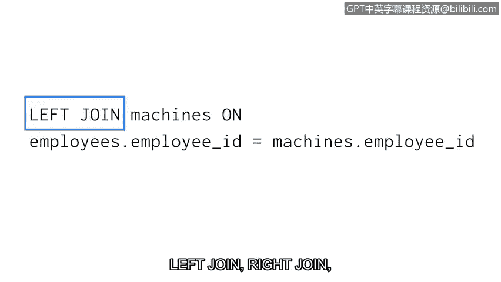

# 082：39_02_连接类型


## 概述

在本节课中，我们将要学习 SQL 中的外连接。上一节我们介绍了内连接，本节中我们来看看如何通过外连接来获取更完整的数据集。

## 外连接简介

内连接仅返回在指定列中具有匹配值的记录。然而，在某些情况下，我们可能需要获取一个或两个表中的所有条目。这时就需要使用外连接。

外连接有三种类型：左连接、右连接和全外连接。与外连接类似，外连接也是将两个表组合在一起。但是，它们不要求列之间必须匹配才能返回行。返回哪些行取决于连接的类型。

## 左连接

左连接返回第一个表的所有记录，但只返回第二个表中在指定列上有匹配的行。

让我们通过查看两个只有少量列和四行数据的表来研究这种连接类型。`employees` 表是左表（第一个表），`machines` 表是右表（第二个表）。我们以 `employee_id` 列进行连接。该列在两表中只有两条记录有匹配值。

当我们执行连接时，SQL 会返回这些具有匹配值的行、左表的所有其他行以及两个表的所有列。来自 `employees` 表但未匹配的记录，通过左连接返回时，在来自 `machines` 表的列中会包含空值。

以下是左连接的语法结构：

```sql
SELECT *
FROM table1
LEFT JOIN table2
ON table1.column = table2.column;
```

## 右连接

右连接返回第二个表的所有记录，但只返回第一个表中在指定列上有匹配的行。

使用上一个例子进行右连接，完整的结果会返回两个表的匹配行、第二个表的所有行以及两个表的所有列。对于任一表中不存在的值，我们会得到一个空值。

以下是右连接的语法结构：

```sql
SELECT *
FROM table1
RIGHT JOIN table2
ON table1.column = table2.column;
```

## 全外连接

最后，我们来讨论全外连接。全外连接返回两个表中的所有记录。

使用我们相同的例子，全外连接返回所有表的所有列。如果某一行在特定列上没有值，则返回空值。例如，`machines` 表中没有任何 `employee_id` 为 1190 的行，因此该行在来自 `machines` 表的列中的值就是空值。

以下是全外连接的语法结构：

```sql
SELECT *
FROM table1
FULL OUTER JOIN table2
ON table1.column = table2.column;
```



## 总结

本节课中我们一起学习了 SQL 中三种外连接：左连接、右连接和全外连接。它们在语法结构上与内连接相似，但使用 `LEFT JOIN`、`RIGHT JOIN` 和 `FULL OUTER JOIN` 这些关键字。

作为安全分析师，你不需要死记硬背所有这些内容。一旦理解了所需的连接类型，你可以快速搜索并找到执行这些查询所需的全部信息。掌握了这些关于连接的知识，我们就涵盖了作为使用 SQL 的安全分析师所需的一些非常重要的信息。

