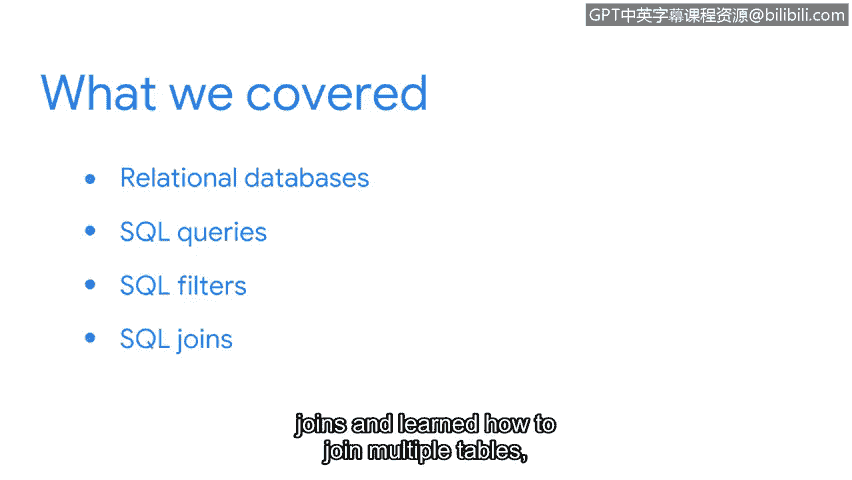

# 083：总结回顾

在本节课中，我们将一起回顾并总结SQL部分所学的全部核心知识与技能。

恭喜你，我们已经共同完成了SQL部分的学习。你付出了很多努力，并掌握了一项对安全分析师职业生涯至关重要的工具。

现在，让我们花点时间回顾一下你在本部分学到的所有主题。

## 📚 本部分学习内容回顾

上一节我们完成了SQL连接的学习，现在我们来整体回顾一下学习路径。

以下是我们在本部分涵盖的核心主题：

*   **关系数据库与SQL基础**：我们首先学习了关系数据库的结构，以及如何使用SQL查询语言来访问它们。
*   **动手编写SQL查询**：我们通过实践练习了如何编写自己的SQL查询语句。
*     **应用SQL进行信息检索**：我们使用SQL来提取作为分析师在工作中可能需要的信息。
*   **掌握SQL过滤器**：我们深入学习了SQL过滤。从简单的字符串条件开始，到最后，我们学会了如何在一个查询中使用多个过滤器。
*   **使用SQL连接表**：我们以SQL连接作为本单元的结尾，学习了如何连接多个表，从而一次性获取更多信息。

## 🚀 学习成果与后续建议

完成本课程，意味着你在未来成为安全分析师的职业生涯中迈出了非常重要的一步。你已经接触到了一个能在工作中为你提供强大助力的工具。

学习像SQL这样的查询语言需要时间。因此，无论何时你需要，我都鼓励你重新回顾本课程的材料。

再次感谢你与我一同完成这段学习旅程。希望你也能像我一样享受使用SQL的过程。

**总结**：本节课中我们一起回顾了SQL部分的学习历程，从数据库基础、查询编写、数据过滤到多表连接，巩固了作为安全分析师所需的核心数据操作技能。请记住持续练习是掌握SQL的关键。