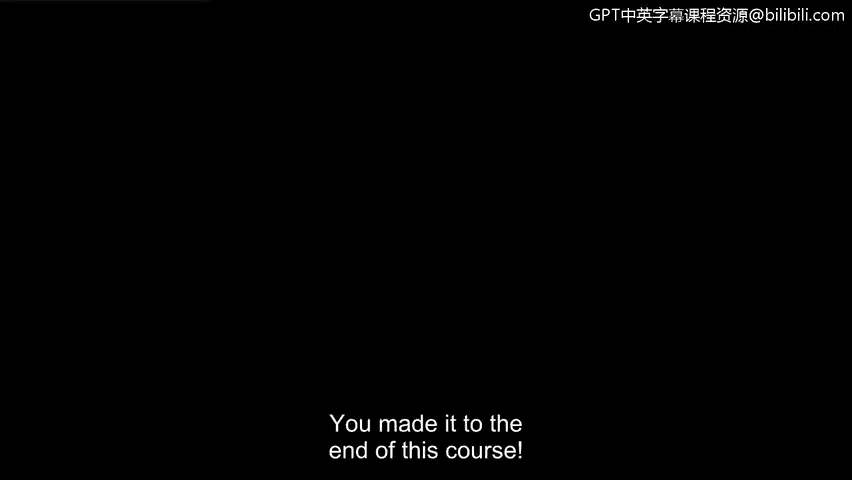
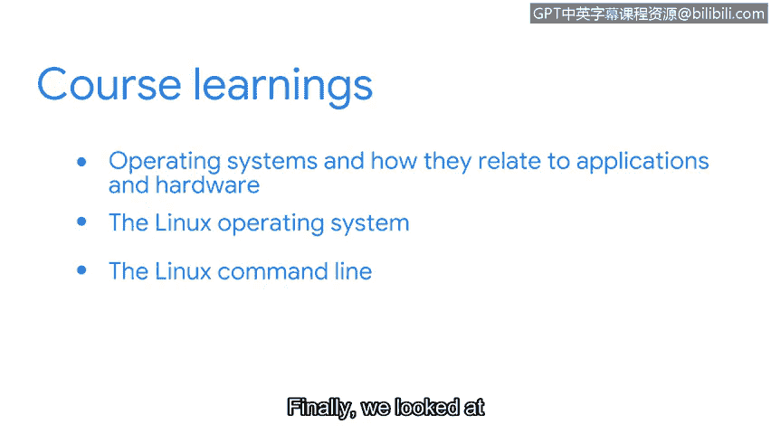
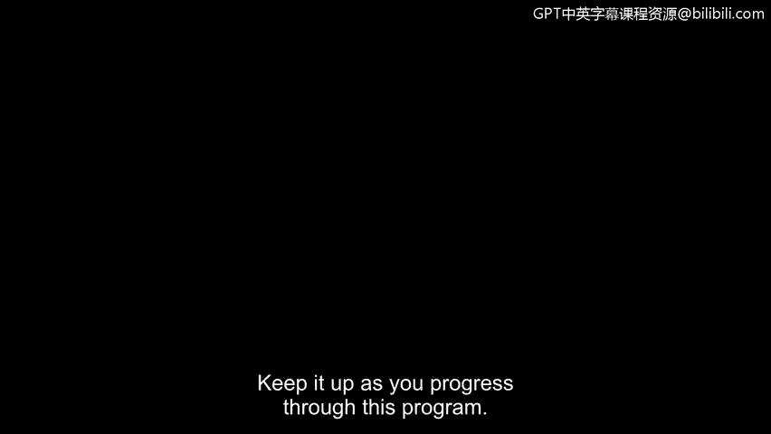

# 084：课程总结 🎉

在本节课中，我们将回顾《工具之道：Linux与SQL》这门课程的核心内容，总结所学知识，并为后续学习做好准备。

## 课程概述

您已经完成了本课程的学习。恭喜您取得了这一成就。

希望您为所学到的一切感到自豪。本课程的重点是计算基础。理解计算基础是您转型为安全分析师过程中的一项宝贵技能。

## 课程内容回顾

上一节我们介绍了课程的整体目标，本节中我们来具体回顾一下所学内容。

以下是本课程涵盖的核心主题：

*   **操作系统基础**：我们首先关注操作系统及其与应用程序和硬件的关系。理解您所保护的系统如何运作，对于有效完成工作至关重要。
*   **Linux操作系统**：这引导我们进入Linux操作系统。在安全领域工作时，熟悉Linux非常重要。我们首先讨论了它的体系结构和各种发行版。
*   **Linux命令行实践**：然后，我们使用Linux命令行来执行安全分析师可能遇到的任务。
*   **SQL数据库查询**：最后，我们探讨了另一个有用的工具，并使用SQL来查询数据库。

## 学习收获与展望

完成本课程后，希望您能更好地理解这些计算基础如何支持安全分析师的日常工作。

同时，也希望您能继续在这个专业项目中前进。前方还有许多其他有用且令人兴奋的主题。

再次恭喜您。您完成了又一项课程。掌握技能是值得自豪的事情。请在本项目的后续学习中继续保持。

## 总结

本节课中，我们一起学习了《工具之道：Linux与SQL》课程的核心要点，包括操作系统原理、Linux体系结构与命令行操作，以及SQL数据库查询。这些基础知识是您未来在网络安全领域深入发展的坚实起点。请带着这些收获，自信地迎接后续的挑战。