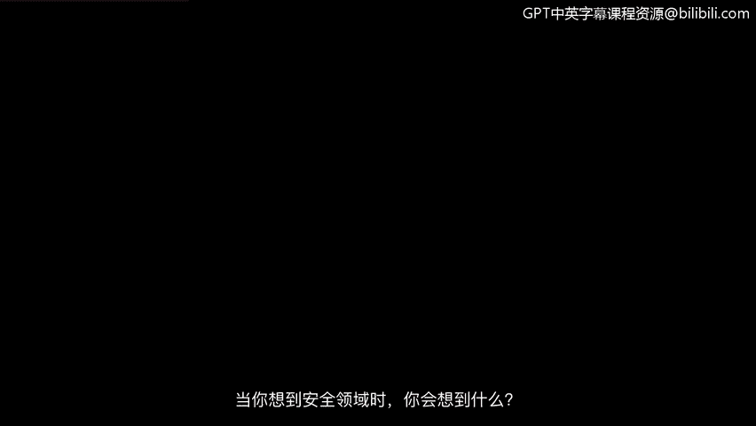
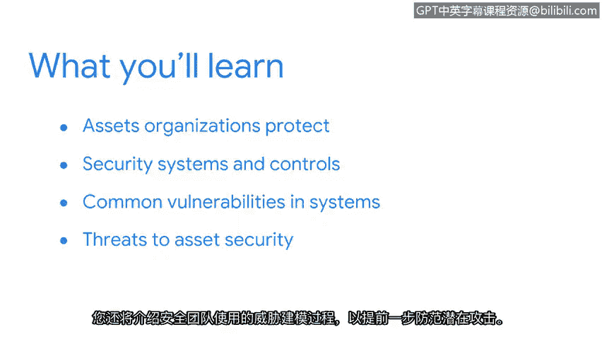

# 001：课程介绍

## 概述

在本节课中，我们将学习网络安全的基础概念，包括资产、威胁和漏洞。课程将介绍安全团队如何通过人员、流程和工具的组合来保护重要资产。我们将探讨资产安全、系统弱点以及威胁建模过程。

---

当你想到安全领域时，脑海中会浮现什么画面。

你可能会想到一个黑暗的房间，里面的人们正弯腰对着电脑工作。

或许你会想象一个人在实验室里仔细分析证据。

或者，你可能设想一名警卫站在建筑物前站岗。

事实是，无论你想到什么，所有这些例子都是广阔安全世界的一部分。

大家好，我是Dequietia。

我担任安全工程师已有四年。

我很高兴能担任本课程的讲师，并与大家分享我在谷歌的一些经验。

我所在的团队由背景各异、视角独特的网络安全专业人士组成。

例如，在我的岗位上，我负责保护Gmail的安全。

我日常工作的一部分包括开发新的安全功能，以及修复应用程序中的漏洞，以确保用户的电子邮件更安全。

我团队中的一些成员是在大学毕业后开始从事安全工作的。

还有许多其他成员是在其他行业工作多年后转入这个领域的。

安全团队的形式和规模各不相同。团队中的每个成员都扮演着特定的角色。

虽然我们在团队中的具体职能不同，但我们都有一个共同的目标。

**保护有价值的资产免受损害。**

实现这一使命需要人员、流程和工具的结合。

在本课程中，你将详细了解这三者。

首先，你将进入资产安全的世界。

你将了解组织保护的各种资产，以及这些资产如何影响公司的整体安全策略。

接下来，你将开始探索安全团队用来主动保护人员及其信息的系统和控制措施。

所有系统都存在可以改进的弱点。

当这些弱点被忽视时，它们可能导致严重的问题。

在本课程的这一部分，你将重点关注系统中的常见漏洞，以及安全团队如何领先于潜在问题。

最后，你将学习资产安全面临的威胁。

你还将了解安全团队用来领先于潜在攻击的威胁建模过程。

在这个领域，我们尽一切可能避免陷入被动的局面。

到本课程结束时，你将更清楚地了解人员、流程和技术如何协同工作，以保护所有重要的事物。

在整个课程中，你还会了解到这个领域令人兴奋的职业机会。

网络安全确实是一个跨学科的领域。你的背景和视角本身就是一种资产。

无论你是应届大学毕业生，还是正在开启新的职业道路，安全领域都提供了广泛的可能性。

那么，你准备好了吗？准备好和我一起踏上这段旅程了吗？