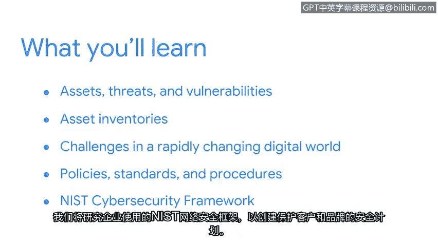

# 003：欢迎来到第一周

在本节课中，我们将要学习网络安全的基础概念，包括资产、威胁和漏洞，以及它们如何构成安全计划的核心。我们还将探讨资产清单的作用，分析数字世界面临的挑战，并了解构成安全计划的基本要素。

如今，我们都非常依赖技术。相关的例子在我们身边随处可见。

个人设备，例如智能手机，帮助我们与全球的朋友和家人保持联系。

定位技术帮助我们实现个人目标并提高效率。

企业也在日常生活中广泛采用技术，从简化运营到自动化流程。

因为技术，我们的世界联系更加紧密。我们越是依赖技术，我们分享的信息就越多。因此，每天都会产生海量的数据。

这种数据量的激增带来了独特的挑战。

随着企业对技术的依赖日益加深，网络犯罪分子影响组织的手段也变得更加复杂。

由于企业存储了大量敏感数据，数据泄露事件正变得日益严重。

这些挑战带来的一个积极方面是，对像你这样的专业人才的需求正在增长。

安全是一项团队工作。像你这样的独特视角对任何组织来说都是一笔财富。一个拥有多元背景、文化和经验的团队更有可能解决问题并实现创新。当数据泄露事件成为头条新闻时，很明显，组织需要更多专注于安全的专业人士。

全球的公司都在努力跟上快速变化的数字环境的需求。随着环境持续演变，你的个人经验就越发宝贵。

在本节中，我们将首先探讨资产、威胁和漏洞如何影响安全计划。之后，我们将讨论资产清单在保护公司各类资产方面的应用。

接着，我们将思考这个快速变化的数字世界所带来的挑战。最后，你将理解安全计划的基本构成要素：其策略、标准和程序。

我们将研究公司用来创建保护其客户和品牌的安全计划所依据的NIS网络安全框架。

我希望你和我一样，对开启这段探索安全世界的旅程感到兴奋。现在，让我们开始吧。

本节课中，我们一起学习了网络安全的重要性以及本课程的核心内容。我们了解到技术依赖带来的数据挑战，认识到安全团队多样性的价值，并预览了资产、威胁、漏洞以及安全计划框架等即将深入探讨的关键主题。