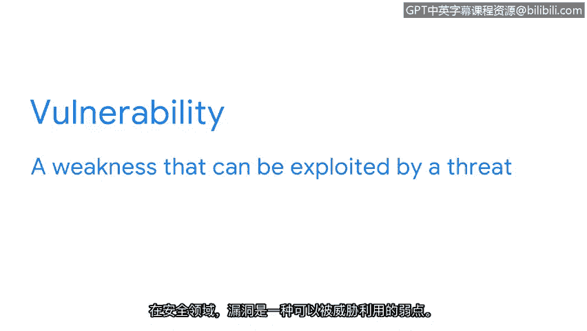

# 004：资产安全的“是什么”、“为什么”和“怎么做”

在本节课中，我们将要学习安全风险规划的基础，即理解资产、威胁和漏洞这三个核心概念。它们是构建任何安全计划的基石，分别代表了安全防护的“是什么”、“为什么”和“怎么做”。

## 安全规划的重要性

无论是绘画、练习篮球还是弹奏吉他，它们都有一个共同点：需要持续的练习。安全专业也不例外。规划未来是一项核心技能，需要在安全领域不断实践。我们通过提前解决问题来应对不确定性。例如，计划旅行时，你会考虑行程长度和所需衣物。如果去寒冷的地方，你会带上外套和毛衣以保暖。我们都希望拥有安全感，知道如果出现问题，会有应对计划。企业也是如此，它们通过分析风险来尽力提前规划。

## 风险与CIA三要素

安全团队通过关注风险来帮助企业。在安全领域，**风险**是指任何可能影响资产**机密性、完整性和可用性**的因素。作为安全从业者，我们的首要任务是维护这三个要素，它们构成了**CIA三要素**。安全风险规划过程是保护这些基石的第一步。

每个组织都根据其面临的风险制定独特的安全计划。幸运的是，要成为一名优秀的安全从业者，你无需熟悉所有可能的安全计划，只需了解这些计划是如何构建的基础即可。

## 安全计划的三大要素

安全计划基于对三个要素的分析：**资产、威胁和漏洞**。组织通过分析这三者如何影响其信息和系统的机密性、完整性和可用性来衡量安全风险。本质上，它们分别代表了安全的“是什么”、“为什么”和“怎么做”。

接下来，让我们更详细地探讨每一个要素。

### 资产：安全防护的“是什么”

资产是指被组织认为具有价值的项目。这通常涵盖广泛的事物。建筑、设备、数据和人员都是企业希望保护的资产示例。

我们可以通过分析一个家庭的资产来更深入地理解这个概念。在一个家庭中，存在多种资产，例如人员和私人物品。房屋的外部结构也由资产构成，如墙壁、屋顶、窗户和门。所有这些资产都有价值，但保护它们的方式可能不同。

例如，有人可能认为保护外墙的优先级低于保护前门。这是因为窃贼更可能从前门进入，而不是穿墙而入。这就是我们安装门锁的原因。考虑到需要关注的资产类型如此之多，安全计划需要优先分配资源。毕竟，无论安全团队规模多大，都不可能全天候监控每一个资产。

### 威胁：安全防护的“为什么”

安全团队可以根据威胁来优先安排工作。在安全领域，**威胁**是指任何可能对资产产生负面影响的状况或事件。与资产类似，威胁也包含多种类型。

回到家庭的例子，威胁可能是试图进入的窃贼。但窃贼并非影响门窗安全的唯一威胁类型。如果它们意外损坏了呢？强风可能在暴风雨中吹开门，或者附近玩球的孩子可能意外损坏窗户。如果你想到了这些可能性，做得很好，你已经展现出了安全思维。

### 漏洞：安全防护的“怎么做”

我们要讨论的安全计划的最后一个要素是漏洞。在安全领域，**漏洞**是指可能被威胁利用的弱点。

例如，前门上的一个**弱锁**，就是一个可能被窃贼利用的漏洞。而同一扇门上**老旧开裂的木头**，则是另一个不同的漏洞，它可能增加风暴损坏的几率。换句话说，可以将漏洞视为资产内部的缺陷。资产可能具有多种不同类型的漏洞，这些漏洞容易成为攻击者的目标。

我们将在后续课程中更详细地探讨不同类型的威胁和漏洞。目前，只需理解安全团队需要考虑广泛的资产、威胁和漏洞，才能有效地规划未来。

## 总结

本节课中，我们一起学习了安全风险规划的基础。我们明确了**资产**是组织需要保护的有价值对象（“是什么”），**威胁**是可能损害资产的潜在事件或行为（“为什么”），而**漏洞**则是资产中可能被威胁利用的弱点（“怎么做”）。理解这三者之间的关系，是评估风险、制定有效安全计划的第一步。记住，安全的核心始终围绕着维护资产的**机密性、完整性和可用性（CIA）**。