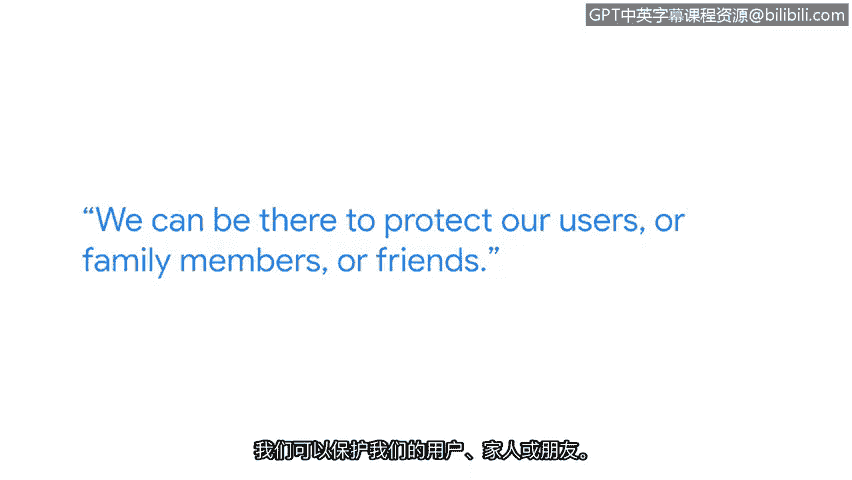

# 005：资产安全中的三个生活

## 概述
在本节课中，我们将跟随谷歌安全工程师Tree的视角，了解资产安全领域的日常工作、核心职责以及成为一名网络安全从业者所需的技能与心态。我们将学习资产管理的具体内容、威胁检测的实际工作，以及解决安全问题的思维方式。

---

## 日常工作与职责
上一节我们概述了课程内容，本节中我们来看看一位安全工程师的典型一天是怎样的。

我是Tree，谷歌的一名安全工程师。我所在的部门是检测与响应部门。

我的日常工作包括享用免费午餐和咖啡，这很不错。然后我最终坐到办公桌前，打开安全信息与事件管理（SIEM）系统，查看有哪些值得关注的事件需要调查，以及存在哪些需要我分析的潜在威胁。

此外，我的工作还包括改进我们检测潜在威胁的分析能力。

## 安全兴趣的起源
了解了日常工作后，我们来看看是什么促使人们进入网络安全领域。Tree的个人经历是一个很好的例子。

我的安全热情在年轻时就已经培养起来。信不信由你，我曾是一次黑客攻击的受害者。

那时，我每天放学后都会回家玩一款电脑游戏。有一天，我回到家，启动游戏，它提示“您的CD密钥正在被使用”，后面跟着一个我不认识的奇怪名字。

起初我感到震惊。这款游戏是我自己购买的，却有人盗用了我的CD密钥。但这起事件激发了我开始学习如何保护自己的动力。

例如，我学习了手动清除恶意软件，这成了我最喜欢的主题之一。同样为了乐趣，我开始针对一些朋友进行一些白帽黑客活动。

## 资产安全的核心
从个人经历转向专业领域，资产安全是网络安全中至关重要的一环。

资产安全是一个非常重要的领域，你需要关注和保护多种多样的资产。

我最喜欢的部分是构建那些真正有可能捕捉到恶意行为的检测机制。

在资产管理安全中，你需要有能力精确地清点所有资产，这些资产包括IP地址、用户数据、员工设备等。同时，你需要确保安全状况符合要求。

总有新技术、新硬件不断涌现。我们有责任去理解可能存在的潜在新威胁。

## 关键技能与思维方式
掌握了资产安全的具体工作后，我们来看看成功应对这些挑战需要哪些关键技能。

解决问题的能力和创造性思维在网络安全中非常重要，因为总会遇到复杂的问题。人们需要能够跳出思维定式，创造性地、全面地思考，以找到降低风险的解决方案。

## 使命与总结
最后，我们来探讨网络安全工作的更深层意义。

网络安全是一项崇高的职业。互联网上可能会发生很多事情，其中不乏坏事。但我们可以站出来对抗它，我们可以采取行动。我们可以在那里保护我们的用户、家人或朋友。

这份责任很重，当然，它也是一项非常重要的使命。我为自己是安全团队的一员而感到自豪。

---

## 总结
本节课中，我们一起学习了安全工程师的日常工作内容，了解了资产安全管理涉及对各类资产（如IP、数据、设备）的精确清点和保护。我们探讨了通过构建检测机制来应对威胁，并认识到解决问题需要创造性思维和全局观。最重要的是，我们理解了网络安全工作保护他人、对抗网络风险的重大责任与使命。