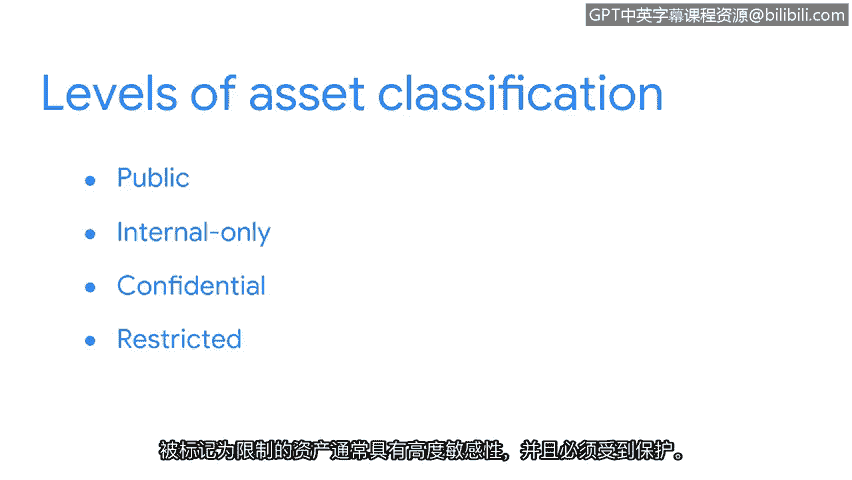

# 006：安全始于资产分类

在本节课中，我们将学习资产管理和资产分类的核心概念。这是网络安全的基础，因为只有清楚了解需要保护的对象，才能有效地实施保护措施。

## 资产管理的重要性

当您找不到重要物品时，会感到非常焦虑。例如，约会迟到却找不到钥匙。我们都会遇到类似情况。无论您是否相信，组织也面临同样的困扰。

请花几秒钟思考您身边重要资产的数量。例如，我想到的是手机、钱包和钥匙。

接下来，假设您刚加入一家小型在线零售商的安全团队。该公司过去几年持续增长，客户数量不断增加。因此，他们正在扩大安全部门，以保护日益增多的资产。

假设你们每人负责10项资产。即使在小型企业环境中，这也是大量的资产。需要保护的事物数量惊人。

安全的一个基本事实是：**您只能保护您已登记在册的事物**。资产管理是跟踪资产及其所受风险的过程。😊

## 资产管理：安全计划的核心

所有安全计划都围绕资产管理展开。请回忆，资产包括组织认为具有价值的任何物品。设备、数据和知识产权只是企业希望保护的众多资产中的几类。

每个组织安全计划的关键部分是跟踪其资产。资产管理始于建立**资产清单**，即一份需要保护的资产目录。这是保护组织资产的重要组成部分。没有这份记录，组织可能会失去对其重要事物的掌控。

理解资产清单的一个好方法是将其比作牧羊人保护羊群。准确统计羊的数量在很多方面都有帮助。例如，可以更容易地分配食物等资源来照料它们。资产清单的另一个好处是，如果其中一项丢失，您会收到警报。

## 资产分类：确定优先级

再次思考您身边的重要资产。就像我一样，您或许能根据重要程度对它们进行评级。例如，在安全方面，我会将钱包排在鞋子之前。

这种实践被称为**资产分类**。通常，资产分类是根据资产对组织的敏感性和重要性进行标记的做法。

组织对资产的标记方式不同。许多组织遵循一个基本的分类方案：**公开、仅限内部、机密和受限**。

*   **公开**资产可以与任何人共享。
*   **仅限内部**资产可以与组织内的任何人共享，但不应在组织外共享。
*   **机密**资产应仅由从事特定项目的人员访问。
*   被归类为**受限**的资产通常高度敏感，必须受到严格保护。

带有此标签的资产被视为“需要知道”。例如包括知识产权、健康或支付信息。

例如，一家发展中的在线零售商可能会将关于新产品的内部电子邮件标记为“机密”，因为从事该新产品的人员应该了解相关信息。他们也可能在办公室门上贴上“受限”标志，以阻止没有特定理由进入的任何人。

这些只是您可能从先前经验中熟悉的几个日常例子。在很大程度上，分类决定了资产是否可以披露、更改或销毁。

## 总结

资产管理是一个持续的过程，有助于发现安全中潜在的意外漏洞和风险。跟踪对我们组织重要的一切事物是安全规划的重要组成部分。

本节课中，我们一起学习了资产管理和资产分类的基础知识。我们了解到，建立资产清单是安全工作的起点，而对资产进行分类则帮助我们确定保护措施的优先级和强度。记住，有效的安全始于清楚地了解您要保护什么。